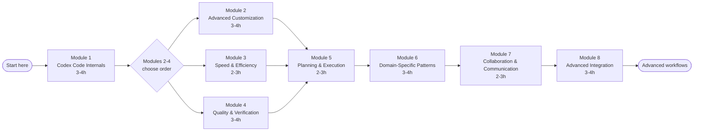
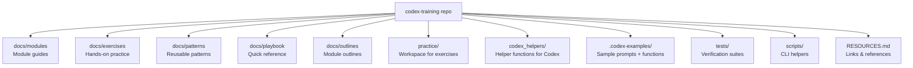

# Codex Code Mastery Program

A comprehensive learning journey from experienced user to expert practitioner, covering technical depth, workflow optimization, pattern development, and teaching capability.

## Philosophy

This program builds mastery across four dimensions:
- **Technical Depth**: Understanding how Codex Code works under the hood
- **Workflow Optimization**: Refining daily patterns for speed and efficiency
- **Pattern Library**: Cataloging proven approaches for every scenario
- **Teaching Capability**: Internalizing knowledge well enough to share it

## Program Structure

Each module follows a consistent rhythm:
1. **Concept**: Deep dive into how something works
2. **Practice**: Hands-on exercises applying the concepts
3. **Pattern**: Distill reusable patterns from experience
4. **Document**: Add to your personal playbook

## Visual Overview

## Modules

### Module 1: Codex Code Internals
**Status**: In Progress
**Time**: 3-4 hours
**Topics**:
- How Codex session messaging works (system/user/function)
- Function calling workflows and helper orchestration
- Context management, summaries, and token budgets
- Guard rails: validation scripts and logging hooks

📁 [Module Content](docs/modules/01-internals.md) | 🏋️ [Exercises](docs/exercises/01-internals/)

---

### Module 2: Advanced Customization
**Status**: Not Started
**Time**: 3-4 hours
**Topics**:
- Creating prompt templates and reusable instructions
- Registering helper functions and wrapper scripts
- Validation scripts and guard rails
- Documenting configuration and context files

📁 [Module Content](docs/modules/02-customization.md) | 🏋️ [Exercises](docs/exercises/02-customization/)

---

### Module 3: Speed & Efficiency Patterns
**Status**: Not Started
**Time**: 2-3 hours
**Topics**:
- Parallel prompt bundles and helper batching
- Coordinating multiple prompt threads
- Context optimization tactics
- Task decomposition frameworks
- Execution strategy selection (parallel vs sequential)

📁 [Module Content](docs/modules/03-speed.md) | 🏋️ [Exercises](docs/exercises/03-speed/)

---

### Module 4: Quality & Verification
**Status**: Not Started
**Time**: 3-4 hours
**Topics**:
- Multi-layer review patterns
- Proactive quality gates
- Test-driven workflows
- Systematic debugging
- Root cause analysis

📁 [Module Content](docs/modules/04-quality.md) | 🏋️ [Exercises](docs/exercises/04-quality/)

---

### Module 5: Planning & Execution
**Status**: Not Started
**Time**: 2-3 hours
**Topics**:
- Writing effective plans
- Plan-execute workflows
- Breaking down complex features
- Progress tracking patterns
- Handling ambiguity

📁 [Module Content](docs/modules/05-planning.md) | 🏋️ [Exercises](docs/exercises/05-planning/)

---

### Module 6: Domain-Specific Patterns
**Status**: Not Started
**Time**: 3-4 hours
**Topics**:
- Refactoring large codebases
- Architecture exploration and design
- Legacy code navigation
- Performance optimization
- Security review patterns

📁 [Module Content](docs/modules/06-domain.md) | 🏋️ [Exercises](docs/exercises/06-domain/)

---

### Module 7: Collaboration & Communication
**Status**: Not Started
**Time**: 2-3 hours
**Topics**:
- Effective prompting techniques
- Providing context efficiently
- Asking better questions
- Iterating on solutions
- Teaching Codex your patterns

📁 [Module Content](docs/modules/07-collaboration.md) | 🏋️ [Exercises](docs/exercises/07-collaboration/)

---

### Module 8: Advanced Integration
**Status**: Not Started
**Time**: 3-4 hours
**Topics**:
- Multi-tool workflows
- CI/CD integration patterns
- Cross-project knowledge transfer
- Custom agent development
- Contributing to the ecosystem

📁 [Module Content](docs/modules/08-integration.md) | 🏋️ [Exercises](docs/exercises/08-integration/)

---

## Learning Path

**Recommended Progression**:
1. Start with Module 1 (foundation for everything else)
2. Modules 2-4 can be done in any order based on interest
3. Modules 5-6 build on 1-4
4. Modules 7-8 are advanced integration

**Total Time**: 20-30 hours spread over weeks/months at your own pace

## Your Resources

- **[Pattern Library](docs/patterns/)**: Reusable patterns organized by category
- **[Playbook](docs/playbook/)**: Quick reference guide for daily use
- **[Practice Workspace](practice/)**: Sandbox for exercises and experiments

## Progress Tracking

Update module status as you complete them:
- [ ] Module 1: Codex Code Internals
- [ ] Module 2: Advanced Customization
- [ ] Module 3: Speed & Efficiency Patterns
- [ ] Module 4: Quality & Verification
- [ ] Module 5: Planning & Execution
- [ ] Module 6: Domain-Specific Patterns
- [ ] Module 7: Collaboration & Communication
- [ ] Module 8: Advanced Integration

## Getting Started

1. Read [Module 1: Codex Code Internals](docs/modules/01-internals.md)
2. Work through [Module 1 Exercises](docs/exercises/01-internals/)
3. Document patterns you discover
4. Move to next module

---

**Note**: This is a living program. Add your own discoveries, adjust exercises, and expand patterns as you learn.

## Codex Workspace

- **`.codex-examples/`** holds sample helper functions, prompt templates, logging scripts, and context files. Copy the pieces you need into your own `.codex/` folder to jumpstart a session.
- **`.codex/functions.json`** documents the helper functions you register with each session (name, description, parameter schema). Keep it synced with `codex_helpers/` so prompts see the same catalog every time.
- **Context files** like `.codex/context.md` describe the current project state. Include them at the start of a session so Codex understands your assumptions without re-reading every detail.

## Contributing

Contributions are welcome! Please see [CONTRIBUTING.md](CONTRIBUTING.md) for guidelines on:
- Reporting issues and suggesting enhancements
- Adding patterns, exercises, and examples
- Code style and pull request process

## License

This project is licensed under the [MIT License](LICENSE).
