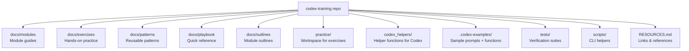

# Codex CLI Mastery Program

A comprehensive learning journey from experienced user to expert practitioner, covering technical depth, workflow optimization, pattern development, and teaching capability.

## Philosophy

This program builds mastery across four dimensions:
- **Technical Depth**: Understanding how Codex works under the hood
- **Workflow Optimization**: Refining daily patterns for speed and efficiency
- **Pattern Library**: Cataloging proven approaches for every scenario
- **Teaching Capability**: Internalizing knowledge well enough to share it

## Program Structure

Each module follows a consistent rhythm:
1. **Concept**: Deep dive into how something works
2. **Practice**: Hands-on exercises applying the concepts
3. **Pattern**: Distill reusable patterns from experience
4. **Document**: Add to your personal playbook

## Visual Overview

```mermaid
graph LR
    start([Start here]) --> M1["Module 1\nGetting Started\n~1h"]
    M1 --> M2["Module 2\nSkills & Workflows\n2-3h"]
    M2 --> M3["Module 3\nSpeed & Efficiency\n2-3h"]
    M3 --> M4["Module 4\nPlanning & Execution\n2-3h"]
    M4 --> M5["Module 5\nQuality & Verification\n3-4h"]
    M5 --> M6["Module 6\nDomain Patterns\n3-4h"]
    M6 --> M7["Module 7\nAdvanced Integration\n3-4h"]
    M7 --> M8["Module 8\nAPI Internals\n3-4h"]
    M8 --> M9["Module 9\nAPI Customization\n2-3h"]
    M9 --> Z([Advanced workflows])
```

## Additional Training Tracks

### Codex CLI Hands-on Training
A standalone training track for new Codex CLI users and PM/trainers. Covers installation, safety model, interactive labs, automation with `codex exec`, and Jupyter integration.

📁 **[Start Here](docs/training/codex-cli-hands-on/README.md)** | ⏱️ ~90 minutes total

---

## Modules

### Module 1: Getting Started (CLI)
**Status**: Not Started  
**Time**: 45-60 minutes  
**Topics**:
- Install and configure Codex CLI
- Built-in tools (file read, apply_patch, shell) and TUI vs exec flows
- Hands-on labs in `docs/training/codex-cli-hands-on/`
- Where to find helpers and prompt templates in this repo

📁 [Module Content](docs/modules/01-getting-started.md) | 🏋️ [Exercises](docs/exercises/01-getting-started/)

---

### Module 2: Skills & Reusable Workflows
**Status**: Not Started  
**Time**: 2-3 hours  
**Topics**:
- What skills are and why they matter
- Finding and using existing skills (superpowers library)
- The 3-attempt rule for debugging
- Creating custom skills for your team

📁 [Module Content](docs/modules/02-skills.md) | 🏋️ [Exercises](docs/exercises/02-skills/)

---

### Module 3: Speed & Efficiency Patterns
**Status**: Not Started  
**Time**: 2-3 hours  
**Topics**:
- Parallel prompt bundles and helper batching
- Coordinating multiple prompt threads
- Context optimization tactics
- Task decomposition frameworks
- Execution strategy selection (parallel vs sequential)

📁 [Module Content](docs/modules/03-speed.md) | 🏋️ [Exercises](docs/exercises/03-speed/)

---

### Module 4: Planning & Execution
**Status**: Not Started  
**Time**: 3-4 hours  
**Topics**:
- Writing effective implementation plans
- Plan-execute workflows with batch reviews
- Breaking down complex features
- Progress tracking with TodoWrite
- Handling ambiguity and pivots

📁 [Module Content](docs/modules/04-planning.md) | 🏋️ [Exercises](docs/exercises/05-planning/)

---

### Module 5: Quality & Verification
**Status**: Not Started  
**Time**: 3-4 hours  
**Topics**:
- Multi-layer review patterns
- Proactive quality gates
- Test-driven workflows
- Systematic debugging
- Root cause analysis

📁 [Module Content](docs/modules/05-quality.md) | 🏋️ [Exercises](docs/exercises/05-quality/)

---

### Module 6: Domain-Specific Patterns
**Status**: Not Started  
**Time**: 3-4 hours  
**Topics**:
- Refactoring large codebases
- Architecture exploration and design
- Legacy code navigation
- Performance optimization
- Security review patterns

📁 [Module Content](docs/modules/06-domain.md) | 🏋️ [Exercises](docs/exercises/06-domain/)

---

### Module 7: Advanced Integration
**Status**: In Progress  
**Time**: 3-4 hours  
**Topics**:
- GitHub CLI (`gh`) integration
- Multi-tool workflows
- CI/CD integration patterns
- Cross-project knowledge transfer
- Contributing to the ecosystem

📁 [Module Content](docs/modules/07-integration.md) | 🏋️ [Exercises](docs/exercises/07-integration/)

---

### Module 8: Codex API Internals (Advanced)
**Status**: Not Started  
**Time**: 3-4 hours  
**Topics**:
- How Codex session messaging works
- Tool calling and execution model
- Context management and token budgets
- Session persistence and recovery

📁 [Module Content](docs/modules/08-api-internals.md) | 🏋️ [Exercises](docs/exercises/08-api-internals/)

---

### Module 9: API Customization & Extensions (Advanced)
**Status**: Not Started  
**Time**: 2-3 hours  
**Topics**:
- Project-specific instructions (AGENTS.md)
- Settings and permission management
- Hooks for automation (pre/post tool use)
- MCP servers for external tool integration

📁 [Module Content](docs/modules/09-api-customization.md) | 🏋️ [Exercises](docs/exercises/09-api-customization/)

---
## Learning Path

**Recommended Progression**:
1. Start with Module 1 (CLI setup + hands-on labs)
2. Continue to Module 2 (skills are used throughout later modules)
3. Work through Modules 3–7 in order (speed → planning → quality → domain → integration)
4. Tackle Modules 8–9 (API internals/customization) when you need to build custom integrations

**Total Time**: 20-30 hours spread over weeks/months at your own pace

## Your Resources

- **[Pattern Library](docs/patterns/)**: Reusable patterns organized by category
- **[Playbook](docs/playbook/)**: Quick reference guide for daily use
- **[Practice Workspace](practice/)**: Sandbox for exercises and experiments

## Progress Tracking

Update module status as you complete them:
- [ ] Module 1: Getting Started (CLI)
- [ ] Module 2: Skills & Reusable Workflows
- [ ] Module 3: Speed & Efficiency Patterns
- [ ] Module 4: Planning & Execution
- [ ] Module 5: Quality & Verification
- [ ] Module 6: Domain-Specific Patterns
- [ ] Module 7: Advanced Integration
- [ ] Module 8: Codex API Internals
- [ ] Module 9: API Customization & Extensions

## Getting Started

1. Read [Module 1: Getting Started](docs/modules/01-getting-started.md)
2. Work through [Module 1 Exercises](docs/exercises/01-getting-started/)
3. Continue to [Module 2: Skills & Workflows](docs/modules/02-skills.md) for the foundation
4. Document patterns you discover
5. Move to next module

---

**Note**: This is a living program. Add your own discoveries, adjust exercises, and expand patterns as you learn.

## Codex Workspace

- **`.codex-examples/`** holds sample helper functions, prompt templates, logging scripts, and context files. Copy the pieces you need into your own `.codex/` folder to jumpstart a session.
- **`.codex/functions.json`** documents the helper functions you register with each session (name, description, parameter schema). Keep it synced with `codex_helpers/` so prompts see the same catalog every time.
- **Context files** like `.codex/context.md` describe the current project state. Include them at the start of a session so Codex understands your assumptions without re-reading every detail.

## Contributing

Contributions are welcome! Please see [CONTRIBUTING.md](CONTRIBUTING.md) for guidelines on:
- Reporting issues and suggesting enhancements
- Adding patterns, exercises, and examples
- Code style and pull request process

## License

This project is licensed under the [MIT License](LICENSE).
