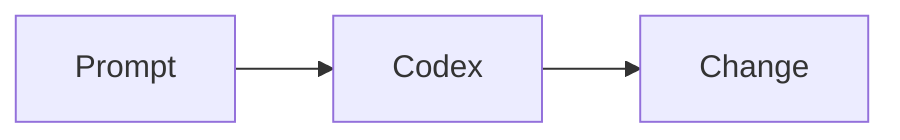

# Codex Training Docs Site

This site is built with VitePress and uses the content under `docs/`.

## Local Development

```bash
npm install
npm run docs:dev
```

Open http://localhost:5173 to view the site.

## Mermaid Diagrams

Mermaid is enabled via `vitepress-plugin-mermaid`. Use fenced blocks to add diagrams:



## CI Docs Build

Docs builds are verified in CI. You can run the same commands locally:

```bash
npm ci
npm run docs:build
```
