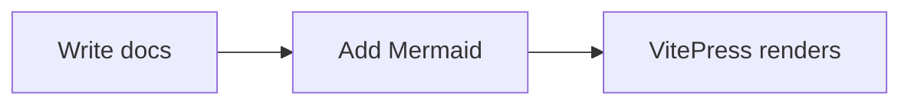

# Codex Training Docs Site

This site is built with VitePress and uses the content under `docs/`.

## Mermaid Diagrams

This site supports Mermaid via `vitepress-plugin-mermaid` (configured in `docs/.vitepress/config.mts`). Use fenced blocks:



## Local Development

```bash
npm install
npm run docs:dev
```

Open http://localhost:5173 to view the site.
