# Module 1: Codex Code Internals

> **⚠️ Advanced / API Focus**: This module covers the OpenAI Codex **API** internals—building custom integrations, function calling, and managing context programmatically. **If you're using Codex CLI**, you don't need this to get started. The CLI handles tools, context, and sessions automatically. Start with the [CLI hands-on training](../training/codex-cli-hands-on/README.md) instead, and return here when you want to build custom API integrations.

## Overview

Understanding how OpenAI Codex works under the hood is essential for building custom integrations. This module explores the chat-based architecture, function-calling workflow, and context strategies that determine how Codex behaves during an API session.

**Learning Objectives**:
- Understand the message types that make up a Codex session and how system/user/assistant instructions shape each interaction
- Master function calling so Codex can reason about external data sources without hallucinating
- Keep the context window healthy through summarization, chunking, and smart request sequencing
- Break large problems into prompt chains, verifying each step and feeding results into the next

**Time**: 3-4 hours

---

## 1. Codex Session Architecture

### What is a Codex session?
A Codex session is a conversation with the OpenAI Chat Completion API. Every request includes a series of messages, typically:
- **System**: Persistent instructions about tone, safety, and available functions
- **User**: The current request or question
- **Assistant**: Codex's response (either text or a `function_call` payload)
- **Function**: When Codex asks your code to run a helper, you call that function, then supply the result back as a `function` message

Think of it as a structured turn-taking system where Codex only knows what you feed it in those messages.</n
### Message flow

```mermaid
flowchart TD
    subgraph init["🔧 INITIALIZATION"]
        S[/"SYSTEM MESSAGE<br/>(tone, constraints, context)"/]
    end

    subgraph conversation["💬 CONVERSATION LOOP"]
        U[/"USER PROMPT<br/>(your request)"/]
        A{"ASSISTANT<br/>(text or function_call)"}
        U --> A
    end

    subgraph function["⚡ FUNCTION EXECUTION"]
        F["YOUR CODE RUNS<br/>(execute the function)"]
        R[/"FUNCTION RESULT<br/>(JSON response)"/]
        F --> R
    end

    subgraph response["✅ FINAL OUTPUT"]
        FINAL["ASSISTANT RESPONSE<br/>(uses result to respond)"]
    end

    S --> U
    A -->|"function_call"| F
    R --> A
    A -->|"text response"| FINAL

    style S fill:#e1f5fe,stroke:#01579b,stroke-width:2px
    style U fill:#fff3e0,stroke:#e65100,stroke-width:2px
    style A fill:#f3e5f5,stroke:#7b1fa2,stroke-width:2px
    style F fill:#e8f5e9,stroke:#2e7d32,stroke-width:2px
    style R fill:#e8f5e9,stroke:#2e7d32,stroke-width:2px
    style FINAL fill:#c8e6c9,stroke:#1b5e20,stroke-width:2px
```


This means there is no persistent agent memory outside the conversation history — context resets when you start a new sequence.

### Designing the system message

> **What is a system prompt?** The system prompt (or "system message") is the first message in every conversation that defines the AI's behavior, capabilities, and constraints. Think of it as a job description you give before work begins. The AI reads this first and follows its instructions throughout the session.

**Best practices:**
- State the role clearly (e.g., "You are Codex, an assistant that edits Python code") and keep it short
- Declare the functions you expose (name, description, parameters) so Codex can reference them
- Mention safety constraints (don’t expose secrets, log everything, prefer explanations)
- Refresh the system prompt for each new session or when you need to pivot behavior

### What Codex retains
- Everything in the current message array (system + history + functions)
- Function results you provide after a `function_call`
- Recent pieces of context you keep near the end of the history

Anything outside that sequence is invisible until you mention it again, so plan to summarize or re-send as needed.

---

## 2. Function Calling & Tool Wrappers

Function calling lets Codex delegate tasks to your own code. Instead of dreaming up how to make an API call, Codex returns a structured `function_call` object that you execute.

### Declaring functions
In the request you send to the OpenAI client, register each helper you want Codex to use:
```python
from openai import OpenAI
client = OpenAI()  # Reads OPENAI_API_KEY from environment

response = client.chat.completions.create(
    model="codex-1",
    messages=[
        # System message: sets AI behavior and context
        {"role": "system", "content": "You are a thoughtful coding assistant."},
        # User message: the actual request
        {"role": "user", "content": "Get the list of TODOs."},
    ],
    # Functions: tools Codex can ask you to run
    functions=[
        {
            "name": "list_todos",                           # Function identifier
            "description": "Collect TODO comments from a repo",  # Helps Codex decide when to use it
            "parameters": {                                 # JSON Schema for arguments
                "type": "object",
                "properties": {
                    "paths": {
                        "type": "array",
                        "items": {"type": "string"}         # Array of file paths
                    }
                },
                "required": ["paths"]                       # paths is mandatory
            }
        }
    ],
    function_call="auto"  # Let Codex decide when to call functions
)
```

**`function_call` options:**
| Value | Behavior |
|-------|----------|
| `"auto"` | Codex decides whether to call a function or respond with text (recommended default) |
| `"none"` | Codex will only respond with text, even if functions are available |
| `{"name": "list_todos"}` | Force Codex to call a specific function |

Use `"auto"` for most cases. Use `{"name": "..."}` when you know a function must be called (e.g., first step of a workflow).

Codex may respond with a `function_call` telling you which helper to invoke and what arguments to pass.

### Running the helper
After you see a `function_call`, run the matching helper and send the result back:
```python
# Check if Codex wants to call a function
if response.choices[0].message.get("function_call"):
    call = response.choices[0].message.function_call  # Extract function name and args

    # Run YOUR implementation of the function
    result = list_todos(call.arguments)

    # Send the result back to Codex as a "function" message
    follow_up = client.chat.completions.create(
        model="codex-1",
        messages=response.messages + [
            {
                "role": "function",      # Special role for function results
                "name": call.name,       # Must match the function that was called
                "content": result        # Your function's output (usually JSON)
            }
        ]
    )
```
Codex now sees the function result and can continue reasoning.

### Tool wrappers instead of built-in tools

> **Why wrappers?** The Codex API is a raw language model—it can only send and receive text. Unlike Codex CLI (which has built-in file/shell tools), the API cannot read files, run commands, or access the internet on its own. You must provide these capabilities by:
> 1. Declaring functions that describe what operations are available
> 2. Implementing those functions in your code
> 3. Running them when Codex requests, and sending results back

**Common wrappers to build:**

```python
# codex_helpers/read_file.py
import json

def read_file(args):
    """
    Wrapper for file reading. Codex calls this instead of reading files directly.
    Returns JSON so Codex can parse structured data.
    """
    path = args.get("path")

    # Security: prevent escaping the project directory
    if not path or ".." in path or path.startswith("/"):
        return json.dumps({"error": "Invalid path - must be relative, no ../"})

    try:
        with open(path, "r") as f:
            content = f.read()

        # Truncate large files to avoid blowing up context
        if len(content) > 10000:
            content = content[:10000] + "\n... (truncated)"

        return json.dumps({
            "path": path,
            "content": content,
            "lines": len(content.splitlines())
        })
    except FileNotFoundError:
        return json.dumps({"error": f"File not found: {path}"})
```

```python
# codex_helpers/run_tests.py
import subprocess
import json

def run_tests(args):
    """
    Wrapper for running tests. Returns structured pass/fail data.
    """
    target = args.get("target", "tests/")  # Default to tests/ directory

    # Run pytest with JSON output
    result = subprocess.run(
        ["pytest", target, "-v", "--tb=short"],
        capture_output=True,
        text=True,
        timeout=60  # Prevent runaway tests
    )

    return json.dumps({
        "exit_code": result.returncode,          # 0 = all passed
        "passed": result.returncode == 0,
        "stdout": result.stdout[:5000],          # Truncate output
        "stderr": result.stderr[:1000] if result.stderr else None
    })
```

**Recommended folder structure:**
```
project/
├── codex_helpers/
│   ├── __init__.py
│   ├── read_file.py      # File reading wrapper
│   ├── run_tests.py      # Test runner wrapper
│   ├── git_status.py     # Git operations wrapper
│   └── functions.json    # Schema manifest for all functions
├── scripts/
│   └── codex_session.py  # Your main API integration script
└── .env                  # API keys (gitignored)
```

Store your wrappers in `./codex_helpers/` and keep a manifest (`functions.json`) describing their schemas. This way every session reuses the same catalog of trusted, validated operations.

### Function-calling best practices

**Keep each function focused**
```json
{
  "name": "read_file",
  "description": "Read a file and return its contents",
  "parameters": {
    "type": "object",
    "properties": {
      "path": { "type": "string", "description": "Relative path to the file" }
    },
    "required": ["path"]
  }
}
```

**Limit responses to avoid noisy results**
```python
response = client.chat.completions.create(
    model="codex-1",
    messages=messages,
    max_tokens=800,  # Cap output length
    functions=functions
)
```

**Validate and sanitize arguments** (Codex can hallucinate parameter names)
```python
def read_file(args):
    path = args.get("path")
    if not path or ".." in path:  # Prevent directory traversal
        return {"error": "Invalid path"}
    if not os.path.exists(path):
        return {"error": f"File not found: {path}"}
    with open(path) as f:
        return {"content": f.read()[:10000]}  # Limit size
```

**Never expose secrets** — use `.env` files
```bash
# .env (add to .gitignore!)
OPENAI_API_KEY=sk-...
DATABASE_URL=postgres://...
```
```python
# Load before any API calls
from dotenv import load_dotenv
load_dotenv()

client = OpenAI()  # Reads OPENAI_API_KEY from environment
```

**Log every call for reproducibility**
```python
import logging
logging.basicConfig(filename="codex_calls.log", level=logging.INFO)

def log_function_call(name, args, result):
    logging.info(f"Function: {name} | Args: {args} | Result: {result[:200]}")

# After each function execution:
log_function_call(func_name, func_args, json.dumps(result))
```

---

## 3. Managing Context and Tokens

### The context window
OpenAI models have finite context windows (e.g., 128K tokens for later Codex models). Each message contributes to this total:
```
Total context = system prompt + user/assistant history + function results + new generation
```
The window includes both incoming message tokens and the tokens you expect the model to emit, so budget accordingly.

### Strategies to stay inside the window

**1. Summaries** — Periodically compress prior exchanges:

*API approach:*
```python
# After a long exchange, ask for a summary
messages.append({"role": "user", "content": "Summarize our progress in 3 bullet points."})
response = client.chat.completions.create(model="codex-1", messages=messages)
summary = response.choices[0].message.content

# Start fresh with just the summary
messages = [
    {"role": "system", "content": system_prompt},
    {"role": "assistant", "content": f"Progress so far:\n{summary}"}
]
```

*CLI approach:*
```bash
codex exec "Summarize what we've learned about the auth system in 3 bullets" > context.txt
# Start new session with context
codex "Context: $(cat context.txt)

Now implement the rate limiting we discussed."
```

**2. Chunking** — Search before sharing entire files:

*API approach:*
```python
def get_relevant_snippet(filepath, keyword):
    """Return only lines containing keyword, with context."""
    with open(filepath) as f:
        lines = f.readlines()
    matches = [(i, line) for i, line in enumerate(lines) if keyword in line]
    # Return matches with 3 lines of context
    return format_with_context(lines, matches, context=3)

# Instead of sending entire file:
snippet = get_relevant_snippet("src/auth.ts", "validateUser")
messages.append({"role": "user", "content": f"Review this code:\n{snippet}"})
```

*CLI approach:*
```bash
# Don't do this (sends entire file):
codex "Review src/auth.ts"

# Do this instead (targeted):
codex "Show me only the validateUser function from src/auth.ts and review it"
```

**3. Streaming** — Stop early if output diverges:

```python
stream = client.chat.completions.create(
    model="codex-1",
    messages=messages,
    stream=True
)

output = ""
for chunk in stream:
    delta = chunk.choices[0].delta.content or ""
    output += delta
    print(delta, end="", flush=True)

    # Stop if we detect repetition or off-topic content
    if len(output) > 2000 and is_repetitive(output):
        break
```

**4. Cache context** — Store state between sessions:

```bash
# Save progress after each major step
codex exec "Summarize: what files we changed, what's left to do" > .codex-context.md

# Resume later
codex "Previous context: $(cat .codex-context.md)

Continue with the next step."
```

### Monitoring tokens

*API approach:*
```python
response = client.chat.completions.create(model="codex-1", messages=messages)

# Check token usage
usage = response.usage
print(f"Prompt: {usage.prompt_tokens}, Completion: {usage.completion_tokens}, Total: {usage.total_tokens}")

# If approaching limit (e.g., 100K of 128K), summarize and reset
if usage.total_tokens > 100000:
    summary = summarize_conversation(messages)
    messages = [{"role": "system", "content": system_prompt},
                {"role": "assistant", "content": summary}]
```

*CLI approach:*
```bash
# Codex CLI manages context automatically, but you can check session size:
ls -la ~/.codex/sessions/

# If a session feels slow or forgetful, start fresh with a summary:
codex exec "Summarize our current task and progress" > summary.txt
# Then start new session with that context
```

---

## 4. Chaining Requests and Planning

### When to split work
Large problems benefit from staged prompts:
1. **Discover**: Ask Codex to describe the problem space or analyze a diff
2. **Plan**: Have it reason about steps and output a plan (list of actions)
3. **Execute**: Apply a plan step-by-step, feeding results back
4. **Verify**: Run tests/functions to confirm the change
5. **Document**: Summarize what changed and how to continue

**Example: Adding rate limiting to an API endpoint**

```python
# Stage 1: DISCOVER - Gather context about current implementation
messages = [
    {"role": "system", "content": "You are a senior backend engineer."},
    {"role": "user", "content": """
        I need to add rate limiting to our login endpoint.
        First, analyze the current implementation and tell me:
        1. How authentication currently works
        2. Where rate limiting should be added
        3. What existing middleware patterns we use
    """}
]
# Codex calls read_file("src/auth/login.py"), read_file("src/middleware/index.py")
# You run those functions and feed results back
# Codex responds with analysis

# Stage 2: PLAN - Get a concrete action plan
messages.append({"role": "user", "content": """
    Based on your analysis, create a numbered implementation plan.
    Each step should be small and testable.
    Include which files to modify and what changes to make.
"""})
# Codex responds with plan:
# 1. Create src/middleware/rate_limit.py with token bucket algorithm
# 2. Add rate limit config to src/config.py
# 3. Apply middleware to login route in src/auth/routes.py
# 4. Add tests in tests/test_rate_limit.py

# Stage 3: EXECUTE - Implement step by step
messages.append({"role": "user", "content": """
    Implement step 1: Create the rate limiting middleware.
    Show me the complete file content.
"""})
# Codex responds with code
# You write it to disk, then continue to step 2...

# Stage 4: VERIFY - Run tests
messages.append({
    "role": "function",
    "name": "run_tests",
    "content": '{"passed": false, "stdout": "FAILED test_rate_limit.py::test_blocks_after_limit"}'
})
messages.append({"role": "user", "content": "Tests failed. Fix the issue."})
# Codex analyzes failure and provides fix

# Stage 5: DOCUMENT - Summarize for future context
messages.append({"role": "user", "content": """
    Tests pass. Summarize what we changed in 3 bullet points.
    I'll use this summary to continue in a future session.
"""})
# Codex: "• Added token bucket rate limiter at src/middleware/rate_limit.py
#         • Login endpoint now allows 5 attempts per minute per IP
#         • Tests added covering limit enforcement and reset behavior"
```

Each stage adds a small amount to the context, so keep plan outputs concise.

### Re-using plan templates

Maintain prompt templates with placeholders so you can quickly spin up consistent sessions:

**Template file: `prompts/feature_plan.md`**
```markdown
System: You are a senior engineer helping implement features.
Always explain your reasoning. Never modify files outside src/.

User: I need to {{task}}.

First, use read_file to examine the relevant code, then:
1. Summarize the current implementation
2. Propose a 3-step plan (keep each step small and testable)
3. Ask me to confirm before proceeding
```

**Template file: `prompts/bug_fix.md`**
```markdown
System: You are debugging a production issue. Be methodical.

User: Bug report: {{bug_description}}

Steps:
1. Use read_file to examine the reported location
2. Form a hypothesis about the root cause
3. Propose a minimal fix (no refactoring)
4. Suggest a test to prevent regression
```

**Rendering script: `scripts/render_prompt.py`**
```python
import sys
import re

def render(template_path, **variables):
    with open(template_path) as f:
        content = f.read()
    for key, value in variables.items():
        content = content.replace(f"{{{{{key}}}}}", value)
    return content

# Usage: python render_prompt.py prompts/feature_plan.md task="add caching to user lookup"
if __name__ == "__main__":
    template = sys.argv[1]
    kwargs = dict(arg.split("=", 1) for arg in sys.argv[2:])
    print(render(template, **kwargs))
```

### Feedback loops

After every Codex response, validate before proceeding:

```python
def validate_response(response, context):
    """Check for common issues in Codex responses."""
    content = response.choices[0].message.content or ""
    issues = []

    # Check for hallucinated file paths
    mentioned_files = re.findall(r'[`\'"]([^`\'"]+\.(py|js|ts))[`\'"]', content)
    for file in mentioned_files:
        if not os.path.exists(file):
            issues.append(f"Referenced non-existent file: {file}")

    # Check for dangerous operations
    danger_patterns = ["rm -rf", "DROP TABLE", "DELETE FROM", "> /dev/"]
    for pattern in danger_patterns:
        if pattern in content:
            issues.append(f"Dangerous operation detected: {pattern}")

    # Check for secrets/keys in output
    if re.search(r'(sk-[a-zA-Z0-9]{20,}|password\s*=\s*["\'][^"\']+["\'])', content):
        issues.append("Possible secret in response")

    return issues

# In your main loop:
response = client.chat.completions.create(...)
issues = validate_response(response, context)

if issues:
    # Send correction back to Codex
    messages.append({
        "role": "user",
        "content": f"Hold on. I found issues with your response:\n"
                   f"{chr(10).join('- ' + i for i in issues)}\n\n"
                   f"Please revise your answer."
    })
    response = client.chat.completions.create(model="codex-1", messages=messages)
```

**Common corrections to send:**
```python
# Codex referenced a file that doesn't exist
"That file doesn't exist. Use read_file to check what files are in src/auth/"

# Codex suggested too many changes at once
"That's too much at once. Let's do step 1 first, then verify it works."

# Codex made assumptions instead of checking
"Don't assume - use read_file to check the actual implementation first."

# Codex output was too vague
"Be more specific. Show me the exact code changes as a diff."
```

---

## 5. Working with Local Data and Scripts

> **Note**: Codex CLI has built-in file and shell tools. This section is for **API users** building custom integrations who need to implement their own tool wrappers.

When using the API directly, you provide your own tool implementations. Here's a complete `git_status` wrapper:

```python
# codex_helpers/git_status.py
import subprocess
import json

def git_status(args):
    """
    Get current git state: branch, modified files, staged changes.
    Returns structured data Codex can reason about.
    """
    result = {}

    # Current branch
    branch = subprocess.run(
        ["git", "branch", "--show-current"],
        capture_output=True, text=True
    )
    result["branch"] = branch.stdout.strip()

    # Modified files (unstaged)
    modified = subprocess.run(
        ["git", "diff", "--name-only"],
        capture_output=True, text=True
    )
    result["modified"] = modified.stdout.strip().split("\n") if modified.stdout.strip() else []

    # Staged files
    staged = subprocess.run(
        ["git", "diff", "--staged", "--name-only"],
        capture_output=True, text=True
    )
    result["staged"] = staged.stdout.strip().split("\n") if staged.stdout.strip() else []

    # Untracked files
    untracked = subprocess.run(
        ["git", "ls-files", "--others", "--exclude-standard"],
        capture_output=True, text=True
    )
    result["untracked"] = untracked.stdout.strip().split("\n") if untracked.stdout.strip() else []

    # Recent commits (for context)
    # --no-pager prevents git from waiting for interactive input
    log = subprocess.run(
        ["git", "--no-pager", "log", "--oneline", "-5"],
        capture_output=True, text=True
    )
    result["recent_commits"] = log.stdout.strip().split("\n") if log.stdout.strip() else []

    return json.dumps(result, indent=2)
```

### File sharing strategy

**Don't send entire files** — search first, then share relevant snippets:

```python
# codex_helpers/search_files.py
import subprocess
import json

def search_files(args):
    """
    Search for a pattern in the codebase. Returns matching lines with context.
    Much more efficient than sending whole files to Codex.
    """
    pattern = args.get("pattern")
    path = args.get("path", ".")
    context_lines = args.get("context", 3)

    # Use ripgrep for fast searching (fall back to grep)
    try:
        result = subprocess.run(
            ["rg", "--json", "-C", str(context_lines), pattern, path],
            capture_output=True, text=True, timeout=30
        )
    except FileNotFoundError:
        result = subprocess.run(
            ["grep", "-rn", "-C", str(context_lines), pattern, path],
            capture_output=True, text=True, timeout=30
        )

    # Limit output to prevent context overflow
    lines = result.stdout.split("\n")[:100]

    return json.dumps({
        "pattern": pattern,
        "path": path,
        "matches": len([l for l in lines if l.strip()]),
        "output": "\n".join(lines),
        "truncated": len(result.stdout.split("\n")) > 100
    })
```

**When sharing code, include line numbers:**

```python
def read_file_with_lines(args):
    """Read file with line numbers so Codex can reference specific locations."""
    path = args.get("path")
    start_line = args.get("start_line", 1)
    end_line = args.get("end_line", None)

    with open(path) as f:
        lines = f.readlines()

    # Slice if range specified
    if end_line:
        lines = lines[start_line-1:end_line]
    else:
        lines = lines[start_line-1:]

    # Add line numbers
    numbered = [f"{start_line + i:4d} | {line.rstrip()}"
                for i, line in enumerate(lines)]

    # Truncate if too long
    if len(numbered) > 200:
        numbered = numbered[:200] + ["... (truncated, use start_line/end_line to page)"]

    return json.dumps({
        "path": path,
        "start_line": start_line,
        "total_lines": len(lines),
        "content": "\n".join(numbered)
    })
```

**Use git diff to show what changed:**

```python
def git_diff(args):
    """Show diff for specific file or all changes."""
    file_path = args.get("path")  # Optional: specific file
    staged = args.get("staged", False)

    # --no-pager prevents git from waiting for interactive pager input
    cmd = ["git", "--no-pager", "diff"]
    if staged:
        cmd.append("--staged")
    if file_path:
        cmd.append(file_path)

    result = subprocess.run(cmd, capture_output=True, text=True)

    # Truncate large diffs
    diff_output = result.stdout
    if len(diff_output) > 5000:
        diff_output = diff_output[:5000] + "\n... (diff truncated)"

    return json.dumps({
        "path": file_path or "all files",
        "staged": staged,
        "diff": diff_output
    })
```

### Security and secrets

**Never expose secrets in prompts or function results:**

```python
import os
import re

# Load secrets from environment, never hardcode
OPENAI_API_KEY = os.environ.get("OPENAI_API_KEY")
DATABASE_URL = os.environ.get("DATABASE_URL")

def sanitize_output(text):
    """Remove potential secrets before sending to Codex."""
    patterns = [
        (r'sk-[a-zA-Z0-9]{20,}', '[OPENAI_KEY_REDACTED]'),
        (r'ghp_[a-zA-Z0-9]{36}', '[GITHUB_TOKEN_REDACTED]'),
        (r'password["\']?\s*[:=]\s*["\'][^"\']+["\']', 'password="[REDACTED]"'),
        (r'postgres://[^@]+@', 'postgres://[REDACTED]@'),
        (r'Bearer [a-zA-Z0-9._-]+', 'Bearer [REDACTED]'),
    ]
    for pattern, replacement in patterns:
        text = re.sub(pattern, replacement, text, flags=re.IGNORECASE)
    return text

# Wrap all function outputs
def safe_read_file(args):
    result = read_file(args)
    return sanitize_output(result)
```

**Audit logging for function calls:**

```python
import logging
from datetime import datetime

# Set up audit log
audit_logger = logging.getLogger("codex_audit")
audit_logger.setLevel(logging.INFO)
handler = logging.FileHandler("codex_audit.log")
handler.setFormatter(logging.Formatter('%(asctime)s - %(message)s'))
audit_logger.addHandler(handler)

def audit_function_call(func_name, args, result, user_id=None):
    """Log every function call for security review."""
    audit_logger.info(json.dumps({
        "timestamp": datetime.utcnow().isoformat(),
        "user": user_id,
        "function": func_name,
        "args": args,
        "result_length": len(result),
        # Flag suspicious patterns
        "flags": detect_suspicious(func_name, args)
    }))

def detect_suspicious(func_name, args):
    """Flag potentially dangerous operations."""
    flags = []
    args_str = json.dumps(args)

    if ".." in args_str:
        flags.append("path_traversal_attempt")
    if "/etc/" in args_str or "/root/" in args_str:
        flags.append("system_path_access")
    if func_name == "run_command" and any(d in args_str for d in ["rm ", "dd ", "mkfs"]):
        flags.append("destructive_command")

    return flags
```

---

## Next Steps
1. Try the Module 1 exercises to practice designing prompts and function calls
2. Build a helper that searches files and registers itself as a function
3. Experiment with chaining requests and summarizing long histories
4. Document any useful prompts in `docs/prompts/`
