# Module 3: Skills & Reusable Workflows

## Overview

Skills are packaged workflows that capture proven techniques for common tasks. Instead of remembering the right prompts and sequences every time, skills encode expert knowledge into reusable patterns you can invoke by name.

**Learning Objectives**:
- Understand what skills are and why they matter
- Find and use existing skills from skill libraries
- Know when to use skills vs. ad-hoc prompts
- Apply skills to quality assurance, planning, and debugging
- Create custom skills for your team's workflows

**Time**: 2-3 hours

---

## 1. What Are Skills?

### The Problem Skills Solve

Without skills, every complex task requires you to:
1. Remember the right sequence of steps
2. Write the right prompts from scratch
3. Hope you don't skip anything important
4. Repeat this for every similar task

**Example: Debugging without a skill**
```
You: "The tests are failing, help me fix them"
Codex: [Makes a guess, tries a fix]
You: "That didn't work"
Codex: [Tries another guess]
You: "Still broken"
Codex: [Another guess...]
# 30 minutes later, still guessing
```

**Example: Debugging with a skill**
```
You: "The tests are failing. Use superpowers:systematic-debugging"
Codex: [Follows proven 4-phase framework]
1. Reproduce reliably
2. Trace backwards to root cause
3. Form and test hypothesis
4. Fix and prevent regression
# Problem solved systematically
```

### Skills Are Encoded Expertise

Think of skills as recipes from expert developers:

```mermaid
flowchart LR
    subgraph without["❌ WITHOUT SKILLS"]
        W1["Remember steps?"]
        W2["Write prompts"]
        W3["Hope it works"]
        W4["Repeat mistakes"]
    end

    subgraph with["✅ WITH SKILLS"]
        S1["Invoke skill"]
        S2["Follow proven steps"]
        S3["Consistent results"]
        S4["Learn from experts"]
    end

    style without fill:#ffebee,stroke:#c62828
    style with fill:#e8f5e9,stroke:#2e7d32
```



### What Skills Contain

A skill typically includes:

| Component | Purpose | Example |
|-----------|---------|---------|
| **Name** | How to invoke it | `superpowers:systematic-debugging` |
| **Trigger** | When to use it | "After 3 failed fix attempts" |
| **Steps** | What to do | "1. Reproduce, 2. Trace, 3. Hypothesis..." |
| **Checklists** | What not to skip | "[ ] Root cause identified" |
| **Anti-patterns** | What to avoid | "Don't guess after 3 failures" |

---

## 2. The Superpowers Skill Library

### What is Superpowers?

Superpowers is a curated library of skills for common development tasks. It's like having a senior developer's playbook available on demand.

### Core Skills Overview

```mermaid
flowchart TD
    subgraph planning["📋 PLANNING"]
        P1["writing-plans"]
        P2["executing-plans"]
        P3["brainstorming"]
    end

    subgraph quality["✅ QUALITY"]
        Q1["test-driven-development"]
        Q2["systematic-debugging"]
        Q3["verification-before-completion"]
    end

    subgraph workflow["🔄 WORKFLOW"]
        W1["receiving-code-review"]
        W2["requesting-code-review"]
        W3["finishing-a-development-branch"]
    end

    style planning fill:#e3f2fd,stroke:#1565c0
    style quality fill:#e8f5e9,stroke:#2e7d32
    style workflow fill:#fff3e0,stroke:#e65100
```



### Key Skills Reference

| Skill | When to Use | What It Does |
|-------|-------------|--------------|
| `brainstorming` | Before implementing anything complex | Refines rough ideas through questions |
| `writing-plans` | Starting a multi-stage feature | Creates structured IMPLEMENTATION_PLAN.md |
| `executing-plans` | After plan is approved | Executes in batches with review checkpoints |
| `test-driven-development` | Writing new functionality | Enforces Red-Green-Refactor cycle |
| `systematic-debugging` | After 3 failed fix attempts | 4-phase root cause investigation |
| `verification-before-completion` | Before claiming "done" | Final quality gate checklist |

---

## 3. Using Skills in Practice

### How to Invoke a Skill

**Pattern 1: Explicit invocation**
```bash
codex "I need to plan a new feature. Use superpowers:writing-plans"
```

**Pattern 2: Natural trigger**
```bash
codex "I've tried 3 fixes and the bug is still there"
# Codex recognizes this matches superpowers:systematic-debugging
```

**Pattern 3: Proactive suggestion**
```bash
You: "Let's add user authentication"
Codex: "This is a complex feature. I'll use superpowers:brainstorming
        to refine the requirements before we start coding."
```

### Skill Workflow Example: Building a Feature

Let's walk through building a "password reset" feature using skills:

**Step 1: Brainstorm (superpowers:brainstorming)**
```
You: "I need to add password reset functionality"

Codex: Using superpowers:brainstorming to refine this idea.

Questions to clarify:
1. How should users request a reset? (Email link? SMS code?)
2. How long should reset tokens be valid?
3. Should we rate-limit reset requests?
4. What happens to existing sessions after reset?

Let's discuss each before planning implementation.
```

**Step 2: Plan (superpowers:writing-plans)**
```
You: "Email link, 1 hour expiry, rate limit 3/hour, invalidate sessions"

Codex: Using superpowers:writing-plans to create implementation plan.

# IMPLEMENTATION_PLAN.md

## Stage 1: Database & Models
**Goal**: Store reset tokens securely
**Success Criteria**:
- [ ] Migration creates password_reset_tokens table
- [ ] Token model with expiry validation
- [ ] Tests for token creation and validation

## Stage 2: Request Flow
**Goal**: Users can request password reset
**Success Criteria**:
- [ ] POST /auth/forgot-password endpoint
- [ ] Rate limiting (3 requests/hour)
- [ ] Email sent with reset link
- [ ] Tests for happy path and rate limiting

## Stage 3: Reset Flow
**Goal**: Users can set new password
**Success Criteria**:
- [ ] GET /auth/reset-password validates token
- [ ] POST /auth/reset-password updates password
- [ ] Existing sessions invalidated
- [ ] Tests for all scenarios
```

**Step 3: Execute (superpowers:executing-plans)**
```
You: "Plan looks good. Execute it."

Codex: Using superpowers:executing-plans.

Starting Stage 1: Database & Models

[Creates migration, model, and tests]
[Runs tests - all pass]

✅ Stage 1 complete. Ready for review before Stage 2.

Do you want to review Stage 1 before I continue?
```

**Step 4: Verify (superpowers:verification-before-completion)**
```
You: "I think we're done"

Codex: Using superpowers:verification-before-completion.

Verification Checklist:
✅ All tests passing (npm test)
✅ No linting errors (npm run lint)
✅ Type check passes (npm run typecheck)
✅ Implementation matches plan
✅ No TODO comments without tickets
⚠️  Missing: Integration test for full flow

Recommendation: Add integration test before marking complete.
```

### When Skills Kick In Automatically

Well-configured environments trigger skills based on context:

| Context | Skill Triggered |
|---------|-----------------|
| "I've tried 3 fixes and it's still broken" | `systematic-debugging` |
| "Let's implement [complex feature]" | `brainstorming` first |
| "Create a plan for..." | `writing-plans` |
| "I think we're done" | `verification-before-completion` |
| "Review my code" | `requesting-code-review` |

---

## 4. The 3-Attempt Rule

One of the most important skill-based patterns is the **3-Attempt Rule**:

```mermaid
flowchart TD
    BUG["🐛 Bug Found"]
    A1["Attempt #1"]
    A2["Attempt #2"]
    A3["Attempt #3"]
    STOP["🛑 STOP"]
    SKILL["Use systematic-debugging skill"]
    FIXED["✅ Fixed"]

    BUG --> A1
    A1 -->|Failed| A2
    A2 -->|Failed| A3
    A3 -->|Failed| STOP
    STOP --> SKILL
    SKILL --> FIXED

    A1 -->|Success| FIXED
    A2 -->|Success| FIXED
    A3 -->|Success| FIXED

    style STOP fill:#ffcdd2,stroke:#c62828,stroke-width:3px
    style SKILL fill:#e3f2fd,stroke:#1565c0
```



**Why 3 attempts?**
- Attempt 1: Your first instinct might be right
- Attempt 2: You've learned something, adjusted
- Attempt 3: Final reasonable guess

After 3 failures, you're guessing randomly. **Stop and go systematic.**

**The systematic-debugging skill provides:**
1. **Reproduce**: Create a reliable test case
2. **Trace**: Follow the error backwards
3. **Hypothesize**: Form a testable theory
4. **Verify**: Fix and add regression test

---

## 5. Skill Anti-Patterns

### Common Mistakes

**Anti-pattern 1: Skipping skills for "simple" tasks**
```
❌ "This is just a small fix, I don't need a skill"
   → Small fixes that skip verification introduce bugs

✅ Always run verification-before-completion, even for small changes
```

**Anti-pattern 2: Not following skill steps**
```
❌ "I'll use writing-plans but skip the success criteria"
   → Plans without criteria can't be verified

✅ Follow the skill completely, or don't use it at all
```

**Anti-pattern 3: Guessing past the 3-attempt limit**
```
❌ Attempt #4, #5, #6... "Maybe this time..."
   → Each guess potentially introduces new bugs

✅ Stop at 3, invoke systematic-debugging
```

**Anti-pattern 4: Claiming done without verification**
```
❌ "Tests pass locally, I'm done"
   → Misses lint errors, type errors, missing tests

✅ Always use verification-before-completion gate
```

### Rationalization Red Flags

If you catch yourself thinking these thoughts, you're about to skip a skill:

| Thought | Reality |
|---------|---------|
| "This is too simple for a skill" | Simple things become complex. Use the skill. |
| "I'll save time by skipping steps" | Skipping steps costs more time debugging. |
| "I remember how this skill works" | Skills evolve. Run the current version. |
| "The skill is overkill" | The skill exists because "overkill" prevents bugs. |

---

## 6. Building Custom Skills

### When to Create a Skill

Create a skill when you find yourself:
- Explaining the same workflow repeatedly
- Following the same steps for recurring tasks
- Forgetting steps in complex procedures
- Wishing you had a checklist

### Skill Template

```markdown
---
name: my-custom-skill
description: When and why to use this skill
triggers:
  - "pattern that should invoke this skill"
  - "another trigger pattern"
---

# My Custom Skill

## When to Use
[Describe the situation where this skill applies]

## Steps

### Step 1: [Name]
[What to do]

**Checklist:**
- [ ] Item 1
- [ ] Item 2

### Step 2: [Name]
[What to do]

## Anti-Patterns
- Don't [common mistake 1]
- Don't [common mistake 2]

## Examples

### Example: [Scenario]
```
[Show the skill in action]
```
```

### Example: Pre-PR Skill

````markdown
---
name: team-pre-pr-checklist
description: Run before creating any PR to ensure quality standards
triggers:
  - "create a PR"
  - "ready for review"
  - "open a pull request"
---

# Pre-PR Checklist

## When to Use
Before creating ANY pull request, regardless of size.

## Steps

### Step 1: Verify Tests
Run the full test suite and fix any failures.

    npm test

**Checklist:**
- [ ] All tests pass
- [ ] New functionality has tests
- [ ] Edge cases are covered

### Step 2: Code Quality

    npm run lint
    npm run typecheck

**Checklist:**
- [ ] No linting errors
- [ ] No type errors
- [ ] No console.log statements

### Step 3: Documentation
**Checklist:**
- [ ] README updated if needed
- [ ] JSDoc comments on public APIs
- [ ] CHANGELOG entry added

### Step 4: Self-Review
**Checklist:**
- [ ] Diff reviewed for accidental changes
- [ ] No debug code left in
- [ ] Commit messages are clear

## Anti-Patterns
- Don't skip for "small" PRs
- Don't rely on CI to catch what you should catch locally
- Don't mark items complete without actually checking
````

---

## 7. Skills Integration

### With Quality (Module 5)

Skills enhance every quality practice:

| Quality Practice | Related Skill |
|------------------|---------------|
| Multi-layer review | `requesting-code-review` |
| TDD workflow | `test-driven-development` |
| Systematic debugging | `systematic-debugging` |
| Pre-commit checks | `verification-before-completion` |

### With Planning (Module 6)

Planning relies heavily on skills:

| Planning Phase | Related Skill |
|----------------|---------------|
| Requirements refinement | `brainstorming` |
| Plan creation | `writing-plans` |
| Plan execution | `executing-plans` |
| Completion verification | `verification-before-completion` |

---

## Key Takeaways

| Concept | Remember |
|---------|----------|
| **Skills = Expertise** | Packaged workflows from experienced developers |
| **3-Attempt Rule** | Stop guessing after 3 failures, use systematic-debugging |
| **Always Verify** | Use verification-before-completion before claiming done |
| **Don't Skip Steps** | Skills work because every step matters |
| **Create Your Own** | Capture recurring workflows as team skills |

---

## Quick Reference

```bash
# Planning skills
"Use superpowers:brainstorming to refine this idea"
"Use superpowers:writing-plans to create implementation plan"
"Use superpowers:executing-plans to execute the plan"

# Quality skills
"Use superpowers:test-driven-development for this feature"
"Use superpowers:systematic-debugging - I've tried 3 fixes"
"Use superpowers:verification-before-completion before I commit"

# Review skills
"Use superpowers:requesting-code-review on my changes"
```

---

## Try This Now

1. **Invoke a planning skill**: Ask Codex to plan a small feature using `writing-plans`
2. **Practice the 3-attempt rule**: Next bug you hit, count your attempts and switch to systematic debugging at 3
3. **Create a custom skill**: Document one recurring workflow your team uses

---

**Skills turn ad-hoc prompting into systematic workflows!** → [Module 5: Quality & Verification](05-quality.md)
