# Module 4: Planning & Execution

> **Prerequisite**: This module uses skills from Module 2. Make sure you understand how to invoke skills like `superpowers:brainstorming`, `superpowers:writing-plans`, and `superpowers:executing-plans` before proceeding.

## Overview

Complex features fail not because the code is hard, but because the approach is wrong. This module teaches you to break down complex work systematically and execute it with confidence.

**Learning Objectives**:
- Write implementation plans that prevent scope creep and missed requirements
- Execute plans in controlled batches with review checkpoints
- Handle ambiguity through structured clarification
- Choose the right decomposition framework for each situation

**Time**: 2-3 hours

---

## 1. Why Planning Matters

### The Cost of Not Planning

```mermaid
flowchart LR
    subgraph no_plan["❌ WITHOUT PLAN"]
        N1["Start coding"]
        N2["Realize missing piece"]
        N3["Refactor"]
        N4["Another missing piece"]
        N5["More refactoring"]
        N6["Eventually done?"]
    end

    subgraph with_plan["✅ WITH PLAN"]
        P1["Understand requirements"]
        P2["Design approach"]
        P3["Execute stage 1"]
        P4["Review checkpoint"]
        P5["Execute stage 2"]
        P6["Done on time"]
    end

    style no_plan fill:#ffebee,stroke:#c62828
    style with_plan fill:#e8f5e9,stroke:#2e7d32
```



**Without a plan, you:**
- Miss requirements until you're deep in implementation
- Discover edge cases that require architectural changes
- Accumulate technical debt from hasty decisions
- Lose track of what's done vs. what's remaining
- Burn context switching between discovery and implementation

**With a plan, you:**
- Identify all requirements upfront
- Design for known edge cases
- Make intentional architectural decisions
- Always know your progress
- Stay focused on execution

### When to Plan

| Situation | Plan? | Why |
|-----------|-------|-----|
| Multi-file change | Yes | Coordination needed |
| New feature | Yes | Requirements need clarification |
| Complex refactor | Yes | Risk of breaking things |
| Single-line fix | No | Overhead > benefit |
| Typo correction | No | Just do it |

**Rule of thumb**: If you'll touch more than 3 files or need more than 30 minutes, plan first.

### Before You Plan: Brainstorm

Don't jump straight into writing a plan. Use `superpowers:brainstorming` to refine vague requirements into concrete specifications.

**When to brainstorm first:**
- Requirements are fuzzy ("add user notifications")
- Multiple valid approaches exist
- You're unsure about scope or constraints

**Example:**
```
You: "I need to add password reset functionality.
      Use superpowers:brainstorming to refine this."

Codex: Using superpowers:brainstorming.

Questions to clarify:
1. How should users request a reset? (Email link? SMS?)
2. How long should reset tokens be valid?
3. Should we rate-limit reset requests?
4. What happens to existing sessions after reset?

Let's discuss each before writing the plan.
```

After brainstorming produces clear requirements, then write your plan with `superpowers:writing-plans`.

---

## 2. Writing Effective Plans

### The IMPLEMENTATION_PLAN.md Structure

Every plan lives in `IMPLEMENTATION_PLAN.md` at the project root:

```markdown
# Feature: User Notifications

## Overview
Add real-time notifications for user actions (mentions, replies, likes).
Users see a bell icon with unread count, clicking opens notification panel.

## Stage 1: Database & Models
**Goal**: Store notifications with proper indexing
**Success Criteria**:
- [ ] notifications table created with user_id, type, data, read_at, created_at
- [ ] Index on (user_id, read_at) for unread queries
- [ ] Notification model with scopes: unread, recent

**Tests**:
- [ ] Model creates notification with required fields
- [ ] Scope returns only unread notifications
- [ ] Scope orders by created_at desc

**Files to Modify**:
- db/migrations/xxx_create_notifications.rb
- app/models/notification.rb
- spec/models/notification_spec.rb

**Status**: Not Started

---

## Stage 2: API Endpoints
**Goal**: CRUD operations for notifications
**Success Criteria**:
- [ ] GET /notifications returns paginated list
- [ ] PATCH /notifications/:id/read marks as read
- [ ] POST /notifications/mark_all_read marks all as read
- [ ] Proper authorization (users see only their notifications)

**Tests**:
- [ ] Unauthenticated requests return 401
- [ ] User cannot access other user's notifications
- [ ] Pagination works correctly
- [ ] Mark read updates read_at timestamp

**Files to Modify**:
- app/controllers/notifications_controller.rb
- config/routes.rb
- spec/requests/notifications_spec.rb

**Status**: Not Started

---

## Stage 3: Frontend Integration
**Goal**: Bell icon with dropdown panel
**Success Criteria**:
- [ ] Bell icon shows unread count badge
- [ ] Clicking opens notification panel
- [ ] Each notification shows type, message, timestamp
- [ ] Clicking notification marks as read and navigates

**Tests**:
- [ ] Component renders with notifications
- [ ] Badge updates when new notification arrives
- [ ] Mark as read updates UI immediately

**Files to Modify**:
- src/components/NotificationBell.tsx
- src/components/NotificationPanel.tsx
- src/hooks/useNotifications.ts

**Status**: Not Started
```

### Plan Quality Checklist

Before starting execution, verify your plan:

```markdown
✅ PLAN QUALITY CHECKLIST

[ ] **Clear scope**: Can someone else understand what we're building?
[ ] **3-5 stages**: Not too granular, not too coarse
[ ] **Success criteria**: Each stage has testable checkboxes
[ ] **Test scenarios**: Know what tests to write
[ ] **File list**: Know which files will change
[ ] **Dependencies**: Stages ordered correctly
[ ] **No ambiguity**: All decisions made upfront
```

**💡 Pro Tip: Be Specific**

Vague goals lead to vague results. Compare:

| Too Vague | Specific & Actionable |
|-----------|----------------------|
| "Fix the bug" | "Fix null check in UserService.getById" |
| "Add feature" | "Add email validation to signup form" |
| "Improve performance" | "Add database index on users.email" |

Each goal and success criterion should be specific enough that you'll know unambiguously when it's done.

### Using the writing-plans Skill

Instead of writing plans manually, use the skill:

```bash
codex "I need to add password reset functionality. Use superpowers:writing-plans
to create an implementation plan. Requirements:
- Email-based reset flow
- 1-hour token expiry
- Rate limit 3 requests per hour
- Invalidate existing sessions on reset"
```

**The skill will:**
1. Ask clarifying questions if needed
2. Break work into 3-5 stages
3. Define success criteria for each stage
4. List files to modify
5. Create testable milestones

**Example output:**

```
Codex: I'll create a plan for password reset. First, some clarifying questions:

1. Should the reset email include the user's name or be generic?
2. After reset, should the user be auto-logged in or redirected to login?
3. Should we notify the user's other sessions about the password change?

[After you answer...]

Creating IMPLEMENTATION_PLAN.md:

# Feature: Password Reset

## Overview
Email-based password reset with security controls...

## Stage 1: Token Generation & Storage
**Goal**: Secure token creation and storage
...

## Stage 2: Email Flow
**Goal**: Send reset emails reliably
...

## Stage 3: Reset Endpoint
**Goal**: Validate token and update password
...

## Stage 4: Session Management
**Goal**: Invalidate sessions on password change
...
```

**💡 Pro Tip**: The skill asks questions you might forget. Don't skip them.

---

## 3. Plan-Execute Workflow

### The Four Phases

```mermaid
flowchart LR
    PLAN["📋 PLAN"]
    REVIEW["👀 REVIEW"]
    EXECUTE["🔨 EXECUTE"]
    COMPLETE["✅ COMPLETE"]

    PLAN --> REVIEW
    REVIEW -->|Approved| EXECUTE
    REVIEW -->|Changes needed| PLAN
    EXECUTE -->|Stage done| REVIEW
    EXECUTE -->|All stages done| COMPLETE

    style PLAN fill:#e3f2fd,stroke:#1565c0
    style REVIEW fill:#fff3e0,stroke:#e65100
    style EXECUTE fill:#e8f5e9,stroke:#2e7d32
    style COMPLETE fill:#f3e5f5,stroke:#7b1fa2
```



### Phase 1: PLAN

```bash
# Start with exploration
codex "I need to add user notifications. First, explore the codebase:
- How do we currently handle real-time updates?
- What notification patterns exist?
- What database/queue systems are in use?"

# Then create the plan
codex "Based on what we learned, use superpowers:writing-plans to create
an implementation plan for user notifications"
```

### Phase 2: REVIEW

**Before executing, verify:**

```bash
codex "Review IMPLEMENTATION_PLAN.md and check:
1. Are all requirements covered?
2. Are there any missing edge cases?
3. Is the staging order correct?
4. Are success criteria specific enough to test?"
```

**Common review feedback:**
- "Stage 2 depends on work that should be in Stage 1"
- "Missing error handling for token expiry"
- "Success criteria too vague: 'works correctly' → 'returns 200 with JSON body'"

### Phase 3: EXECUTE

Use the `executing-plans` skill for controlled execution:

```bash
codex "Use superpowers:executing-plans to start executing IMPLEMENTATION_PLAN.md"
```

> **⚠️ Important**: Plan execution is not fully automatic. Codex will:
> - Ask for approval before making changes to files
> - Pause between stages for your review
> - Run tests and show results before proceeding
>
> Never skip these checkpoints. Review changes, verify tests pass, and approve each step explicitly.

**What happens:**

```
Codex: Loading IMPLEMENTATION_PLAN.md...

Plan: User Notifications
Stages: 3 (Database → API → Frontend)
Current: Stage 1 - Database & Models

Starting Stage 1 execution...

Task 1/3: Create migration
[Creates db/migrations/xxx_create_notifications.rb]
✅ Migration created

Task 2/3: Create model
[Creates app/models/notification.rb]
✅ Model created with scopes

Task 3/3: Write tests
[Creates spec/models/notification_spec.rb]
✅ Tests written

Running tests for Stage 1...
✅ All tests pass

Stage 1 complete. Ready for review.

Would you like to:
1. Review Stage 1 changes before continuing
2. Continue to Stage 2
3. Adjust the plan
```

**💡 Pro Tip**: Always choose "Review" after each stage. Catching issues early is cheaper.

### Phase 4: COMPLETE

When all stages are done:

```bash
codex "All stages complete. Run superpowers:verification-before-completion
and clean up IMPLEMENTATION_PLAN.md if everything passes"
```

**Completion checklist:**
```
✅ All stages marked complete
✅ All tests passing
✅ No linting errors
✅ No type errors
✅ Diff reviewed
✅ IMPLEMENTATION_PLAN.md deleted
✅ Ready for PR
```

---

## 4. Batch Execution

### Why Batches?

Executing everything at once is risky:
- Large changes are hard to review
- Bugs compound across stages
- Rollback becomes complex

**Batch execution gives you:**
- Review checkpoints
- Early issue detection
- Easier debugging
- Cleaner git history

### Batch Size Guidelines

| Batch Size | Contains | Recommended |
|------------|----------|-------------|
| 🔹 **Small** (2-3 tasks) | Create model, write tests, review | ✅ Ideal |
| 🔸 **Medium** (1 stage) | Full endpoint with routes + tests | ✅ Good |
| 🔴 **Too Large** (multiple stages) | Entire feature at once | ❌ Avoid |

### Batch Review Pattern

After each batch:

```bash
# 1. Run tests
codex exec "Run tests for the files we just modified"

# 2. Quick review
codex "Review the changes we just made:
- Any obvious bugs?
- Missing error handling?
- Test coverage adequate?"

# 3. If issues found, fix before continuing
codex "Fix the null check issue you identified in NotificationController"

# 4. Commit the batch
git add . && git commit -m "Stage 1: Add notification model and tests"
```

---

## 5. Handling Ambiguity

### When Requirements Are Unclear

**Don't guess. Clarify.**

```mermaid
flowchart TD
    AMBIGUOUS["❓ Unclear Requirement"]
    IDENTIFY["Identify what's unclear"]
    OPTIONS["List possible interpretations"]
    ASK["Ask user to choose"]
    UPDATE["Update plan"]
    PROCEED["Proceed with clarity"]

    AMBIGUOUS --> IDENTIFY --> OPTIONS --> ASK --> UPDATE --> PROCEED

    style AMBIGUOUS fill:#fff3e0,stroke:#e65100
    style PROCEED fill:#e8f5e9,stroke:#2e7d32
```



### Clarifying Ambiguity

When you hit ambiguity, ask focused questions with clear options:

```
You: "Before I continue, I need to clarify token delivery:

Option 1: Email only - Traditional email link (most common)
Option 2: Email + SMS - Send code to both channels (more secure)
Option 3: SMS only - Text message with code (mobile-first)

Which approach should I use?"
```

### Pivot Pattern

Sometimes plans need to change mid-execution:

**Pivot triggers:**
- Discovered complexity not in plan
- Requirements changed
- Technical constraint discovered
- Better approach identified

**How to pivot:**

```bash
# 1. Stop current work
codex "Pausing execution. I discovered that the notifications table
needs to support polymorphic associations, which changes Stage 1."

# 2. Update the plan
codex "Update IMPLEMENTATION_PLAN.md:
- Stage 1 now needs polymorphic setup
- Add new success criteria for polymorphic tests
- Adjust file list"

# 3. Update todos
codex "Update the to-do list to reflect the plan changes"

# 4. Resume from updated plan
codex "Continue execution from the updated plan"
```

**Example pivot conversation:**

```
You: Continue with Stage 2

Codex: Starting Stage 2: API Endpoints...

Wait - I notice the existing API uses GraphQL, not REST.
The plan assumed REST endpoints.

Options:
1. Continue with REST (adds inconsistency)
2. Pivot to GraphQL (matches codebase, requires plan update)
3. Add both REST and GraphQL (more work, maximum compatibility)

Which approach should we take?

You: Pivot to GraphQL

Codex: Updating IMPLEMENTATION_PLAN.md...

Stage 2 (revised): GraphQL Integration
**Goal**: Add notification queries and mutations
**Success Criteria**:
- [ ] Query: notifications(first: Int, unreadOnly: Boolean)
- [ ] Mutation: markNotificationRead(id: ID!)
- [ ] Mutation: markAllNotificationsRead
- [ ] Subscription: notificationReceived

[Plan updated. Continuing execution with GraphQL approach...]
```

---

## 6. Feature Decomposition Frameworks

### Choosing the Right Framework


### Framework 1: By Layer (Full-Stack Features)

**Best for**: New features that touch all layers

```markdown
Feature: Team Workspaces

Stage 1: Database Layer
- workspaces table
- workspace_memberships table
- migrations and models

Stage 2: API Layer
- CRUD endpoints for workspaces
- Membership management endpoints
- Authorization middleware

Stage 3: Business Logic
- Workspace creation workflow
- Invitation system
- Permission checks

Stage 4: Frontend
- Workspace switcher component
- Workspace settings page
- Member management UI

Stage 5: Testing
- Model unit tests
- API integration tests
- E2E tests for key flows
```

### Framework 2: By User Journey (User-Facing Features)

**Best for**: Features with clear user workflows

```markdown
Feature: Checkout Flow

Stage 1: Cart Review
- Display cart items
- Update quantities
- Remove items
- Show subtotal

Stage 2: Shipping
- Address form
- Address validation
- Shipping method selection
- Calculate shipping cost

Stage 3: Payment
- Payment method selection
- Credit card form
- Payment processing
- Error handling

Stage 4: Confirmation
- Order summary
- Confirmation email
- Order tracking link
```

### Framework 3: By Risk (Complex Integrations)

**Best for**: Features with uncertain or risky parts

```markdown
Feature: Stripe Payment Integration

Stage 1: High Risk - Payment Processing
- Stripe API integration
- Payment intent creation
- Webhook handling
- Idempotency

Stage 2: High Risk - Error Handling
- Failed payment recovery
- Retry logic
- User notifications
- Refund processing

Stage 3: Medium Risk - Subscription Management
- Plan creation
- Subscription lifecycle
- Prorating

Stage 4: Low Risk - UI Polish
- Payment form styling
- Loading states
- Success animations
```

### Framework 4: By Dependency (Sequential Work)

**Best for**: Features where each step enables the next

```markdown
Feature: Search Functionality

Stage 1: Foundation - Search Index
- Elasticsearch setup
- Index configuration
- Document mapping

Stage 2: Building Block - Indexing Pipeline
- Model callbacks for indexing
- Bulk indexing job
- Index refresh strategy

Stage 3: Core Feature - Search API
- Search endpoint
- Query building
- Result formatting
- Pagination

Stage 4: Enhancement - Advanced Search
- Filters
- Facets
- Autocomplete
- Highlighting
```

### Decision Matrix

| If you have... | Use... | Because... |
|----------------|--------|------------|
| Clear technical layers | By Layer | Natural separation of concerns |
| User workflow to implement | By Journey | Ensures complete UX |
| Unknown complexity/risk | By Risk | De-risks early |
| Step-by-step dependencies | By Dependency | Can't skip steps |

---

## 7. Planning Patterns Library

### Pattern: Spike-Then-Plan

**When**: New technology, unclear complexity, exploration needed

```bash
# 1. Time-boxed spike (e.g., 2 hours max)
codex "Spike: Explore how to integrate Stripe webhooks.
- What events do we need?
- How do we verify signatures?
- What's the idempotency approach?
Don't implement, just explore and document findings."

# 2. Document findings
codex exec "Summarize spike findings in SPIKE_NOTES.md"

# 3. Create informed plan
codex "Based on SPIKE_NOTES.md, use superpowers:writing-plans
to create implementation plan for Stripe webhook integration"
```

### Pattern: Incremental Elaboration

**When**: Large features, evolving requirements

```bash
# 1. Start with high-level plan
codex "Create a high-level plan for user dashboard with 3-5 stages.
Don't detail each stage yet, just the overall structure."

# 2. Execute Stage 1
codex "Detail and execute Stage 1"

# 3. Elaborate Stage 2 based on learnings
codex "Now that Stage 1 is done, elaborate Stage 2 in detail.
What did we learn that affects Stage 2?"

# 4. Continue incrementally
```

### Pattern: Parallel Workstreams

**When**: Independent components, multiple contributors

```bash
# 1. Identify independent pieces
codex "Decompose this feature into independent workstreams
that can be developed in parallel"

# 2. Create separate plans
codex "Create a mini-plan for the Backend workstream"
codex "Create a mini-plan for the Frontend workstream"

# 3. Define integration points
codex "Identify where Backend and Frontend workstreams integrate.
What contracts need to be agreed upfront?"

# 4. Execute in parallel, integrate at defined points
```

---

## Key Takeaways

| Concept | Remember |
|---------|----------|
| **Plan Before Code** | If it's 3+ files or 30+ minutes, plan first |
| **3-5 Stages** | Not too granular, not too coarse |
| **Success Criteria** | Every stage has testable checkboxes |
| **Batch Execution** | Review after each stage, not at the end |
| **Update Status** | Mark stages complete in IMPLEMENTATION_PLAN.md as you go |
| **Clarify Ambiguity** | Ask before assuming |
| **Pivot When Needed** | Plans are living documents |

---

## Quick Reference

```bash
# Create a plan
codex "Use superpowers:writing-plans for [feature description]"

# Execute a plan
codex "Use superpowers:executing-plans on IMPLEMENTATION_PLAN.md"

# Review progress
codex "What's the current status of IMPLEMENTATION_PLAN.md?
What's completed, what's remaining?"

# Pivot
codex "Update IMPLEMENTATION_PLAN.md based on [new information]"

# Complete
codex "All stages done. Use superpowers:verification-before-completion
and clean up IMPLEMENTATION_PLAN.md"
```

### Decomposition Quick Reference

| Framework | When | Example |
|-----------|------|---------|
| By Layer | Full-stack | DB → API → UI |
| By Journey | User flow | Cart → Pay → Confirm |
| By Risk | Uncertain | Hard first → Easy last |
| By Dependency | Sequential | Foundation → Features |

---

## Try This Now

1. **Create a plan**: Pick a feature you've been thinking about. Use `writing-plans` to create IMPLEMENTATION_PLAN.md
2. **Execute one stage**: Use `executing-plans` to complete Stage 1 with review checkpoint
3. **Practice a pivot**: Intentionally discover something that requires a plan adjustment
4. **Update status**: Keep IMPLEMENTATION_PLAN.md status fields current as you work

---

**Plan first, execute confidently!** → [Module 6: Domain-Specific Prompting](06-domain.md)
