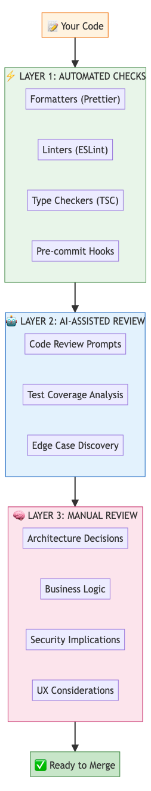
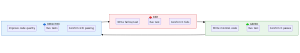
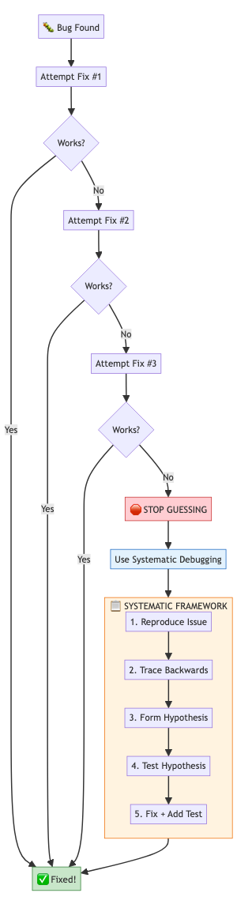
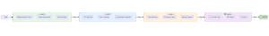

# Module 4: Quality & Verification

> **Applies to both API and CLI**: These quality patterns work whether you're using Codex programmatically or through the interactive CLI. The examples show CLI usage, but the principles transfer directly to API integrations.

## Overview

Quality isn't something you add at the end—it's built into every step. This module teaches you systematic approaches to catch issues early, maintain high standards, and build confidence in your code changes.

**Learning Objectives**:
- Implement multi-layer review patterns that catch different types of issues
- Apply test-driven development with Codex as your pair programmer
- Debug systematically instead of guessing
- Create quality gates that prevent bad code from progressing
- Master root cause analysis techniques

**Time**: 3-4 hours

---

## 1. Multi-Layer Review Patterns

### Why Multiple Layers?

Different review methods catch different problems:
- **Automated tools** catch syntax, formatting, and known anti-patterns instantly
- **AI review** catches logic errors, edge cases, and suggests improvements
- **Human review** catches architecture issues, business logic errors, and UX problems

No single layer catches everything. Stack them.

<p align="center">
  
</p>

### Layer 1: Automated Checks (Instant Feedback)

These run automatically via hooks—you don't even think about them.

**Setup once, benefit forever:**
```json
{
  "hooks": {
    "Write:Callback": {
      "command": "prettier",
      "args": ["--write", "$FILE_PATH"]
    },
    "Write:Validate": {
      "command": "eslint",
      "args": ["--quiet", "$FILE_PATH"]
    }
  }
}
```

**What this catches:**
| Tool | Catches | Example |
|------|---------|---------|
| Prettier | Inconsistent formatting | Mixed tabs/spaces, line length |
| ESLint | Code smells, bugs | Unused variables, missing returns |
| TypeScript | Type errors | Wrong argument types, null access |
| Pre-commit | Policy violations | Console.logs, debug code |

### Layer 2: AI-Assisted Review (Smart Analysis)

This is where Codex shines. Ask it to review with specific focus areas.

**Effective code review prompt:**
```bash
codex "Review the changes I just made. Focus on:

1. LOGIC: Are there any bugs or incorrect assumptions?
2. EDGE CASES: What inputs would break this code?
3. ERROR HANDLING: Are failures handled gracefully?
4. SECURITY: Any vulnerabilities (injection, auth bypass)?

Show the git diff first, then give specific feedback with line numbers."
```

**Example conversation:**
```
You: Review my changes for the login function

Codex: Looking at your changes to src/auth/login.ts:

⚠️ LOGIC ISSUE (line 34):
You're checking `user.isActive` after password validation.
If user is inactive, you still leak that the password was correct.
→ Check `isActive` before password comparison.

⚠️ EDGE CASE (line 42):
No handling for when `user.email` is null/undefined.
→ Add null check or use optional chaining.

✅ GOOD: Password comparison uses timing-safe comparison.
✅ GOOD: Failed attempts are rate-limited.

Suggested fix for line 34:
- if (user && await bcrypt.compare(password, user.hash)) {
-   if (!user.isActive) return { error: 'Account disabled' };
+ if (user && user.isActive && await bcrypt.compare(password, user.hash)) {
```

**💡 Pro Tip**: Be specific about what you want reviewed. "Review my code" gives generic feedback. "Review for SQL injection vulnerabilities" gives targeted, useful feedback.

### Layer 3: Manual Review (Human Judgment)

Humans excel at questions AI can't answer:
- Does this match what the product team asked for?
- Will users understand this interface?
- Does this fit our architecture vision?
- Are we solving the right problem?

**Your manual review checklist:**
```markdown
- [ ] Does this solve the actual user problem?
- [ ] Will this scale to 10x current usage?
- [ ] Can a new team member understand this in 6 months?
- [ ] Does this introduce technical debt we'll regret?
- [ ] Are there compliance/legal considerations?
```

### The Complete Review Workflow

```bash
# 1. Make your changes
codex "Add rate limiting to the /api/login endpoint"

# 2. Automated checks run via hooks (you see errors immediately)

# 3. AI review for logic and edge cases
codex "Review my rate limiting implementation:
- Is the algorithm correct?
- What happens at boundary conditions?
- Can it be bypassed?"

# 4. Fix issues found
codex "Fix the bypass vulnerability you identified"

# 5. Verify test coverage
codex "What tests should I add for the rate limiter?"

# 6. Add missing tests
codex "Add tests for the edge cases you identified"

# 7. Final human review - you look at the PR yourself
codex "Summarize all changes for my PR description"
```

---

## 2. Test-Driven Development with Codex

### The TDD Cycle

TDD isn't about testing—it's about design. Writing tests first forces you to think about the interface before the implementation.

<p align="center">
  
</p>

### TDD with Codex: A Complete Example

Let's build an email validator using TDD:

**🔴 RED: Write the failing test first**
```bash
codex "I need to validate email addresses. Write the test first,
following TDD. Don't implement yet—just the test."
```

Codex writes:
```typescript
// tests/emailValidator.test.ts
describe('validateEmail', () => {
  it('accepts valid email addresses', () => {
    expect(validateEmail('user@example.com')).toBe(true);
    expect(validateEmail('name.surname@company.co.uk')).toBe(true);
  });

  it('rejects invalid email addresses', () => {
    expect(validateEmail('not-an-email')).toBe(false);
    expect(validateEmail('@missing-local.com')).toBe(false);
    expect(validateEmail('missing-domain@')).toBe(false);
  });

  it('rejects empty and null inputs', () => {
    expect(validateEmail('')).toBe(false);
    expect(validateEmail(null)).toBe(false);
    expect(validateEmail(undefined)).toBe(false);
  });
});
```

```bash
# Run test - it fails because validateEmail doesn't exist
npm test
# ❌ FAIL: validateEmail is not defined
```

**🟢 GREEN: Implement minimal code to pass**
```bash
codex "Now implement validateEmail with the minimum code to pass these tests."
```

Codex writes:
```typescript
// src/emailValidator.ts
export function validateEmail(email: unknown): boolean {
  if (typeof email !== 'string' || !email) return false;
  return /^[^\s@]+@[^\s@]+\.[^\s@]+$/.test(email);
}
```

```bash
npm test
# ✅ PASS: All tests passing
```

**🔵 REFACTOR: Improve without breaking tests**
```bash
codex "The tests pass. Now refactor for clarity and add edge cases we missed."
```

Codex responds:
```typescript
// Improved with constants and better organization
const EMAIL_REGEX = /^[^\s@]+@[^\s@]+\.[^\s@]+$/;
const MAX_EMAIL_LENGTH = 254; // RFC 5321

export function validateEmail(email: unknown): boolean {
  if (typeof email !== 'string') return false;
  if (email.length === 0 || email.length > MAX_EMAIL_LENGTH) return false;
  return EMAIL_REGEX.test(email);
}

// Additional tests I'd recommend:
// - Email at max length (254 chars)
// - Email just over max length
// - Unicode characters in local part
// - Multiple @ symbols
```

### Edge Case Discovery Pattern

After basic implementation, ask Codex to find what you missed:

```bash
codex "What edge cases might break my email validator?
List inputs that a real attacker or buggy system might send."
```

Response:
```
Edge cases to consider:

1. UNICODE ATTACKS:
   - 'user@éxample.com' (IDN domains)
   - 'üser@example.com' (unicode in local part)

2. LENGTH ATTACKS:
   - 'a'*1000 + '@example.com' (very long local part)
   - 'a@' + 'b'*1000 + '.com' (very long domain)

3. SPECIAL CHARACTERS:
   - '"user name"@example.com' (quoted local part - valid!)
   - 'user+tag@example.com' (plus addressing)
   - 'user@[192.168.1.1]' (IP address domain)

4. BOUNDARY CASES:
   - 'a@b.c' (minimum valid email)
   - '.user@example.com' (leading dot)
   - 'user.@example.com' (trailing dot)

Shall I add tests for these?
```

**💡 Pro Tip**: Always ask "What would break this?" after implementing. Codex is great at adversarial thinking.

---

## 3. Systematic Debugging

### The 3-Attempt Rule

> **After 3 failed fix attempts, STOP GUESSING and switch to systematic debugging.**

Guessing wastes time and often introduces new bugs. Here's the pattern:

<p align="center">
  
</p>

### Systematic Debugging Framework

When you hit the wall after 3 attempts, use this framework:

**Phase 1: Reproduce Reliably**
```bash
codex "I'm getting intermittent 500 errors on /api/users. Help me create
a reliable reproduction case. What information do you need?"
```

Codex will ask for:
- Exact request that fails (curl command, headers, body)
- Error logs/stack trace
- When it started (recent changes?)
- Pattern (every time? Only certain users? Only under load?)

**Phase 2: Trace Backwards**
```bash
codex "Here's the stack trace: [paste trace]
Trace backwards from the error. What data becomes invalid and where?"
```

Example response:
```
Tracing backwards through your stack trace:

ERROR: Cannot read property 'email' of undefined
  at UserService.getProfile (user-service.ts:45)
  at UserController.show (user-controller.ts:23)
  at Router.handle (router.ts:156)

🔍 ANALYSIS:
Line 45: `return user.email` - 'user' is undefined
Line 38: `const user = await this.repo.findById(id)`
Line 23: `const id = req.params.id`

HYPOTHESIS: The user ID from params isn't finding a user.

Questions to investigate:
1. Is `id` the correct format? (string vs number)
2. Does this user exist in the database?
3. Is there a race condition where user is deleted mid-request?

To test, add logging at line 38:
console.log('Looking for user:', id, typeof id);
```

**Phase 3: Form and Test Hypothesis**
```bash
codex "I added logging. The ID is '123' (string) but the database
expects a number. How should I fix this properly?"
```

**Phase 4: Fix and Prevent Regression**
```bash
codex "Fix the type mismatch and add a test that would have caught this."
```

### Debugging Patterns

**Pattern: Binary Search with Git Bisect**

When "it worked yesterday":
```bash
codex "The login feature broke sometime this week. Help me use git bisect
to find the breaking commit. What commands do I run?"
```

Response:
```bash
# Start bisect
git bisect start

# Mark current (broken) as bad
git bisect bad

# Mark last known good commit (e.g., last Monday)
git bisect good abc123

# Git checks out a middle commit. Test it:
npm test

# Tell git the result
git bisect good  # or 'git bisect bad'

# Repeat until git identifies the breaking commit
# Usually finds it in ~7 steps for 100 commits
```

**Pattern: Isolation Testing**

When you don't know which component is failing:
```bash
codex "My API returns wrong data. I don't know if the bug is in:
- The controller
- The service layer
- The database query
- The serializer

Help me test each layer in isolation."
```

---

## 4. Proactive Quality Gates

Quality gates prevent bad code from progressing. Each gate must pass before moving forward.

<p align="center">
  
</p>

### Gate 1: Pre-Implementation

Before writing code, verify you understand the problem:

```bash
codex "I'm about to implement user notifications. Before I start:

1. What questions should I answer first?
2. What edge cases should I consider?
3. What's the simplest version I could ship?"
```

**Checklist:**
- [ ] Requirements are written down (not just in your head)
- [ ] Edge cases identified
- [ ] Test strategy defined
- [ ] Breaking changes identified

### Gate 2: During Implementation

While coding, maintain quality continuously:

```bash
# Every 30 minutes or after each feature chunk:
codex "Quick check on my progress:
- Am I following TDD?
- Any obvious issues in what I've written?
- Am I overcomplicating this?"
```

**Checklist:**
- [ ] Tests written before/with implementation
- [ ] Commits are small and focused
- [ ] No commented-out code accumulating
- [ ] No TODO without a ticket number

### Gate 3: Pre-Commit

Before committing, run comprehensive checks:

```bash
# Parallel review before commit
codex exec "Review my staged changes for bugs" > review.txt &
codex exec "Check test coverage for staged changes" > coverage.txt &
wait

# Check results
cat review.txt coverage.txt

# If clean, commit
git commit -m "Add user notifications"
```

**Automated gate with hooks:**
```json
{
  "hooks": {
    "Bash:Validate": {
      "command": "sh",
      "args": ["-c", "npm test && npm run lint && npm run typecheck"]
    }
  }
}
```

### Gate 4: Pre-PR

Before creating a PR, ensure it's ready for others:

```bash
codex "I'm about to create a PR. Check:

1. Do all tests pass?
2. Is there adequate test coverage?
3. Is the PR description clear?
4. Are there any debugging artifacts to remove?

Here's my diff: $(git diff main...HEAD)"
```

**💡 Pro Tip**: Create a personal pre-PR checklist and save it. Run it every time:

```bash
#!/bin/bash
# scripts/pre-pr-check.sh

echo "🔍 Running pre-PR checks..."

echo "1. Running tests..."
npm test || exit 1

echo "2. Running linter..."
npm run lint || exit 1

echo "3. Checking for debug code..."
if grep -r "console.log\|debugger" src/; then
  echo "❌ Found debug code!"
  exit 1
fi

echo "4. Checking for TODOs without tickets..."
if grep -r "TODO:" src/ | grep -v "TODO(#"; then
  echo "⚠️  Found TODOs without ticket numbers"
fi

echo "✅ All checks passed!"
```

---

## 5. Root Cause Analysis

### The 5 Whys Technique

Don't fix symptoms—fix causes. Ask "why" until you reach the root:

```
🐛 Bug: Users can't log in

Why? → The auth token is invalid
Why? → The token expired
Why? → Token refresh didn't run
Why? → The refresh timer was cleared
Why? → Component unmount clears all timers
ROOT CAUSE: Need to persist refresh timer or use a different approach
```

```bash
codex "Help me apply the 5 Whys to this bug: [describe bug]
Keep asking why until we find the root cause."
```

### Fault Tree Analysis

For complex bugs, map all possible causes:

```
Login Failure
├── Authentication Issue
│   ├── Invalid credentials
│   │   ├── Wrong password
│   │   └── Account doesn't exist
│   ├── Account locked
│   └── 2FA failure
├── Token Issue
│   ├── Token expired
│   ├── Token malformed
│   └── Wrong signing key
├── Infrastructure Issue
│   ├── Database unreachable
│   ├── Redis cache miss
│   └── Network timeout
└── Client Issue
    ├── CORS blocked
    ├── Cookie not sent
    └── JavaScript error
```

```bash
codex "Create a fault tree for this error: [error message]
List all possible causes organized by category."
```

### Strategic Instrumentation

When the bug is mysterious, add logging strategically:

```bash
codex "I need to debug why orders sometimes have wrong totals.
Where should I add logging to trace the calculation?"
```

Response:
```typescript
// Add logging at these decision points:

function calculateOrderTotal(order: Order): number {
  console.log('[CALC] Starting calculation for order:', order.id);

  let subtotal = 0;
  for (const item of order.items) {
    const itemTotal = item.price * item.quantity;
    console.log(`[CALC] Item ${item.id}: ${item.price} × ${item.quantity} = ${itemTotal}`);
    subtotal += itemTotal;
  }
  console.log('[CALC] Subtotal:', subtotal);

  const discount = calculateDiscount(order);
  console.log('[CALC] Discount applied:', discount);

  const tax = calculateTax(subtotal - discount);
  console.log('[CALC] Tax:', tax);

  const total = subtotal - discount + tax;
  console.log('[CALC] Final total:', total);

  return total;
}

// After finding the bug, remove or convert to debug-level logging
```

---

## 6. Quality Patterns Library

### Pattern: Defense in Depth

Validate at multiple layers—never trust data from the previous layer:

```typescript
// Layer 1: API Input (don't trust the client)
app.post('/users', async (req, res) => {
  const input = UserCreateSchema.parse(req.body); // Zod validation

  // Layer 2: Business Logic (don't trust the API layer)
  const user = await userService.create({
    email: input.email.toLowerCase().trim(),
    name: sanitizeHtml(input.name),
  });

  // Layer 3: Database (don't trust the service layer)
  // DB has constraints: unique email, NOT NULL, max lengths
});
```

### Pattern: Fail Fast with Context

Errors should scream useful information:

```typescript
// ❌ BAD: Silent or vague failure
function getUser(id) {
  const user = db.users.find(id);
  return user || null;  // Caller has no idea why it failed
}

// ✅ GOOD: Fail fast with context
function getUser(id: string): User {
  if (!id) {
    throw new Error('getUser requires an id');
  }

  const user = db.users.find(id);

  if (!user) {
    throw new NotFoundError(`User not found: ${id}`);
  }

  return user;
}
```

### Pattern: Invariant Assertions

Assert things that "should never happen"—they will:

```typescript
function processPayment(order: Order): Receipt {
  // These should never fail if upstream code is correct
  // But if they do, we want to know immediately
  invariant(order.total > 0, `Order total must be positive: ${order.total}`);
  invariant(order.items.length > 0, 'Order must have items');
  invariant(order.userId, 'Order must have a user');

  // Now process with confidence
  return paymentGateway.charge(order);
}

function invariant(condition: boolean, message: string): asserts condition {
  if (!condition) {
    throw new Error(`Invariant violation: ${message}`);
  }
}
```

---

## Key Takeaways

| Concept | Remember |
|---------|----------|
| **Multi-Layer Reviews** | Automated → AI → Human. Each catches different issues. |
| **TDD** | Red → Green → Refactor. Tests are design, not just verification. |
| **3-Attempt Rule** | Stop guessing after 3 tries. Go systematic. |
| **Quality Gates** | Each gate must pass before proceeding. No exceptions. |
| **Root Cause Analysis** | Fix causes, not symptoms. Ask "why" 5 times. |

---

## Try This Now

1. **Set up Layer 1**: Add formatting and linting hooks to your project
2. **Practice TDD**: Build a simple function (string formatter, validator) using Red-Green-Refactor
3. **Create your pre-PR script**: Write a `pre-pr-check.sh` that runs your quality checks
4. **Debug systematically**: Next bug you hit, use the 5 Whys before guessing

---

## Quick Reference

```bash
# AI Code Review
codex "Review my changes for: logic errors, edge cases, security issues"

# TDD Cycle
codex "Write a failing test for [feature]"  # RED
codex "Implement minimal code to pass"       # GREEN
codex "Refactor for clarity"                 # REFACTOR

# Systematic Debugging
codex "Help me trace backwards from this error: [stack trace]"
codex "Create a fault tree for: [symptom]"

# Pre-PR Check
codex "Review my PR for issues before I submit"
```

---

**Build quality in from the start!** → [Module 4 Exercises](../exercises/04-quality/)
