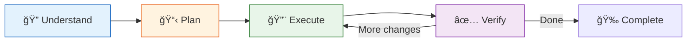
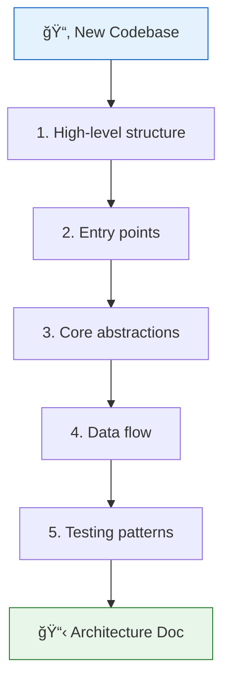
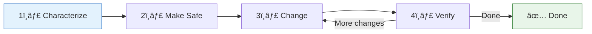
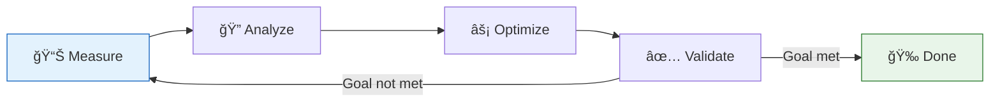

# Module 6: Domain-Specific Patterns

> **Prerequisite**: This module builds on Module 2 (Skills). You'll use existing skills and learn to create domain-specific skills for your team's recurring workflows.

## Overview

Master patterns for common software development scenarios: refactoring, architecture exploration, legacy code, performance, and security. More importantly, learn to recognize when a pattern should become a reusable skill.

**Learning Objectives**:
- Navigate and refactor large codebases safely
- Explore and understand unfamiliar architecture
- Work effectively with legacy code
- Optimize performance systematically
- Review security comprehensively
- Create domain-specific skills for recurring patterns

**Time**: 3-4 hours

---

## 1. Refactoring Large Codebases

### Refactoring Principles with Codex

1. **Understand Before Changing**: Explore first, refactor second
2. **Test Safety Net**: Tests must pass before and after
3. **Incremental Changes**: Small, verifiable steps
4. **Commit Often**: Each step is a commit

### Refactoring Workflow

<!-- Note: Edge labels may render with gray backgrounds on GitHub - this is a known limitation -->


**Phase 1: Understanding**

Before touching any code, understand what you're dealing with:

```
You: "I need to refactor the payment processing module.
      It's grown to 2000 lines and is hard to maintain.
      Help me understand the current structure first."

Codex: I'll analyze the payment module. Let me explore...

Found in src/payments/processor.ts:
- PaymentProcessor class (1847 lines)
- 23 public methods
- 45 private methods
- Direct dependencies: Stripe, PayPal, database, logger, emailer

Key issues identified:
1. Single class handles all payment providers (violates SRP)
2. Database queries mixed with business logic
3. Duplicate validation code in 8 methods
4. No interface - hard to test or swap providers

Current flow:
  processPayment() → validateCard() → chargeProvider() →
  saveTransaction() → sendReceipt() → updateInventory()

Recommendation: Extract provider-specific logic into separate
classes behind a PaymentProvider interface.
```

**Phase 2: Planning**

Use `superpowers:writing-plans` to create a safe refactoring plan:

```
You: "Use superpowers:writing-plans to create a refactoring plan
      for extracting payment providers into separate classes."

Codex: Using superpowers:writing-plans.

# IMPLEMENTATION_PLAN.md

## Goal
Extract payment provider logic into separate classes behind
a common interface, reducing PaymentProcessor from 1847 to ~400 lines.

## Stage 1: Create Interface & Tests
**Goal**: Define PaymentProvider interface and add characterization tests
**Success Criteria**:
- [ ] PaymentProvider interface defined
- [ ] Existing tests still pass
- [ ] Characterization tests cover current behavior

## Stage 2: Extract Stripe Provider
**Goal**: Move Stripe-specific code to StripeProvider class
**Success Criteria**:
- [ ] StripeProvider implements PaymentProvider
- [ ] All Stripe tests pass
- [ ] PaymentProcessor uses StripeProvider

## Stage 3: Extract PayPal Provider
**Goal**: Move PayPal-specific code to PayPalProvider class
**Success Criteria**:
- [ ] PayPalProvider implements PaymentProvider
- [ ] All PayPal tests pass
- [ ] PaymentProcessor uses PayPalProvider

## Stage 4: Clean Up
**Goal**: Remove duplication, improve PaymentProcessor
**Success Criteria**:
- [ ] No duplicate validation code
- [ ] PaymentProcessor under 500 lines
- [ ] All tests pass
```

**Phase 3: Execution**

Execute incrementally with verification at each step:

```
You: "Execute Stage 1. Create the PaymentProvider interface
      and add characterization tests for current behavior."

Codex: Starting Stage 1...

Creating interface:
// src/payments/PaymentProvider.ts
export interface PaymentProvider {
  name: string;
  charge(amount: number, token: string): Promise<ChargeResult>;
  refund(transactionId: string): Promise<RefundResult>;
  validatePaymentMethod(token: string): Promise<ValidationResult>;
}

Adding characterization tests to capture current behavior...

Running tests: npm test -- --grep "payment"
✓ 47 tests passing

Stage 1 complete. Ready for review before Stage 2.
```

### Refactoring Patterns

#### Pattern: Extract Function

When a function does too much, extract cohesive chunks into separate functions.

```
You: "This createOrder function is 150 lines. Help me extract
      the validation logic into its own function."

Codex: I'll extract the validation logic (lines 12-45).

**Before:**
// src/orders.ts
function createOrder(data: OrderData): Order {
  // Validation (lines 12-45)
  if (!data.items || data.items.length === 0) {
    throw new Error('Order must have items');
  }
  if (!data.customer.email) {
    throw new Error('Customer email required');
  }
  if (!data.customer.address) {
    throw new Error('Shipping address required');
  }
  for (const item of data.items) {
    if (item.quantity < 1) {
      throw new Error('Invalid quantity');
    }
    if (!inventory.has(item.sku)) {
      throw new Error(`Item ${item.sku} not found`);
    }
  }

  // Rest of function (lines 46-150)...
}

**After:**
function validateOrderData(data: OrderData): void {
  if (!data.items || data.items.length === 0) {
    throw new Error('Order must have items');
  }
  if (!data.customer.email) {
    throw new Error('Customer email required');
  }
  if (!data.customer.address) {
    throw new Error('Shipping address required');
  }
  for (const item of data.items) {
    if (item.quantity < 1) {
      throw new Error('Invalid quantity');
    }
    if (!inventory.has(item.sku)) {
      throw new Error(`Item ${item.sku} not found`);
    }
  }
}

function createOrder(data: OrderData): Order {
  validateOrderData(data);  // Now 1 line instead of 34

  // Rest of function...
}

Running tests: npm test
✓ All 23 tests passing
```

#### Pattern: Rename for Clarity

Unclear names make code hard to understand. Rename systematically.

```
You: "The variable 'd' is used throughout the codebase.
      Rename it to 'discountPercent' for clarity."

Codex: I'll find all usages and rename systematically.

Searching for 'd' as a variable name...
Found 12 usages across 4 files:
- src/pricing.ts: 6 usages
- src/cart.ts: 3 usages
- src/checkout.ts: 2 usages
- src/reports.ts: 1 usage

**Before:**
// src/pricing.ts
function calculateTotal(items: Item[], d: number): number {
  const subtotal = items.reduce((sum, i) => sum + i.price, 0);
  return subtotal * (1 - d / 100);
}

**After:**
// src/pricing.ts
function calculateTotal(items: Item[], discountPercent: number): number {
  const subtotal = items.reduce((sum, item) => sum + item.price, 0);
  return subtotal * (1 - discountPercent / 100);
}

Renamed in all 4 files.
Running tests: npm test
✓ All tests passing
```

#### Pattern: Move to Module

When related functions are scattered, consolidate them into a focused module.

```
You: "Email-related functions are spread across 5 files.
      Consolidate them into a dedicated email module."

Codex: I'll identify and move email functions incrementally.

Found email-related functions:
- src/orders.ts: sendOrderConfirmation()
- src/auth.ts: sendPasswordReset(), sendWelcomeEmail()
- src/shipping.ts: sendShippingNotification()
- src/support.ts: sendTicketResponse()

**Step 1: Create the module**
// src/email/index.ts
export { sendEmail } from './sender';
export { templates } from './templates';

**Step 2: Move first function**
// src/email/notifications.ts
export async function sendOrderConfirmation(order: Order): Promise<void> {
  await sendEmail({
    to: order.customer.email,
    template: templates.orderConfirmation,
    data: { order }
  });
}

**Step 3: Update import in orders.ts**
// Before:
function sendOrderConfirmation(order) { ... }

// After:
import { sendOrderConfirmation } from './email/notifications';

Running tests after each move...
✓ Tests passing after moving sendOrderConfirmation
✓ Tests passing after moving sendPasswordReset
✓ Tests passing after moving sendWelcomeEmail
✓ Tests passing after moving sendShippingNotification
✓ Tests passing after moving sendTicketResponse

Final structure:
src/email/
├── index.ts           # Public exports
├── sender.ts          # Core send function
├── templates.ts       # Email templates
└── notifications.ts   # All notification functions
```

#### Pattern: Extract Interface

When code depends on a concrete implementation, extract an interface to enable testing and flexibility.

```
You: "The ReportGenerator class directly uses PostgresDB.
      Extract an interface so we can use different databases
      and mock it in tests."

Codex: I'll extract a Database interface and update the code.

**Before:**
// src/reports/generator.ts
import { PostgresDB } from '../db/postgres';

class ReportGenerator {
  private db: PostgresDB;

  constructor() {
    this.db = new PostgresDB();  // Hard dependency
  }

  async generateSalesReport(): Promise<Report> {
    const sales = await this.db.query('SELECT * FROM sales');
    // ... process sales
  }
}

**After:**
// src/db/database.interface.ts
export interface Database {
  query<T>(sql: string, params?: any[]): Promise<T[]>;
  execute(sql: string, params?: any[]): Promise<void>;
}

// src/db/postgres.ts
import { Database } from './database.interface';

export class PostgresDB implements Database {
  async query<T>(sql: string, params?: any[]): Promise<T[]> { ... }
  async execute(sql: string, params?: any[]): Promise<void> { ... }
}

// src/reports/generator.ts
import { Database } from '../db/database.interface';

class ReportGenerator {
  constructor(private db: Database) {}  // Injected dependency

  async generateSalesReport(): Promise<Report> {
    const sales = await this.db.query('SELECT * FROM sales');
    // ... process sales
  }
}

// Now tests can use a mock:
// tests/reports/generator.test.ts
class MockDatabase implements Database {
  async query<T>(): Promise<T[]> {
    return [{ id: 1, amount: 100 }] as T[];
  }
  async execute(): Promise<void> {}
}

test('generates sales report', async () => {
  const generator = new ReportGenerator(new MockDatabase());
  const report = await generator.generateSalesReport();
  expect(report.total).toBe(100);
});

✓ All tests passing
✓ ReportGenerator now testable without real database
```

---

## 2. Architecture Exploration

### Exploring Unfamiliar Codebases

When you join a new project or need to understand unfamiliar code, use a systematic breadth-first approach:



### Example: Exploring an E-commerce Backend

```
You: "I just joined this project. Help me understand
      the architecture. Start with the high-level structure."

Codex: Exploring the codebase...

## High-Level Structure

    src/
    ├── api/           # REST endpoints (Express routes)
    ├── services/      # Business logic layer
    ├── models/        # Database models (Sequelize)
    ├── middleware/    # Auth, logging, error handling
    ├── jobs/          # Background workers (Bull queues)
    ├── utils/         # Shared utilities
    └── config/        # Environment configuration

## Entry Points
- src/index.ts - Main server startup
- src/api/routes.ts - All API routes registered here
- src/jobs/worker.ts - Background job processor

## Key Patterns
- Repository pattern for data access
- Service layer for business logic
- Dependency injection via constructor params
- Event-driven for async operations (orders → inventory → shipping)

Want me to trace a specific feature, like order processing?

You: "Yes, trace how an order flows through the system."

Codex: Tracing order flow...

## Order Processing Flow

1. **API Layer** (`src/api/orders.ts:45`)
   POST /orders → OrderController.create()

2. **Validation** (`src/middleware/validation.ts:23`)
   validateOrderSchema() checks items, payment, shipping

3. **Service Layer** (`src/services/OrderService.ts:78`)
   OrderService.createOrder():
   - Validates inventory availability
   - Calculates totals and tax
   - Creates order record
   - Emits 'order.created' event

4. **Event Handlers** (`src/events/orderHandlers.ts`)
   On 'order.created':
   - InventoryService.reserve() - reserves items
   - PaymentService.charge() - processes payment
   - NotificationService.sendConfirmation()

5. **Background Jobs** (`src/jobs/shipping.ts`)
   ShippingJob processes fulfillment async

Key files to understand order logic:
- src/services/OrderService.ts (main business logic)
- src/models/Order.ts (data structure)
- src/events/orderHandlers.ts (side effects)
```

### Saving Architecture Knowledge

Save your findings so you don't lose context:

```bash
# Create architecture documentation
codex exec "Document the architecture of this codebase
in a format suitable for onboarding new developers" > docs/ARCHITECTURE.md

# Create a context file for future sessions
codex exec "Summarize the key abstractions and patterns
in bullet points" > contexts/architecture.md
```

Context files help future Codex sessions understand the codebase faster.

### Architecture Mapping Patterns

#### Pattern: Feature Tracing

Pick a feature and trace it end-to-end to understand how the system works.

```
You: "I need to understand how authentication works in this app.
      Trace the login flow from API to database."

Codex: I'll trace the authentication flow...

Searching for auth-related code:
  grep -r "login\|authenticate\|auth" src/

## Login Flow Trace

1. **Entry Point**: POST /api/auth/login
   File: src/api/routes/auth.ts:24

    router.post('/login', authController.login);

2. **Controller**: Validates input, calls service
   File: src/controllers/AuthController.ts:45

    async login(req, res) {
      const { email, password } = req.body;
      const result = await this.authService.authenticate(email, password);
      res.json({ token: result.token });
    }

3. **Service**: Business logic
   File: src/services/AuthService.ts:67

    async authenticate(email: string, password: string) {
      const user = await this.userRepo.findByEmail(email);
      if (!user) throw new UnauthorizedError('Invalid credentials');

      const valid = await bcrypt.compare(password, user.passwordHash);
      if (!valid) throw new UnauthorizedError('Invalid credentials');

      return { token: this.jwtService.sign({ userId: user.id }) };
    }

4. **Repository**: Database access
   File: src/repositories/UserRepository.ts:23

    async findByEmail(email: string): Promise<User | null> {
      return this.db.query('SELECT * FROM users WHERE email = $1', [email]);
    }

## Dependencies Identified
- bcrypt (password hashing)
- jsonwebtoken (JWT generation)
- PostgreSQL (user storage)

## Security Notes
- Passwords hashed with bcrypt (good)
- JWT expiry: 24 hours (check if acceptable)
- No rate limiting on login endpoint (potential issue)
```

#### Pattern: Dependency Mapping

Understand how modules relate to identify core vs. peripheral code.

```
You: "Map the dependencies in this codebase. Which modules
      are core and which are leaf nodes?"

Codex: I'll analyze import statements to build a dependency graph...

Scanning 147 source files...

## Dependency Analysis

### Core Modules (most depended upon)
These are imported by many other modules - changes here have wide impact:

    src/db/connection.ts        → imported by 23 modules
    src/utils/logger.ts         → imported by 19 modules
    src/config/index.ts         → imported by 18 modules
    src/models/User.ts          → imported by 12 modules
    src/services/AuthService.ts → imported by 8 modules

### Leaf Modules (no dependents)
These import others but nothing imports them - safe to modify:

    src/api/routes/health.ts
    src/jobs/cleanup.ts
    src/scripts/migrate.ts
    src/cli/commands/seed.ts

### Circular Dependencies Found âš ï¸
    src/services/OrderService.ts â†â†’ src/services/InventoryService.ts

    OrderService imports InventoryService (to check stock)
    InventoryService imports OrderService (to get pending orders)

    Recommendation: Extract shared logic to a new module or use events.

### Dependency Graph (simplified)

    ┌─────────────â”
    │   config    │
    └──────┬──────┘
           │
    ┌──────▼──────â”
    │     db      │
    └──────┬──────┘
           │
    ┌──────▼──────┠    ┌─────────────â”
    │   models    │◄────│   repos     │
    └──────┬──────┘     └──────┬──────┘
           │                   │
    ┌──────▼───────────────────▼──────â”
    │           services              │
    └──────────────┬──────────────────┘
                   │
    ┌──────────────▼──────────────────â”
    │        controllers              │
    └──────────────┬──────────────────┘
                   │
    ┌──────────────▼──────────────────â”
    │           routes                │
    └─────────────────────────────────┘
```

#### Pattern: Data Flow Analysis

Trace how data moves and transforms through the system.

```
You: "I need to understand how product data flows from
      the admin dashboard to the customer-facing storefront."

Codex: I'll trace the product data flow...

## Product Data Flow

### 1. Data Entry (Admin Dashboard)

    Admin UI (React)
        │
        â–¼ POST /api/admin/products
    AdminProductController.create()
        │
        â–¼ Validates & transforms
    ProductService.createProduct()
        │
        â–¼ INSERT INTO products
    PostgreSQL (products table)

### 2. Data Processing (Background)

    ProductCreatedEvent
        │
        ├──▶ SearchIndexer.indexProduct()
        │        │
        │        ▼
        │    Elasticsearch (products index)
        │
        ├──▶ ImageProcessor.generateThumbnails()
        │        │
        │        ▼
        │    S3 (product-images bucket)
        │
        └──▶ CacheWarmer.warmProductCache()
                 │
                 â–¼
             Redis (product:{id})

### 3. Data Retrieval (Storefront)

    Customer UI (React)
        │
        â–¼ GET /api/products/:id
    ProductController.getProduct()
        │
        â–¼ Check cache first
    Redis.get('product:123')
        │
        ├── Cache HIT → Return cached data
        │
        └── Cache MISS
                │
                â–¼
            ProductRepository.findById()
                │
                â–¼
            PostgreSQL → Cache → Return

### Data Transformations

| Stage | Format | Fields Added/Removed |
|-------|--------|---------------------|
| Admin Input | FormData | Raw upload |
| Database | ProductRow | id, timestamps, slugified name |
| Cache | ProductCache | Pre-computed pricing, image URLs |
| API Response | ProductDTO | Filtered by user permissions |
| Storefront | ProductView | Formatted prices, availability |

### Key Files
- src/services/ProductService.ts (business logic)
- src/events/productHandlers.ts (async processing)
- src/transformers/ProductTransformer.ts (DTO mapping)
```

---

## 3. Working with Legacy Code

### Legacy Code Principles

Legacy code isn't just old code—it's code without tests, unclear intent, or tribal knowledge. The goal isn't to rewrite it, but to make it safe to change.

1. **Characterization Tests**: Understand behavior before changing
2. **Seams**: Find safe points to make changes
3. **Incremental Improvement**: Leave code better than you found it
4. **Document As You Learn**: Future you will thank you

### Example: Adding a Feature to Legacy Code

```
You: "I need to add discount codes to the checkout process.
      The checkout code is 8 years old with no tests.
      How do I approach this safely?"

Codex: This is a classic legacy code situation. Let's work through
it safely using characterization tests and seams.

First, let me analyze the current checkout code...

Found: src/checkout.js (1,247 lines, 0 tests)

Key function: processCheckout(cart, user, paymentInfo)
- Lines 45-312 (267 lines in one function!)
- Mixes validation, pricing, payment, and email
- Global state: window.cartState, window.userSession
- No dependency injection - hard to test

**Step 1: Characterization Tests**

Before changing anything, let's capture current behavior.
I'll create tests that document what the code DOES, not what
it SHOULD do:

// tests/checkout.characterization.test.js
describe('checkout - characterization', () => {
  it('calculates subtotal as sum of item prices', () => {
    const cart = { items: [{price: 10}, {price: 20}] };
    const result = calculateSubtotal(cart);
    expect(result).toBe(30); // Documents current behavior
  });

  it('applies 8% tax for CA addresses', () => {
    // Even if this rate is wrong, test what it DOES
    const result = calculateTax(100, 'CA');
    expect(result).toBe(8);
  });
});

**Step 2: Find a Seam**

A seam is a place where you can alter behavior without editing code.
I found one: the pricing calculation is called from line 89.

Current code:
  const total = calculatePricing(cart, user);

This function can be extracted and tested independently.

**Step 3: Extract and Add Your Feature**

I'll use the Sprout Method pattern:
1. Create new function: applyDiscountCode(cart, code)
2. Add tests for the new function
3. Call it from the seam point
4. Leave the rest of processCheckout untouched

Want me to implement this approach?

You: "Yes, implement the discount code feature using that approach."

Codex: Using superpowers:test-driven-development for the new code.

**Red**: Writing test first...
// tests/discount.test.js
describe('applyDiscountCode', () => {
  it('applies percentage discount', () => {
    const cart = { subtotal: 100 };
    const result = applyDiscountCode(cart, 'SAVE20');
    expect(result.discount).toBe(20);
  });

  it('rejects expired codes', () => {
    const cart = { subtotal: 100 };
    expect(() => applyDiscountCode(cart, 'EXPIRED'))
      .toThrow('Discount code expired');
  });
});

Running: npm test -- discount
✗ 2 tests failing (function doesn't exist)

**Green**: Implementing...
// src/discount.js (new file - isolated from legacy code)
export function applyDiscountCode(cart, code) {
  const discount = await lookupDiscount(code);
  if (discount.expired) throw new Error('Discount code expired');
  return {
    ...cart,
    discount: cart.subtotal * (discount.percent / 100)
  };
}

Running: npm test -- discount
✓ 2 tests passing

**Integration**: Adding to checkout seam...
// In processCheckout, at line 89:
if (discountCode) {
  cart = applyDiscountCode(cart, discountCode);
}
const total = calculatePricing(cart, user);

Characterization tests still pass: ✓
New feature works: ✓
Legacy code unchanged: ✓
```

### Legacy Code Workflow

The key insight: don't try to understand or fix everything. Focus only on what you need to change, and leave the rest alone.



```
You: "I need to add a 'priority shipping' option to the checkout.
      The checkout code is 12 years old, written by someone who left,
      and has zero tests. Where do I even start?"

Codex: This is classic legacy code territory. Let's work through
the safe modification workflow.

## Step 1: Characterization (Understand Current Behavior)

First, I need to understand what the checkout currently does,
without trying to understand ALL of it.

Analyzing src/checkout.php...

I found the shipping calculation at lines 234-298.
Current behavior:
- Standard shipping: $5.99 flat rate
- Free shipping: orders over $50
- Express shipping: $12.99 (2-day)

Let me write characterization tests that capture THIS behavior:

// tests/checkout/shipping.characterization.test.js
describe('shipping calculation - characterization', () => {
  // These tests document CURRENT behavior, not desired behavior

  it('charges $5.99 for standard shipping under $50', () => {
    const result = calculateShipping({ total: 49.99, method: 'standard' });
    expect(result).toBe(5.99);
  });

  it('gives free standard shipping over $50', () => {
    const result = calculateShipping({ total: 50.01, method: 'standard' });
    expect(result).toBe(0);
  });

  it('charges $12.99 for express regardless of total', () => {
    const result = calculateShipping({ total: 100, method: 'express' });
    expect(result).toBe(12.99);
  });
});

Running tests... ✓ 3 passing

Now I have a safety net for the shipping logic.

## Step 2: Make Change Safe (Find a Seam)

A "seam" is a place where I can insert new behavior without
modifying existing code. Looking for one...

Found seam at line 267:

    // Current code
    if ($method === 'express') {
        return 12.99;
    }
    // I can add new shipping method here ↠SEAM

This is where I can add priority shipping without touching
the existing standard/express logic.

## Step 3: Make the Change

Adding priority shipping using the Sprout Method:

// New function - fully tested, isolated from legacy
function calculatePriorityShipping(order) {
  const baseRate = 19.99;
  const weightSurcharge = order.weight > 5 ? 5.00 : 0;
  return baseRate + weightSurcharge;
}

// tests/checkout/priority-shipping.test.js
describe('priority shipping', () => {
  it('charges $19.99 base rate', () => {
    expect(calculatePriorityShipping({ weight: 2 })).toBe(19.99);
  });

  it('adds $5 surcharge for heavy packages', () => {
    expect(calculatePriorityShipping({ weight: 6 })).toBe(24.99);
  });
});

Integration point (minimal change to legacy):

    // In checkout.php, at the seam (line 267)
    if ($method === 'priority') {
        return calculatePriorityShipping($order);  // ↠One line added
    }

## Step 4: Verify

Running all tests:
✓ Characterization tests still pass (didn't break existing)
✓ New priority shipping tests pass (new feature works)

The legacy checkout code is almost untouched. We added ONE line
to the legacy file and put all new logic in tested, isolated code.

Want me to commit this change?
```

**Key Principles**:

| Principle | Why |
|-----------|-----|
| Test current behavior first | You can't safely change what you don't understand |
| Find seams, don't rewrite | Minimize changes to untested code |
| New code goes in new files | Keep new code isolated and tested |
| Stop when done | Don't try to "fix" the legacy code - just make your change |

### Legacy Code Patterns

#### Pattern: Sprout Method

Add new functionality without touching risky legacy code.

```
You: "I need to add email validation to this 500-line
      registration function. It has no tests."

Codex: I'll use the Sprout Method - add new code in a
separate, tested function.

**Before** (legacy code - don't touch):
// src/registration.js - 500 lines, no tests
function registerUser(data) {
  // ... 500 lines of untested spaghetti ...
  saveUser(data);
}

**Sprout** (new code - fully tested):
// src/validation/email.js - NEW FILE
export function validateEmail(email) {
  if (!email) throw new ValidationError('Email required');
  if (!email.includes('@')) throw new ValidationError('Invalid email');
  if (isDisposableEmail(email)) throw new ValidationError('Disposable emails not allowed');
  return true;
}

// tests/validation/email.test.js - NEW FILE
describe('validateEmail', () => {
  it('rejects missing email', () => { ... });
  it('rejects invalid format', () => { ... });
  it('rejects disposable domains', () => { ... });
});

**Integration** (minimal change to legacy):
// src/registration.js - add ONE line
function registerUser(data) {
  validateEmail(data.email);  // ↠Only change to legacy code
  // ... rest unchanged ...
}

✓ New code is tested
✓ Legacy code almost untouched
✓ Risk minimized
```

#### Pattern: Wrap Method

Add behavior before/after legacy code without modifying it.

```
You: "I need to add logging around this payment processing
      function, but I can't modify it - too risky."

Codex: I'll use the Wrap Method - rename the original and
wrap it with new behavior.

**Before:**
// src/payments.js
function processPayment(order) {
  // 200 lines of critical payment logic
  // No tests, handles real money
}

**After:**
// src/payments.js
function processPaymentCore(order) {  // ↠Renamed original
  // 200 lines unchanged
}

function processPayment(order) {  // ↠New wrapper with original name
  const startTime = Date.now();
  logger.info('Payment started', { orderId: order.id });

  try {
    const result = processPaymentCore(order);  // ↠Call original
    logger.info('Payment succeeded', {
      orderId: order.id,
      duration: Date.now() - startTime
    });
    return result;
  } catch (error) {
    logger.error('Payment failed', {
      orderId: order.id,
      error: error.message
    });
    throw error;
  }
}

✓ Original logic untouched (just renamed)
✓ All callers automatically get logging
✓ Can test the wrapper independently
```

#### Pattern: Extract and Override

Make untestable code testable by extracting dependencies.

```
You: "This ReportGenerator directly calls the database.
      I can't test it without a real database connection."

Codex: I'll extract the database call to a method we can
override in tests.

**Before** (untestable):
// src/reports/generator.js
class ReportGenerator {
  generateSalesReport(startDate, endDate) {
    // Direct database call - can't test without real DB
    const sales = db.query(`
      SELECT * FROM sales
      WHERE date BETWEEN $1 AND $2
    `, [startDate, endDate]);

    return this.formatReport(sales);
  }
}

**After** (testable):
// src/reports/generator.js
class ReportGenerator {
  // Extracted to overridable method
  getSalesData(startDate, endDate) {
    return db.query(`
      SELECT * FROM sales
      WHERE date BETWEEN $1 AND $2
    `, [startDate, endDate]);
  }

  generateSalesReport(startDate, endDate) {
    const sales = this.getSalesData(startDate, endDate);
    return this.formatReport(sales);
  }
}

// tests/reports/generator.test.js
class TestableReportGenerator extends ReportGenerator {
  getSalesData() {
    // Override with test data - no database needed
    return [
      { id: 1, amount: 100, date: '2024-01-15' },
      { id: 2, amount: 200, date: '2024-01-16' },
    ];
  }
}

test('formats sales report correctly', () => {
  const generator = new TestableReportGenerator();
  const report = generator.generateSalesReport('2024-01-01', '2024-01-31');
  expect(report.total).toBe(300);
});

✓ Original class unchanged except extracted method
✓ Tests run fast (no database)
✓ Can test all formatting logic
```

---

## 4. Performance Optimization

### Performance Workflow

**The Golden Rule**: Measure before optimizing. Guessing at bottlenecks wastes time.



```
You: "The product listing page takes 4 seconds to load.
      Help me systematically improve it to under 1 second."

Codex: I'll follow the performance workflow: Measure → Analyze → Optimize → Validate.

## Phase 1: Measure

First, let's establish baselines and identify bottlenecks.

Current measurements:
- Total page load: 4.2s
- API response (GET /products): 2.8s  ↠Main bottleneck
- Frontend render: 0.9s
- Asset loading: 0.5s

Goal: < 1 second total

## Phase 2: Analyze

Investigating the API endpoint...

GET /products breakdown:
- Database query: 2.1s  ↠75% of API time
- Serialization: 0.4s
- Network: 0.3s

Database analysis:
- Query fetches 500 products with 12 JOINs
- N+1 query pattern: 501 queries total
- No index on products.category_id
- No pagination (returns ALL products)

## Phase 3: Optimize

Recommended optimizations (by impact):

1. **Add pagination** (estimated: -1.5s)
   Limit to 20 products per page

2. **Fix N+1 queries** (estimated: -0.8s)
   Use eager loading for associations

3. **Add database index** (estimated: -0.3s)
   CREATE INDEX idx_products_category ON products(category_id)

Shall I implement these in order?

You: "Yes, start with pagination."

Codex: Implementing pagination...

// Before: Returns all 500 products
const products = await Product.findAll({
  include: [Category, Images, Reviews]
});

// After: Paginated, eager loaded
const products = await Product.findAll({
  include: [Category, Images, Reviews],
  limit: 20,
  offset: (page - 1) * 20
});

Running tests... ✓ All passing

## Phase 4: Validate

New measurements:
- API response: 0.4s (was 2.8s) ✓
- Total page load: 0.9s (was 4.2s) ✓

Goal achieved! < 1 second total.
```

### Performance Patterns

#### Pattern: Database Query Optimization

The most common performance issue is inefficient database queries.

```
You: "The user dashboard is slow. I suspect database issues."

Codex: I'll analyze the database queries...

Enabling query logging and profiling...

## Query Analysis for GET /dashboard

Found 47 queries executing in 1.8 seconds.

### Problem 1: N+1 Query Pattern

    // Current code - executes 1 + N queries
    const users = await User.findAll();
    for (const user of users) {
      user.orders = await Order.findByUserId(user.id);  // N queries!
    }

    // Fix - single query with JOIN
    const users = await User.findAll({
      include: [{ model: Order }]  // 1 query with JOIN
    });

    Result: 47 queries → 3 queries

### Problem 2: Missing Index

    EXPLAIN ANALYZE SELECT * FROM orders WHERE user_id = 123;
    -- Seq Scan on orders (cost=0.00..1847.00 rows=50000)
    -- Execution time: 234ms

    CREATE INDEX idx_orders_user_id ON orders(user_id);

    -- After index:
    -- Index Scan using idx_orders_user_id (cost=0.29..8.31 rows=1)
    -- Execution time: 0.4ms

### Problem 3: Over-fetching

    // Fetching all columns when only need 3
    SELECT * FROM products;  -- 25 columns

    // Fix - fetch only needed columns
    SELECT id, name, price FROM products;

## Results
Before: 1.8 seconds
After:  0.12 seconds (93% improvement)
```

#### Pattern: Caching Strategy

Choose the right caching layer for your data.

```
You: "Help me implement caching for product data.
      Some data changes rarely, some changes often."

Codex: I'll design a multi-layer caching strategy.

## Caching Analysis

| Data Type | Change Frequency | Best Cache Layer |
|-----------|-----------------|------------------|
| Product catalog | Daily | CDN + Redis (1 hour TTL) |
| Product prices | Hourly | Redis (5 min TTL) |
| Inventory count | Per transaction | None (always fresh) |
| User cart | Per action | Redis (session-based) |

## Implementation

### Layer 1: CDN Caching (static content)
// Set cache headers for product images
res.setHeader('Cache-Control', 'public, max-age=86400');  // 24 hours

### Layer 2: Application Cache (Redis)
async function getProduct(id) {
  // Check cache first
  const cached = await redis.get(`product:${id}`);
  if (cached) return JSON.parse(cached);

  // Cache miss - fetch from DB
  const product = await db.products.findById(id);

  // Cache for 5 minutes
  await redis.setex(`product:${id}`, 300, JSON.stringify(product));

  return product;
}

### Layer 3: Cache Invalidation
// When product is updated, invalidate cache
async function updateProduct(id, data) {
  await db.products.update(id, data);
  await redis.del(`product:${id}`);  // Invalidate
  await cdn.purge(`/products/${id}`);  // Purge CDN
}

## Cache Hit Rates (after 1 week)
- Product catalog: 94% hit rate
- Prices: 78% hit rate
- Average response time: 45ms (was 380ms)
```

#### Pattern: Bundle Size Optimization

Large JavaScript bundles slow down page loads.

```
You: "Our main bundle is 2.4MB. Help me reduce it."

Codex: I'll analyze and optimize the bundle.

Running webpack-bundle-analyzer...

## Bundle Analysis

Total: 2.4MB

Top offenders:
- moment.js: 548KB (23%) - includes ALL locales
- lodash: 312KB (13%) - importing entire library
- chart.js: 289KB (12%)
- date-fns: 0KB - not used but imported

## Optimizations

### 1. Replace moment.js with date-fns (tree-shakeable)
// Before
import moment from 'moment';  // 548KB
moment(date).format('YYYY-MM-DD');

// After
import { format } from 'date-fns';  // 2KB (only what you use)
format(date, 'yyyy-MM-dd');

Savings: 546KB

### 2. Import only needed lodash functions
// Before
import _ from 'lodash';  // 312KB
_.debounce(fn, 300);

// After
import debounce from 'lodash/debounce';  // 4KB
debounce(fn, 300);

Savings: 308KB

### 3. Code split chart.js (only load when needed)
// Before - loaded on every page
import Chart from 'chart.js';

// After - loaded only on dashboard
const Chart = await import('chart.js');

Savings: 289KB (moved to separate chunk)

### 4. Remove unused import
// Delete this unused import
import { unusedFunction } from 'date-fns';

## Results
Before: 2.4MB
After: 1.2MB (50% reduction)
First load time: 3.2s → 1.6s
```

### Coordinating Performance Investigation

For complex performance issues, investigate multiple areas in parallel:

```bash
# Run investigations concurrently in the background
codex exec "Profile API endpoints in api/ and describe latency hotspots" > perf-api.txt &
codex exec "Analyze database queries in db/ for missing indexes" > perf-db.txt &
codex exec "Analyze bundle size using webpack-bundle-analyzer output" > perf-bundle.txt &
codex exec "Review caching strategy and TTLs in config/" > perf-cache.txt &
wait

# Synthesize findings
codex "Performance investigation results:
API: $(cat perf-api.txt)
Database: $(cat perf-db.txt)
Bundle: $(cat perf-bundle.txt)
Cache: $(cat perf-cache.txt)

Rank the top 3 optimizations by impact and propose a plan."
```

Each investigation runs independently. The final prompt synthesizes all findings into a prioritized action plan.

---

## 5. Security Review

### Security Review Framework

Use the OWASP Top 10 as a checklist, but focus your review based on what the code actually does.

```
You: "Review the user authentication module for security issues."

Codex: I'll conduct a systematic security review using OWASP Top 10.

## Security Review: src/auth/

### OWASP Top 10 Checklist

| Category | Status | Findings |
|----------|--------|----------|
| Injection | âš ï¸ Medium | SQL injection in search (line 145) |
| Broken Auth | 🔴 Critical | Passwords stored as MD5 |
| Sensitive Data | âš ï¸ Medium | Tokens logged in plaintext |
| XXE | ✅ Pass | No XML parsing |
| Access Control | âš ï¸ Medium | Missing admin check (line 89) |
| Misconfiguration | ✅ Pass | Secure headers present |
| XSS | âš ï¸ Medium | Unescaped output (line 203) |
| Deserialization | ✅ Pass | JSON only, no eval |
| Dependencies | 🔴 Critical | lodash 4.17.11 (CVE-2019-10744) |
| Logging | âš ï¸ Low | Failed logins not logged |

### Critical Findings

**1. Weak Password Hashing (CRITICAL)**
Location: src/auth/password.js:34

    // INSECURE - MD5 is cryptographically broken
    const hash = crypto.createHash('md5').update(password).digest('hex');

Fix:
    const hash = await bcrypt.hash(password, 12);

**2. SQL Injection (MEDIUM)**
Location: src/auth/search.js:145

    // VULNERABLE - string concatenation
    const query = `SELECT * FROM users WHERE name LIKE '%${term}%'`;

Fix:
    const query = 'SELECT * FROM users WHERE name LIKE $1';
    const result = await db.query(query, [`%${term}%`]);
```

### Security Review Patterns

#### Pattern: Input Validation Review

Every user input is a potential attack vector.

```
You: "Check all user input points in the API for validation issues."

Codex: I'll map all input points and check validation...

## Input Validation Audit

### Input Points Found

| Endpoint | Input | Validation | Issue |
|----------|-------|------------|-------|
| POST /login | email, password | ✅ Schema validated | - |
| POST /users | body | ⌠No validation | Accepts anything |
| GET /search | query param | ⌠No sanitization | XSS risk |
| PUT /profile | body + file | âš ï¸ Partial | File type not checked |

### Issue 1: Unvalidated User Creation

Location: src/api/users.js:23

    // INSECURE - no validation
    router.post('/users', async (req, res) => {
      const user = await User.create(req.body);  // Accepts any fields!
      res.json(user);
    });

This allows:
- Mass assignment attacks (setting isAdmin: true)
- Type confusion (sending array instead of string)
- Oversized payloads (memory exhaustion)

**Fix:**
    import { z } from 'zod';

    const createUserSchema = z.object({
      email: z.string().email(),
      name: z.string().min(1).max(100),
      password: z.string().min(8)
    });

    router.post('/users', async (req, res) => {
      const validated = createUserSchema.parse(req.body);
      const user = await User.create(validated);
      res.json(user);
    });

### Issue 2: XSS in Search Results

Location: src/api/search.js:67

    // INSECURE - reflects user input without encoding
    res.send(`<h1>Results for: ${req.query.q}</h1>`);

Attack: /search?q=<script>steal(document.cookie)</script>

**Fix:**
    import { escape } from 'lodash';
    res.send(`<h1>Results for: ${escape(req.query.q)}</h1>`);
```

#### Pattern: Authentication & Authorization

Check both who can log in (authentication) and what they can do (authorization).

```
You: "Review the authentication flow for security issues."

Codex: I'll analyze authentication and authorization...

## Authentication Review

### Password Storage Analysis

Current implementation (src/auth/password.js):

    // Line 12 - INSECURE
    function hashPassword(password) {
      return crypto.createHash('sha256').update(password).digest('hex');
    }

Issues:
- ⌠No salt (identical passwords = identical hashes)
- ⌠Fast hash (SHA256 can be brute-forced)
- ⌠No pepper (if DB leaked, all hashes exposed)

**Secure implementation:**
    import bcrypt from 'bcrypt';

    async function hashPassword(password) {
      return bcrypt.hash(password, 12);  // Cost factor 12
    }

    async function verifyPassword(password, hash) {
      return bcrypt.compare(password, hash);
    }

### Session Management

Current implementation (src/auth/session.js):

    // Line 34 - ISSUES
    const token = jwt.sign({ userId: user.id }, 'secret123');

Issues:
- ⌠Hardcoded secret (should be environment variable)
- ⌠No expiration (tokens valid forever)
- ⌠No issuer/audience (can be reused across services)

**Secure implementation:**
    const token = jwt.sign(
      {
        userId: user.id,
        iss: 'myapp',
        aud: 'myapp-users'
      },
      process.env.JWT_SECRET,  // From environment
      { expiresIn: '1h' }       // Expires in 1 hour
    );

### Authorization Gaps

Location: src/api/admin.js:45

    // INSECURE - no authorization check
    router.delete('/users/:id', async (req, res) => {
      await User.destroy({ where: { id: req.params.id } });
      res.json({ success: true });
    });

Any logged-in user can delete any other user!

**Fix:**
    router.delete('/users/:id', requireAdmin, async (req, res) => {
      await User.destroy({ where: { id: req.params.id } });
      res.json({ success: true });
    });

    function requireAdmin(req, res, next) {
      if (!req.user?.isAdmin) {
        return res.status(403).json({ error: 'Admin required' });
      }
      next();
    }
```

#### Pattern: Data Protection

Identify sensitive data and ensure it's protected at rest, in transit, and in logs.

```
You: "Audit how we handle sensitive data - PII, credentials, tokens."

Codex: I'll trace sensitive data through the system...

## Sensitive Data Audit

### Data Classification

| Data Type | Sensitivity | Found In | Protected? |
|-----------|-------------|----------|------------|
| Passwords | Critical | users table | âš ï¸ Weak hash |
| SSN | Critical | users.ssn | ⌠Plaintext |
| Credit Cards | Critical | Not stored | ✅ |
| Email | PII | users.email | ✅ |
| API Keys | Critical | config.js | ⌠Hardcoded |
| Session Tokens | High | logs/*.log | ⌠Logged |

### Critical Issues

**1. SSN Stored in Plaintext**
Location: src/models/User.js

    ssn: {
      type: DataTypes.STRING  // INSECURE - plaintext
    }

**Fix:** Encrypt at application level:
    import { encrypt, decrypt } from './crypto';

    // Before saving
    user.ssn = encrypt(ssn, process.env.ENCRYPTION_KEY);

    // When reading (only authorized)
    const ssn = decrypt(user.ssn, process.env.ENCRYPTION_KEY);

**2. Tokens Logged in Plaintext**
Location: src/middleware/logger.js:23

    // INSECURE - logs full request including auth headers
    logger.info('Request', { headers: req.headers });

This exposes Bearer tokens in log files!

**Fix:**
    const sanitizedHeaders = { ...req.headers };
    delete sanitizedHeaders.authorization;
    delete sanitizedHeaders.cookie;
    logger.info('Request', { headers: sanitizedHeaders });

**3. API Keys in Source Code**
Location: src/config.js:12

    // INSECURE - never commit secrets
    module.exports = {
      stripeKey: 'sk_live_abc123...',
      awsSecret: 'AKIA...'
    };

**Fix:** Use environment variables:
    module.exports = {
      stripeKey: process.env.STRIPE_SECRET_KEY,
      awsSecret: process.env.AWS_SECRET_ACCESS_KEY
    };
```

### Using Codex for Security Review

For comprehensive reviews, use parallel investigations:

```bash
# Run security checks in parallel
codex exec "Check for SQL injection vulnerabilities in src/api/" > sec-sqli.txt &
codex exec "Review authentication in src/auth/ for OWASP issues" > sec-auth.txt &
codex exec "Find hardcoded secrets in the codebase" > sec-secrets.txt &
codex exec "Run npm audit and summarize critical vulnerabilities" > sec-deps.txt &
wait

# Synthesize into a security report
codex "Security review findings:
SQLi: $(cat sec-sqli.txt)
Auth: $(cat sec-auth.txt)
Secrets: $(cat sec-secrets.txt)
Dependencies: $(cat sec-deps.txt)

Create a prioritized remediation plan with effort estimates."
```

---

## 6. Domain Pattern Library

### Pattern: Strangler Fig Refactoring

**When**: Replacing a large legacy system that can't be rewritten all at once.

**Why It Works**: Named after the strangler fig tree that grows around its host until it replaces it entirely. You build the new system alongside the old, gradually routing traffic until the old system can be retired.

```
You: "We need to replace our monolithic PHP order system with
      microservices. It handles $2M/day in transactions.
      How do we do this safely?"

Codex: This is a perfect case for Strangler Fig. Let's design the approach.

## Current State Analysis

Monolith: legacy-orders.php
- 45,000 lines
- Handles: orders, inventory, payments, shipping, notifications
- Database: MySQL with 89 tables
- Traffic: 2,000 requests/minute

## Strangler Fig Strategy

### Phase 1: Add Routing Layer

First, place a router in front of the monolith. This becomes your
"strangler" that can direct traffic to either system.

    ┌─────────────────────────────────────────â”
    │           API Gateway (new)             │
    └────────────────┬────────────────────────┘
                     │
         ┌───────────┴───────────â”
         â–¼                       â–¼
    ┌─────────┠           ┌─────────â”
    │ Monolith│            │  New    │
    │  (PHP)  │            │Services │
    └─────────┘            └─────────┘

Implementation:
// api-gateway/routes.js
const routes = {
  // Start with everything going to monolith
  'POST /orders': 'monolith',
  'GET /orders/:id': 'monolith',
  'POST /payments': 'monolith',
  // ... all routes to monolith initially
};

### Phase 2: Extract First Service (Notifications)

Start with the lowest-risk, least-coupled feature.

// New: notification-service/index.js
app.post('/notifications', async (req, res) => {
  const { type, recipient, data } = req.body;
  await sendNotification(type, recipient, data);
  res.json({ success: true });
});

Update router:
routes['POST /notifications'] = 'notification-service';

The monolith still processes orders, but now calls the new
notification service instead of handling it internally.

### Phase 3: Gradual Migration

Extract services in order of risk (lowest first):

| Order | Service | Risk | Dependencies |
|-------|---------|------|--------------|
| 1 | Notifications | Low | None |
| 2 | Inventory | Low | Database read |
| 3 | Shipping | Medium | External APIs |
| 4 | Payments | High | Financial, compliance |
| 5 | Orders | High | All services |

### Phase 4: Feature Flags for Cutover

Use feature flags for gradual rollout:

// api-gateway/routes.js
async function routeOrder(req) {
  const useNewService = await featureFlag.check(
    'new-order-service',
    { userId: req.user.id }
  );

  if (useNewService) {
    return callNewOrderService(req);
  }
  return callMonolith(req);
}

Rollout strategy:
- 1% of traffic → monitor for 1 week
- 10% of traffic → monitor for 1 week
- 50% of traffic → monitor for 3 days
- 100% of traffic → retire monolith code path

### Phase 5: Retire the Monolith

Once all traffic routes to new services:
1. Keep monolith running (read-only) for 30 days
2. Archive the code
3. Migrate historical data
4. Decommission servers

## Key Metrics to Track

| Metric | Threshold | Action if Exceeded |
|--------|-----------|-------------------|
| Error rate | > 0.1% | Roll back traffic |
| Latency p99 | > 500ms | Investigate |
| Order success | < 99.9% | Halt migration |

Want me to detail the implementation for extracting a specific service?
```

### Pattern: Branch by Abstraction

**When**: Refactoring critical code that must stay working throughout the change, with no downtime or feature branches.

**Why It Works**: Instead of a risky "big bang" switch, you introduce an abstraction layer that lets both old and new implementations coexist. All changes happen on main branch, always deployable.

```
You: "We need to replace our MySQL database with PostgreSQL.
      The app must stay live throughout the migration.
      How do we do this without a feature branch?"

Codex: Branch by Abstraction is perfect for this. Let's work through it.

## Current State

All code directly uses MySQL:

// src/repositories/userRepository.js
const mysql = require('mysql2');
const pool = mysql.createPool(config.mysql);

async function findUser(id) {
  const [rows] = await pool.query(
    'SELECT * FROM users WHERE id = ?',
    [id]
  );
  return rows[0];
}

Problem: 47 files directly import and use mysql2.

## Step 1: Create Abstraction Layer

First, define an interface that both databases can implement:

// src/db/DatabaseAdapter.ts
export interface DatabaseAdapter {
  query<T>(sql: string, params?: any[]): Promise<T[]>;
  execute(sql: string, params?: any[]): Promise<void>;
  transaction<T>(fn: (tx: Transaction) => Promise<T>): Promise<T>;
}

// src/db/MySQLAdapter.ts
export class MySQLAdapter implements DatabaseAdapter {
  async query<T>(sql: string, params?: any[]): Promise<T[]> {
    const [rows] = await this.pool.query(sql, params);
    return rows as T[];
  }
  // ... other methods
}

## Step 2: Update All Callers to Use Abstraction

Gradually update each file (one at a time, each is a commit):

// Before (direct MySQL usage)
const mysql = require('mysql2');
const [rows] = await pool.query('SELECT * FROM users WHERE id = ?', [id]);

// After (uses abstraction)
import { db } from '../db';
const rows = await db.query('SELECT * FROM users WHERE id = ?', [id]);

Track progress:

| File | Status | Commit |
|------|--------|--------|
| userRepository.js | ✅ Migrated | abc123 |
| orderRepository.js | ✅ Migrated | def456 |
| productRepository.js | 🔄 In Progress | - |
| ... 44 more files | â³ Pending | - |

Each commit:
- Changes one file
- All tests pass
- App stays deployable

## Step 3: Create New Implementation

Now add PostgreSQL adapter behind the same interface:

// src/db/PostgreSQLAdapter.ts
export class PostgreSQLAdapter implements DatabaseAdapter {
  async query<T>(sql: string, params?: any[]): Promise<T[]> {
    // Note: PostgreSQL uses $1, $2 instead of ?
    const pgSql = this.convertPlaceholders(sql);
    const result = await this.pool.query(pgSql, params);
    return result.rows as T[];
  }

  private convertPlaceholders(sql: string): string {
    let index = 0;
    return sql.replace(/\?/g, () => `$${++index}`);
  }
}

## Step 4: Feature Flag for Switching

Use a feature flag to gradually switch implementations:

// src/db/index.ts
import { MySQLAdapter } from './MySQLAdapter';
import { PostgreSQLAdapter } from './PostgreSQLAdapter';

export function createDatabase(): DatabaseAdapter {
  if (featureFlags.get('use-postgresql')) {
    return new PostgreSQLAdapter();
  }
  return new MySQLAdapter();
}

Rollout:
- 0% PostgreSQL → baseline
- 1% PostgreSQL → test with real traffic
- 10% PostgreSQL → monitor for 1 week
- 100% PostgreSQL → full cutover

## Step 5: Remove Old Implementation

Once PostgreSQL handles 100% of traffic for 30 days:

// Delete these files:
// - src/db/MySQLAdapter.ts
// - config/mysql.js

// Simplify factory:
// src/db/index.ts
export function createDatabase(): DatabaseAdapter {
  return new PostgreSQLAdapter();
}

## Summary

    Time →
    ┌────────────────────────────────────────────────────â”
    │ Direct MySQL │ Abstraction │ Both │ PostgreSQL only │
    └────────────────────────────────────────────────────┘
                   ↑            ↑      ↑
                   │            │      └── Remove MySQL
                   │            └── Feature flag rollout
                   └── All callers migrated

Every commit is deployable. No big bang. No feature branch.
```

### Pattern: Dependency Inversion

**When**: Breaking tight coupling between modules, especially when you need to test high-level modules without their dependencies, or swap implementations.

**Why It Works**: High-level modules shouldn't depend on low-level modules. Both should depend on abstractions. This inverts the typical dependency direction.

```
You: "Our OrderService directly creates and uses StripePayment,
      EmailSender, and InventoryDB. I can't test it without
      hitting real Stripe and sending real emails. Help me fix this."

Codex: This is a dependency inversion problem. Let's fix it step by step.

## Current State (Tightly Coupled)

// src/services/OrderService.ts
import { StripePayment } from '../payments/StripePayment';
import { EmailSender } from '../notifications/EmailSender';
import { InventoryDB } from '../inventory/InventoryDB';

class OrderService {
  private stripe = new StripePayment();      // Direct instantiation
  private email = new EmailSender();          // Can't mock
  private inventory = new InventoryDB();      // Needs real DB

  async createOrder(orderData: OrderData): Promise<Order> {
    // Check inventory
    const available = await this.inventory.checkStock(orderData.items);
    if (!available) throw new Error('Out of stock');

    // Process payment
    const charge = await this.stripe.charge(orderData.total);

    // Create order
    const order = await this.saveOrder(orderData, charge.id);

    // Send confirmation
    await this.email.send(orderData.customer.email, 'order-confirmation', order);

    return order;
  }
}

## Problem Visualization

    OrderService
        │
        ├──► StripePayment (concrete)
        ├──► EmailSender (concrete)
        └──► InventoryDB (concrete)

    Testing OrderService requires:
    - Real Stripe API (costs money, slow)
    - Real email server (sends spam)
    - Real database (complex setup)

## Step 1: Define Interfaces

Create interfaces that describe WHAT you need, not HOW it's done:

// src/interfaces/PaymentProvider.ts
export interface PaymentProvider {
  charge(amount: number, currency: string): Promise<PaymentResult>;
  refund(chargeId: string): Promise<RefundResult>;
}

// src/interfaces/NotificationService.ts
export interface NotificationService {
  send(to: string, template: string, data: any): Promise<void>;
}

// src/interfaces/InventoryService.ts
export interface InventoryService {
  checkStock(items: OrderItem[]): Promise<boolean>;
  reserve(items: OrderItem[]): Promise<ReservationId>;
  release(reservationId: ReservationId): Promise<void>;
}

## Step 2: Update Service to Depend on Interfaces

// src/services/OrderService.ts
import { PaymentProvider } from '../interfaces/PaymentProvider';
import { NotificationService } from '../interfaces/NotificationService';
import { InventoryService } from '../interfaces/InventoryService';

class OrderService {
  constructor(
    private payment: PaymentProvider,           // Injected
    private notifications: NotificationService,  // Injected
    private inventory: InventoryService          // Injected
  ) {}

  async createOrder(orderData: OrderData): Promise<Order> {
    // Same logic, but using injected dependencies
    const available = await this.inventory.checkStock(orderData.items);
    if (!available) throw new Error('Out of stock');

    const charge = await this.payment.charge(orderData.total, 'usd');
    const order = await this.saveOrder(orderData, charge.id);
    await this.notifications.send(
      orderData.customer.email,
      'order-confirmation',
      order
    );

    return order;
  }
}

## Step 3: Make Implementations Conform to Interfaces

// src/payments/StripePayment.ts
import { PaymentProvider, PaymentResult } from '../interfaces/PaymentProvider';

export class StripePayment implements PaymentProvider {
  async charge(amount: number, currency: string): Promise<PaymentResult> {
    const charge = await stripe.charges.create({ amount, currency });
    return { id: charge.id, status: 'success' };
  }
  // ... other methods
}

## Step 4: Wire It Up in Production

// src/container.ts (dependency injection container)
import { OrderService } from './services/OrderService';
import { StripePayment } from './payments/StripePayment';
import { SendGridEmail } from './notifications/SendGridEmail';
import { PostgresInventory } from './inventory/PostgresInventory';

export function createOrderService(): OrderService {
  return new OrderService(
    new StripePayment(),
    new SendGridEmail(),
    new PostgresInventory()
  );
}

## Step 5: Now Testing Is Easy!

// tests/services/OrderService.test.ts
class MockPayment implements PaymentProvider {
  charges: any[] = [];
  async charge(amount: number): Promise<PaymentResult> {
    const id = `mock_${Date.now()}`;
    this.charges.push({ id, amount });
    return { id, status: 'success' };
  }
}

class MockNotifications implements NotificationService {
  sent: any[] = [];
  async send(to: string, template: string, data: any): Promise<void> {
    this.sent.push({ to, template, data });
  }
}

class MockInventory implements InventoryService {
  async checkStock(): Promise<boolean> { return true; }
  async reserve(): Promise<string> { return 'res_123'; }
}

test('creates order and charges payment', async () => {
  const payment = new MockPayment();
  const notifications = new MockNotifications();
  const inventory = new MockInventory();

  const service = new OrderService(payment, notifications, inventory);
  const order = await service.createOrder(testOrderData);

  expect(payment.charges).toHaveLength(1);
  expect(payment.charges[0].amount).toBe(9999);
  expect(notifications.sent[0].template).toBe('order-confirmation');
});

// Tests run in milliseconds, no external services needed!

## After: Inverted Dependencies

    PaymentProvider ◄─── OrderService ───► NotificationService
          â–²                                        â–²
          │                                        │
    StripePayment                           SendGridEmail
    MockPayment                             MockNotifications

High-level OrderService depends on abstractions.
Low-level implementations also depend on abstractions.
Easy to test, easy to swap implementations.
```

### Pattern: Performance Budget

**When**: Preventing performance regressions in CI/CD. Once you've optimized, you want to ensure no one accidentally makes it slow again.

**Why It Works**: What gets measured gets managed. By defining budgets and failing builds that exceed them, you make performance a first-class concern that can't be ignored.

```
You: "We optimized our bundle to 180KB, but last week someone
      added a library and it jumped to 450KB. How do we prevent this?"

Codex: You need a Performance Budget enforced in CI. Let's set it up.

## Step 1: Define Your Budgets

First, decide what matters and set thresholds:

// performance-budget.json
{
  "budgets": [
    {
      "metric": "bundle-size",
      "target": "200KB",
      "warning": "180KB",
      "paths": ["dist/main.js", "dist/vendor.js"]
    },
    {
      "metric": "lighthouse-performance",
      "target": 90,
      "warning": 95
    },
    {
      "metric": "largest-contentful-paint",
      "target": "2.5s",
      "warning": "2.0s"
    },
    {
      "metric": "time-to-interactive",
      "target": "3.0s",
      "warning": "2.5s"
    }
  ]
}

## Step 2: Measure in CI

Add a CI step that measures and compares:

# .github/workflows/ci.yml
name: CI
on: [push, pull_request]

jobs:
  performance-budget:
    runs-on: ubuntu-latest
    steps:
      - uses: actions/checkout@v3

      - name: Build
        run: npm run build

      - name: Check Bundle Size
        run: |
          MAIN_SIZE=$(stat -f%z dist/main.js)
          VENDOR_SIZE=$(stat -f%z dist/vendor.js)
          TOTAL=$((MAIN_SIZE + VENDOR_SIZE))
          BUDGET=204800  # 200KB in bytes

          echo "Bundle size: $((TOTAL / 1024))KB"

          if [ $TOTAL -gt $BUDGET ]; then
            echo "⌠BUDGET EXCEEDED: $((TOTAL / 1024))KB > 200KB"
            exit 1
          fi

          echo "✅ Within budget"

      - name: Lighthouse CI
        uses: treosh/lighthouse-ci-action@v9
        with:
          configPath: ./lighthouserc.json
          uploadArtifacts: true

## Step 3: Detailed Bundle Analysis on Failure

When budget is exceeded, show what caused it:

// scripts/analyze-bundle.js
const { BundleAnalyzerPlugin } = require('webpack-bundle-analyzer');

// Generate report showing what's in the bundle
async function analyzeBundle() {
  const stats = require('./dist/stats.json');

  const modules = stats.modules
    .map(m => ({ name: m.name, size: m.size }))
    .sort((a, b) => b.size - a.size)
    .slice(0, 10);

  console.log('\n📦 Top 10 Largest Modules:\n');
  modules.forEach((m, i) => {
    console.log(`${i + 1}. ${m.name}: ${(m.size / 1024).toFixed(1)}KB`);
  });

  // Compare with baseline
  const baseline = require('./baseline-stats.json');
  const newModules = stats.modules.filter(
    m => !baseline.modules.find(b => b.name === m.name)
  );

  if (newModules.length > 0) {
    console.log('\n🆕 New modules added:\n');
    newModules.forEach(m => {
      console.log(`+ ${m.name}: ${(m.size / 1024).toFixed(1)}KB`);
    });
  }
}

## Step 4: PR Comment with Analysis

Post results as a PR comment for visibility:

# .github/workflows/ci.yml (continued)
      - name: Comment PR with Results
        if: github.event_name == 'pull_request'
        uses: actions/github-script@v6
        with:
          script: |
            const fs = require('fs');
            const results = JSON.parse(fs.readFileSync('perf-results.json'));

            const body = `## Performance Budget Report

            | Metric | Current | Budget | Status |
            |--------|---------|--------|--------|
            | Bundle Size | ${results.bundleSize}KB | 200KB | ${results.bundleSize <= 200 ? '✅' : 'âŒ'} |
            | LCP | ${results.lcp}s | 2.5s | ${results.lcp <= 2.5 ? '✅' : 'âŒ'} |
            | TTI | ${results.tti}s | 3.0s | ${results.tti <= 3.0 ? '✅' : 'âŒ'} |

            ${results.failed ? '### ⌠Budget Exceeded!\n\nPlease reduce bundle size before merging.' : '### ✅ All budgets met!'}
            `;

            github.rest.issues.createComment({
              issue_number: context.issue.number,
              owner: context.repo.owner,
              repo: context.repo.repo,
              body: body
            });

## Step 5: Budget Exception Process

Sometimes you legitimately need to exceed the budget. Create a process:

// In PR description, require justification:
## Performance Budget Override Request

**Metric**: Bundle Size
**Current**: 245KB
**Budget**: 200KB
**Increase**: +45KB

**Justification**: Adding chart.js for new analytics dashboard.
This feature is critical for Q4 launch.

**Mitigation Plan**:
1. Code-split chart.js (load only on dashboard) - reduces main bundle by 45KB
2. Implement in follow-up PR #1234

**Approved by**: @tech-lead

## Example: What Developers See

On a PR that exceeds budget:

    ⌠Performance Budget Check Failed

    Bundle Size: 267KB (budget: 200KB, +67KB over)

    📦 New modules added this PR:
    + node_modules/moment/moment.js: 58KB
    + node_modules/moment/locale/*.js: 9KB

    💡 Suggestions:
    - Replace moment.js with date-fns (saves ~56KB)
    - Or use dynamic import: const moment = await import('moment')

    To override, add [perf-override] to commit message with justification.

This makes performance visible and creates accountability.
```

---

## 7. Creating Domain-Specific Skills

### When to Create a Domain Skill

If you find yourself repeating the same domain pattern more than twice, it's time to create a skill. Signs you need a custom skill:

| Signal | Example | Skill Candidate |
|--------|---------|-----------------|
| Same prompts repeated | "Review this PR for security issues" | `team:security-review` |
| Multi-step workflow | Architecture exploration steps | `team:architecture-exploration` |
| Team-specific patterns | Your deployment checklist | `team:pre-deploy-checklist` |
| Onboarding friction | New devs ask the same questions | `team:codebase-intro` |

#### Recognizing Skill Opportunities

```
You: "I keep explaining the same thing to Codex every time I do
      a database migration. Is there a better way?"

Codex: This is a perfect skill opportunity! Let's analyze what you're
repeating and convert it to a reusable skill.

## What Are You Repeating?

Tell me what you typically explain for database migrations:

You: "Every time I say:
      - Check for breaking changes to existing data
      - Generate the migration file
      - Write both up and down migrations
      - Test the migration locally with real-ish data
      - Test the rollback
      - Check if any background jobs depend on the schema
      - Update the seed data if needed"

Codex: That's 7 steps you're repeating each time. Let's turn this
into a skill.

## Skill Assessment Checklist

✅ **Repeatable**: Same steps every time
✅ **Team-wide**: Other devs would benefit
✅ **Complex enough**: Multiple steps that need coordination
✅ **Domain-specific**: Unique to your project's conventions

## Creating the Skill

I'll create a database migration skill that encodes your workflow:

// ~/.codex/skills/database-migration.md
---
name: database-migration
description: Safe database migration workflow with rollback testing
triggers:
  - "database migration"
  - "schema change"
  - "add column"
---

## Pre-Migration Analysis
Before generating a migration:
- [ ] List affected tables
- [ ] Identify breaking changes
- [ ] Check background job dependencies

## Migration Steps
- [ ] Generate migration file
- [ ] Write UP migration
- [ ] Write DOWN migration (rollback)
- [ ] Update seed data if needed

## Testing Requirements
- [ ] Run migration locally
- [ ] Verify with test data
- [ ] Test rollback
- [ ] Run affected tests

## Documentation
- [ ] Add migration notes to PR description
- [ ] Document any required data backfill

Now when you say "help me with a database migration", I'll automatically
follow these steps.
```

#### Skill vs. Documentation vs. Checklist

Not everything should be a skill. Use the right tool:

| Use Case | Tool | Why |
|----------|------|-----|
| Steps Codex should follow | **Skill** | Codex executes it automatically |
| Reference information | **Documentation** | Humans read it, Codex can search it |
| One-time process | **Checklist** | Use TodoWrite for the current task |
| Team conventions | **CLAUDE.md** | Applied to all conversations |

#### Common Skill Creation Mistakes

**Mistake 1: Too Generic**
```markdown
# Bad: "Code Review Skill"
Review the code for issues.

# Good: "Security-Focused PR Review for Auth Changes"
When reviewing PRs that touch authentication:
1. Check password handling...
2. Verify session management...
```

**Mistake 2: No Success Criteria**
```markdown
# Bad
- Review the database queries

# Good
- [ ] Each query uses parameterized statements (no string concat)
- [ ] N+1 queries identified and resolved
- [ ] Indexes verified for WHERE clauses
```

**Mistake 3: Missing Context**
```markdown
# Bad
Run the security scan.

# Good
Run the security scan:
```bash
npm audit
```
Expected: 0 critical, 0 high vulnerabilities
If issues found: Check if in our exceptions list (SECURITY_EXCEPTIONS.md)
```

### Example: Creating a Security Review Skill

Instead of remembering the OWASP checklist every time, encode it:

````markdown
---
name: team-security-review
description: Comprehensive security review for PRs touching auth, payments, or user data
triggers:
  - "security review"
  - "review for vulnerabilities"
  - "check for security issues"
---

# Security Review Skill

## When to Use
Before merging any PR that touches:
- Authentication or authorization
- Payment processing
- User data handling
- External API integrations

## Steps

### Step 1: Input Validation Audit
Check all user input points:
- [ ] Request parameters validated
- [ ] Request body schema validated
- [ ] File uploads restricted by type/size
- [ ] No direct SQL/NoSQL query construction

### Step 2: Authentication Check
- [ ] Passwords hashed with bcrypt/argon2 (not MD5/SHA1)
- [ ] Session tokens are cryptographically random
- [ ] JWT secrets not hardcoded
- [ ] Token expiry is reasonable (< 24h for access tokens)

### Step 3: Authorization Check
- [ ] Every endpoint checks user permissions
- [ ] No direct object references without ownership check
- [ ] Admin endpoints protected
- [ ] Rate limiting on sensitive operations

### Step 4: Data Protection
- [ ] Sensitive data not logged
- [ ] PII encrypted at rest
- [ ] HTTPS enforced
- [ ] No secrets in code or config files

### Step 5: Dependency Check
```bash
npm audit
# or
pip-audit
```

## Output Format
For each finding:
1. **Severity**: Critical/High/Medium/Low
2. **Location**: file:line
3. **Issue**: What's wrong
4. **Fix**: How to resolve
````

### Example: Creating an Architecture Exploration Skill

````markdown
---
name: team-architecture-exploration
description: Systematic approach to understanding unfamiliar codebases
triggers:
  - "explore this codebase"
  - "help me understand the architecture"
  - "I'm new to this project"
---

# Architecture Exploration Skill

## When to Use
- Joining a new project
- Investigating unfamiliar module
- Onboarding new team members

## Steps

### Step 1: High-Level Survey (5 min)
Examine without diving deep:
- [ ] README.md - project purpose and setup
- [ ] package.json / requirements.txt - dependencies
- [ ] Directory structure - organization pattern

### Step 2: Entry Points (10 min)
Find where execution starts:
- [ ] Main entry file (index.ts, main.py, etc.)
- [ ] Route definitions (API endpoints)
- [ ] CLI commands if applicable

### Step 3: Core Abstractions (15 min)
Identify the building blocks:
- [ ] Key interfaces/types
- [ ] Service classes
- [ ] Data models
- [ ] Shared utilities

### Step 4: Data Flow (15 min)
Trace one feature end-to-end:
- [ ] Pick a representative feature (e.g., user login)
- [ ] Trace from API to database
- [ ] Document the layers touched

### Step 5: Document Findings
Create `contexts/architecture.md` with:
- Directory overview
- Key patterns used
- Important files to know
- Gotchas and quirks

## Anti-Patterns
- Don't try to understand everything at once
- Don't start with tests (they often lag reality)
- Don't trust comments blindly (verify with code)
````

### Skill Organization for Teams

```
~/.codex/
├── superpowers/           # Community skills (read-only)
└── skills/                # Your team's custom skills
    ├── security-review.md
    ├── architecture-exploration.md
    ├── pre-deploy-checklist.md
    ├── database-migration.md
    └── incident-response.md
```

### When Patterns Become Skills


**Progression:**
1. **Ad-hoc**: You figure it out each time
2. **Pattern**: You remember the steps
3. **Documented**: Written in a doc somewhere
4. **Skill**: Codex knows it and follows it automatically

---

## Key Takeaways

1. **Refactoring**: Understand, plan, execute incrementally
2. **Architecture**: Explore breadth-first, trace key features
3. **Legacy Code**: Characterize, make safe, improve incrementally
4. **Performance**: Measure, analyze, optimize, validate
5. **Security**: Systematic review, OWASP Top 10, automated tools
6. **Skills**: Turn recurring patterns into reusable team skills

---

## Next Steps

1. Complete [Module 6 Exercises](../exercises/06-domain/)
2. Practice architecture exploration on unfamiliar code
3. Refactor a piece of legacy code safely
4. Conduct security review on a module
5. Create one domain-specific skill for your team

---

**Master the domains!** Head to [Exercise 1](../exercises/06-domain/exercise-1.md)
