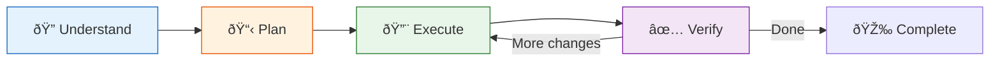
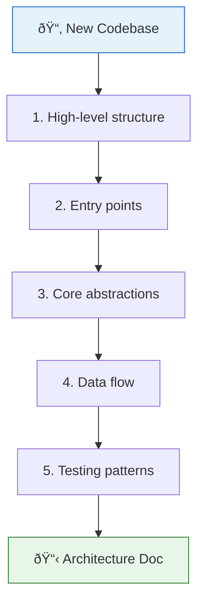

# Module 7: Domain-Specific Patterns

> **Prerequisite**: This module builds on Module 3 (Skills). You'll use existing skills and learn to create domain-specific skills for your team's recurring workflows.

## Overview

Master patterns for common software development scenarios: refactoring, architecture exploration, legacy code, performance, and security. More importantly, learn to recognize when a pattern should become a reusable skill.

**Learning Objectives**:
- Navigate and refactor large codebases safely
- Explore and understand unfamiliar architecture
- Work effectively with legacy code
- Optimize performance systematically
- Review security comprehensively
- Create domain-specific skills for recurring patterns

**Time**: 3-4 hours

---

## 1. Refactoring Large Codebases

### Refactoring Principles with Codex

1. **Understand Before Changing**: Explore first, refactor second
2. **Test Safety Net**: Tests must pass before and after
3. **Incremental Changes**: Small, verifiable steps
4. **Commit Often**: Each step is a commit

### Refactoring Workflow



**Phase 1: Understanding**

Before touching any code, understand what you're dealing with:

```
You: "I need to refactor the payment processing module.
      It's grown to 2000 lines and is hard to maintain.
      Help me understand the current structure first."

Codex: I'll analyze the payment module. Let me explore...

Found in src/payments/processor.ts:
- PaymentProcessor class (1847 lines)
- 23 public methods
- 45 private methods
- Direct dependencies: Stripe, PayPal, database, logger, emailer

Key issues identified:
1. Single class handles all payment providers (violates SRP)
2. Database queries mixed with business logic
3. Duplicate validation code in 8 methods
4. No interface - hard to test or swap providers

Current flow:
  processPayment() → validateCard() → chargeProvider() →
  saveTransaction() → sendReceipt() → updateInventory()

Recommendation: Extract provider-specific logic into separate
classes behind a PaymentProvider interface.
```

**Phase 2: Planning**

Use `superpowers:writing-plans` to create a safe refactoring plan:

```
You: "Use superpowers:writing-plans to create a refactoring plan
      for extracting payment providers into separate classes."

Codex: Using superpowers:writing-plans.

# IMPLEMENTATION_PLAN.md

## Goal
Extract payment provider logic into separate classes behind
a common interface, reducing PaymentProcessor from 1847 to ~400 lines.

## Stage 1: Create Interface & Tests
**Goal**: Define PaymentProvider interface and add characterization tests
**Success Criteria**:
- [ ] PaymentProvider interface defined
- [ ] Existing tests still pass
- [ ] Characterization tests cover current behavior

## Stage 2: Extract Stripe Provider
**Goal**: Move Stripe-specific code to StripeProvider class
**Success Criteria**:
- [ ] StripeProvider implements PaymentProvider
- [ ] All Stripe tests pass
- [ ] PaymentProcessor uses StripeProvider

## Stage 3: Extract PayPal Provider
**Goal**: Move PayPal-specific code to PayPalProvider class
**Success Criteria**:
- [ ] PayPalProvider implements PaymentProvider
- [ ] All PayPal tests pass
- [ ] PaymentProcessor uses PayPalProvider

## Stage 4: Clean Up
**Goal**: Remove duplication, improve PaymentProcessor
**Success Criteria**:
- [ ] No duplicate validation code
- [ ] PaymentProcessor under 500 lines
- [ ] All tests pass
```

**Phase 3: Execution**

Execute incrementally with verification at each step:

```
You: "Execute Stage 1. Create the PaymentProvider interface
      and add characterization tests for current behavior."

Codex: Starting Stage 1...

Creating interface:
// src/payments/PaymentProvider.ts
export interface PaymentProvider {
  name: string;
  charge(amount: number, token: string): Promise<ChargeResult>;
  refund(transactionId: string): Promise<RefundResult>;
  validatePaymentMethod(token: string): Promise<ValidationResult>;
}

Adding characterization tests to capture current behavior...

Running tests: npm test -- --grep "payment"
✓ 47 tests passing

Stage 1 complete. Ready for review before Stage 2.
```

### Refactoring Patterns

#### Pattern: Extract Function

When a function does too much, extract cohesive chunks into separate functions.

```
You: "This createOrder function is 150 lines. Help me extract
      the validation logic into its own function."

Codex: I'll extract the validation logic (lines 12-45).

**Before:**
// src/orders.ts
function createOrder(data: OrderData): Order {
  // Validation (lines 12-45)
  if (!data.items || data.items.length === 0) {
    throw new Error('Order must have items');
  }
  if (!data.customer.email) {
    throw new Error('Customer email required');
  }
  if (!data.customer.address) {
    throw new Error('Shipping address required');
  }
  for (const item of data.items) {
    if (item.quantity < 1) {
      throw new Error('Invalid quantity');
    }
    if (!inventory.has(item.sku)) {
      throw new Error(`Item ${item.sku} not found`);
    }
  }

  // Rest of function (lines 46-150)...
}

**After:**
function validateOrderData(data: OrderData): void {
  if (!data.items || data.items.length === 0) {
    throw new Error('Order must have items');
  }
  if (!data.customer.email) {
    throw new Error('Customer email required');
  }
  if (!data.customer.address) {
    throw new Error('Shipping address required');
  }
  for (const item of data.items) {
    if (item.quantity < 1) {
      throw new Error('Invalid quantity');
    }
    if (!inventory.has(item.sku)) {
      throw new Error(`Item ${item.sku} not found`);
    }
  }
}

function createOrder(data: OrderData): Order {
  validateOrderData(data);  // Now 1 line instead of 34

  // Rest of function...
}

Running tests: npm test
✓ All 23 tests passing
```

#### Pattern: Rename for Clarity

Unclear names make code hard to understand. Rename systematically.

```
You: "The variable 'd' is used throughout the codebase.
      Rename it to 'discountPercent' for clarity."

Codex: I'll find all usages and rename systematically.

Searching for 'd' as a variable name...
Found 12 usages across 4 files:
- src/pricing.ts: 6 usages
- src/cart.ts: 3 usages
- src/checkout.ts: 2 usages
- src/reports.ts: 1 usage

**Before:**
// src/pricing.ts
function calculateTotal(items: Item[], d: number): number {
  const subtotal = items.reduce((sum, i) => sum + i.price, 0);
  return subtotal * (1 - d / 100);
}

**After:**
// src/pricing.ts
function calculateTotal(items: Item[], discountPercent: number): number {
  const subtotal = items.reduce((sum, item) => sum + item.price, 0);
  return subtotal * (1 - discountPercent / 100);
}

Renamed in all 4 files.
Running tests: npm test
✓ All tests passing
```

#### Pattern: Move to Module

When related functions are scattered, consolidate them into a focused module.

```
You: "Email-related functions are spread across 5 files.
      Consolidate them into a dedicated email module."

Codex: I'll identify and move email functions incrementally.

Found email-related functions:
- src/orders.ts: sendOrderConfirmation()
- src/auth.ts: sendPasswordReset(), sendWelcomeEmail()
- src/shipping.ts: sendShippingNotification()
- src/support.ts: sendTicketResponse()

**Step 1: Create the module**
// src/email/index.ts
export { sendEmail } from './sender';
export { templates } from './templates';

**Step 2: Move first function**
// src/email/notifications.ts
export async function sendOrderConfirmation(order: Order): Promise<void> {
  await sendEmail({
    to: order.customer.email,
    template: templates.orderConfirmation,
    data: { order }
  });
}

**Step 3: Update import in orders.ts**
// Before:
function sendOrderConfirmation(order) { ... }

// After:
import { sendOrderConfirmation } from './email/notifications';

Running tests after each move...
✓ Tests passing after moving sendOrderConfirmation
✓ Tests passing after moving sendPasswordReset
✓ Tests passing after moving sendWelcomeEmail
✓ Tests passing after moving sendShippingNotification
✓ Tests passing after moving sendTicketResponse

Final structure:
src/email/
├── index.ts           # Public exports
├── sender.ts          # Core send function
├── templates.ts       # Email templates
└── notifications.ts   # All notification functions
```

#### Pattern: Extract Interface

When code depends on a concrete implementation, extract an interface to enable testing and flexibility.

```
You: "The ReportGenerator class directly uses PostgresDB.
      Extract an interface so we can use different databases
      and mock it in tests."

Codex: I'll extract a Database interface and update the code.

**Before:**
// src/reports/generator.ts
import { PostgresDB } from '../db/postgres';

class ReportGenerator {
  private db: PostgresDB;

  constructor() {
    this.db = new PostgresDB();  // Hard dependency
  }

  async generateSalesReport(): Promise<Report> {
    const sales = await this.db.query('SELECT * FROM sales');
    // ... process sales
  }
}

**After:**
// src/db/database.interface.ts
export interface Database {
  query<T>(sql: string, params?: any[]): Promise<T[]>;
  execute(sql: string, params?: any[]): Promise<void>;
}

// src/db/postgres.ts
import { Database } from './database.interface';

export class PostgresDB implements Database {
  async query<T>(sql: string, params?: any[]): Promise<T[]> { ... }
  async execute(sql: string, params?: any[]): Promise<void> { ... }
}

// src/reports/generator.ts
import { Database } from '../db/database.interface';

class ReportGenerator {
  constructor(private db: Database) {}  // Injected dependency

  async generateSalesReport(): Promise<Report> {
    const sales = await this.db.query('SELECT * FROM sales');
    // ... process sales
  }
}

// Now tests can use a mock:
// tests/reports/generator.test.ts
class MockDatabase implements Database {
  async query<T>(): Promise<T[]> {
    return [{ id: 1, amount: 100 }] as T[];
  }
  async execute(): Promise<void> {}
}

test('generates sales report', async () => {
  const generator = new ReportGenerator(new MockDatabase());
  const report = await generator.generateSalesReport();
  expect(report.total).toBe(100);
});

✓ All tests passing
✓ ReportGenerator now testable without real database
```

---

## 2. Architecture Exploration

### Exploring Unfamiliar Codebases

When you join a new project or need to understand unfamiliar code, use a systematic breadth-first approach:



### Example: Exploring an E-commerce Backend

```
You: "I just joined this project. Help me understand
      the architecture. Start with the high-level structure."

Codex: Exploring the codebase...

## High-Level Structure

    src/
    ├── api/           # REST endpoints (Express routes)
    ├── services/      # Business logic layer
    ├── models/        # Database models (Sequelize)
    ├── middleware/    # Auth, logging, error handling
    ├── jobs/          # Background workers (Bull queues)
    ├── utils/         # Shared utilities
    └── config/        # Environment configuration

## Entry Points
- src/index.ts - Main server startup
- src/api/routes.ts - All API routes registered here
- src/jobs/worker.ts - Background job processor

## Key Patterns
- Repository pattern for data access
- Service layer for business logic
- Dependency injection via constructor params
- Event-driven for async operations (orders → inventory → shipping)

Want me to trace a specific feature, like order processing?

You: "Yes, trace how an order flows through the system."

Codex: Tracing order flow...

## Order Processing Flow

1. **API Layer** (`src/api/orders.ts:45`)
   POST /orders → OrderController.create()

2. **Validation** (`src/middleware/validation.ts:23`)
   validateOrderSchema() checks items, payment, shipping

3. **Service Layer** (`src/services/OrderService.ts:78`)
   OrderService.createOrder():
   - Validates inventory availability
   - Calculates totals and tax
   - Creates order record
   - Emits 'order.created' event

4. **Event Handlers** (`src/events/orderHandlers.ts`)
   On 'order.created':
   - InventoryService.reserve() - reserves items
   - PaymentService.charge() - processes payment
   - NotificationService.sendConfirmation()

5. **Background Jobs** (`src/jobs/shipping.ts`)
   ShippingJob processes fulfillment async

Key files to understand order logic:
- src/services/OrderService.ts (main business logic)
- src/models/Order.ts (data structure)
- src/events/orderHandlers.ts (side effects)
```

### Saving Architecture Knowledge

Save your findings so you don't lose context:

```bash
# Create architecture documentation
codex exec "Document the architecture of this codebase
in a format suitable for onboarding new developers" > docs/ARCHITECTURE.md

# Create a context file for future sessions
codex exec "Summarize the key abstractions and patterns
in bullet points" > contexts/architecture.md
```

Context files help future Codex sessions understand the codebase faster.

### Architecture Mapping Patterns

#### Pattern: Feature Tracing

Pick a feature and trace it end-to-end to understand how the system works.

```
You: "I need to understand how authentication works in this app.
      Trace the login flow from API to database."

Codex: I'll trace the authentication flow...

Searching for auth-related code:
  grep -r "login\|authenticate\|auth" src/

## Login Flow Trace

1. **Entry Point**: POST /api/auth/login
   File: src/api/routes/auth.ts:24

    router.post('/login', authController.login);

2. **Controller**: Validates input, calls service
   File: src/controllers/AuthController.ts:45

    async login(req, res) {
      const { email, password } = req.body;
      const result = await this.authService.authenticate(email, password);
      res.json({ token: result.token });
    }

3. **Service**: Business logic
   File: src/services/AuthService.ts:67

    async authenticate(email: string, password: string) {
      const user = await this.userRepo.findByEmail(email);
      if (!user) throw new UnauthorizedError('Invalid credentials');

      const valid = await bcrypt.compare(password, user.passwordHash);
      if (!valid) throw new UnauthorizedError('Invalid credentials');

      return { token: this.jwtService.sign({ userId: user.id }) };
    }

4. **Repository**: Database access
   File: src/repositories/UserRepository.ts:23

    async findByEmail(email: string): Promise<User | null> {
      return this.db.query('SELECT * FROM users WHERE email = $1', [email]);
    }

## Dependencies Identified
- bcrypt (password hashing)
- jsonwebtoken (JWT generation)
- PostgreSQL (user storage)

## Security Notes
- Passwords hashed with bcrypt (good)
- JWT expiry: 24 hours (check if acceptable)
- No rate limiting on login endpoint (potential issue)
```

#### Pattern: Dependency Mapping

Understand how modules relate to identify core vs. peripheral code.

```
You: "Map the dependencies in this codebase. Which modules
      are core and which are leaf nodes?"

Codex: I'll analyze import statements to build a dependency graph...

Scanning 147 source files...

## Dependency Analysis

### Core Modules (most depended upon)
These are imported by many other modules - changes here have wide impact:

    src/db/connection.ts        → imported by 23 modules
    src/utils/logger.ts         → imported by 19 modules
    src/config/index.ts         → imported by 18 modules
    src/models/User.ts          → imported by 12 modules
    src/services/AuthService.ts → imported by 8 modules

### Leaf Modules (no dependents)
These import others but nothing imports them - safe to modify:

    src/api/routes/health.ts
    src/jobs/cleanup.ts
    src/scripts/migrate.ts
    src/cli/commands/seed.ts

### Circular Dependencies Found âš ï¸
    src/services/OrderService.ts â†â†’ src/services/InventoryService.ts

    OrderService imports InventoryService (to check stock)
    InventoryService imports OrderService (to get pending orders)

    Recommendation: Extract shared logic to a new module or use events.

### Dependency Graph (simplified)

    ┌─────────────â”
    │   config    │
    └──────┬──────┘
           │
    ┌──────▼──────â”
    │     db      │
    └──────┬──────┘
           │
    ┌──────▼──────┠    ┌─────────────â”
    │   models    │◄────│   repos     │
    └──────┬──────┘     └──────┬──────┘
           │                   │
    ┌──────▼───────────────────▼──────â”
    │           services              │
    └──────────────┬──────────────────┘
                   │
    ┌──────────────▼──────────────────â”
    │        controllers              │
    └──────────────┬──────────────────┘
                   │
    ┌──────────────▼──────────────────â”
    │           routes                │
    └─────────────────────────────────┘
```

#### Pattern: Data Flow Analysis

Trace how data moves and transforms through the system.

```
You: "I need to understand how product data flows from
      the admin dashboard to the customer-facing storefront."

Codex: I'll trace the product data flow...

## Product Data Flow

### 1. Data Entry (Admin Dashboard)

    Admin UI (React)
        │
        â–¼ POST /api/admin/products
    AdminProductController.create()
        │
        â–¼ Validates & transforms
    ProductService.createProduct()
        │
        â–¼ INSERT INTO products
    PostgreSQL (products table)

### 2. Data Processing (Background)

    ProductCreatedEvent
        │
        ├──▶ SearchIndexer.indexProduct()
        │        │
        │        ▼
        │    Elasticsearch (products index)
        │
        ├──▶ ImageProcessor.generateThumbnails()
        │        │
        │        ▼
        │    S3 (product-images bucket)
        │
        └──▶ CacheWarmer.warmProductCache()
                 │
                 â–¼
             Redis (product:{id})

### 3. Data Retrieval (Storefront)

    Customer UI (React)
        │
        â–¼ GET /api/products/:id
    ProductController.getProduct()
        │
        â–¼ Check cache first
    Redis.get('product:123')
        │
        ├── Cache HIT → Return cached data
        │
        └── Cache MISS
                │
                â–¼
            ProductRepository.findById()
                │
                â–¼
            PostgreSQL → Cache → Return

### Data Transformations

| Stage | Format | Fields Added/Removed |
|-------|--------|---------------------|
| Admin Input | FormData | Raw upload |
| Database | ProductRow | id, timestamps, slugified name |
| Cache | ProductCache | Pre-computed pricing, image URLs |
| API Response | ProductDTO | Filtered by user permissions |
| Storefront | ProductView | Formatted prices, availability |

### Key Files
- src/services/ProductService.ts (business logic)
- src/events/productHandlers.ts (async processing)
- src/transformers/ProductTransformer.ts (DTO mapping)
```

---

## 3. Working with Legacy Code

### Legacy Code Principles

Legacy code isn't just old code—it's code without tests, unclear intent, or tribal knowledge. The goal isn't to rewrite it, but to make it safe to change.

1. **Characterization Tests**: Understand behavior before changing
2. **Seams**: Find safe points to make changes
3. **Incremental Improvement**: Leave code better than you found it
4. **Document As You Learn**: Future you will thank you

### Example: Adding a Feature to Legacy Code

```
You: "I need to add discount codes to the checkout process.
      The checkout code is 8 years old with no tests.
      How do I approach this safely?"

Codex: This is a classic legacy code situation. Let's work through
it safely using characterization tests and seams.

First, let me analyze the current checkout code...

Found: src/checkout.js (1,247 lines, 0 tests)

Key function: processCheckout(cart, user, paymentInfo)
- Lines 45-312 (267 lines in one function!)
- Mixes validation, pricing, payment, and email
- Global state: window.cartState, window.userSession
- No dependency injection - hard to test

**Step 1: Characterization Tests**

Before changing anything, let's capture current behavior.
I'll create tests that document what the code DOES, not what
it SHOULD do:

// tests/checkout.characterization.test.js
describe('checkout - characterization', () => {
  it('calculates subtotal as sum of item prices', () => {
    const cart = { items: [{price: 10}, {price: 20}] };
    const result = calculateSubtotal(cart);
    expect(result).toBe(30); // Documents current behavior
  });

  it('applies 8% tax for CA addresses', () => {
    // Even if this rate is wrong, test what it DOES
    const result = calculateTax(100, 'CA');
    expect(result).toBe(8);
  });
});

**Step 2: Find a Seam**

A seam is a place where you can alter behavior without editing code.
I found one: the pricing calculation is called from line 89.

Current code:
  const total = calculatePricing(cart, user);

This function can be extracted and tested independently.

**Step 3: Extract and Add Your Feature**

I'll use the Sprout Method pattern:
1. Create new function: applyDiscountCode(cart, code)
2. Add tests for the new function
3. Call it from the seam point
4. Leave the rest of processCheckout untouched

Want me to implement this approach?
```

```
You: "Yes, implement the discount code feature using that approach."

Codex: Using superpowers:test-driven-development for the new code.

**Red**: Writing test first...
// tests/discount.test.js
describe('applyDiscountCode', () => {
  it('applies percentage discount', () => {
    const cart = { subtotal: 100 };
    const result = applyDiscountCode(cart, 'SAVE20');
    expect(result.discount).toBe(20);
  });

  it('rejects expired codes', () => {
    const cart = { subtotal: 100 };
    expect(() => applyDiscountCode(cart, 'EXPIRED'))
      .toThrow('Discount code expired');
  });
});

Running: npm test -- discount
✗ 2 tests failing (function doesn't exist)

**Green**: Implementing...
// src/discount.js (new file - isolated from legacy code)
export function applyDiscountCode(cart, code) {
  const discount = await lookupDiscount(code);
  if (discount.expired) throw new Error('Discount code expired');
  return {
    ...cart,
    discount: cart.subtotal * (discount.percent / 100)
  };
}

Running: npm test -- discount
✓ 2 tests passing

**Integration**: Adding to checkout seam...
// In processCheckout, at line 89:
if (discountCode) {
  cart = applyDiscountCode(cart, discountCode);
}
const total = calculatePricing(cart, user);

Characterization tests still pass: ✓
New feature works: ✓
Legacy code unchanged: ✓
```

### Legacy Code Workflow

**Step 1: Characterization**
```
1. Identify the code you need to change
2. Write tests that describe current behavior
3. Even if behavior is wrong, test it as-is
4. Now you have a safety net
```

**Step 2: Make Change Safe**
```
1. Find seam (boundary where you can test)
2. Extract dependencies
3. Add tests at seam
4. Now you can change internal implementation
```

**Step 3: Refactor**
```
1. Make change with tests passing
2. Incrementally improve structure
3. Tests catch regressions
4. Stop when good enough (don't perfect legacy code)
```

### Legacy Code Patterns

**Pattern: Sprout Method**
```
Need to add new feature to legacy method:

1. Create new method with new feature
2. Add tests for new method
3. Call new method from legacy method
4. Leave legacy method mostly untouched
```

**Pattern: Wrap Method**
```
Need to add behavior around legacy method:

1. Rename legacy method (e.g., doWorkCore)
2. Create new method with original name
3. New method calls renamed method + new behavior
4. Add tests for new wrapper
```

**Pattern: Extract and Override**
```
Need to test legacy method with dependency:

1. Extract dependency call to separate method
2. In test, subclass and override extracted method
3. Now you can test without real dependency
```

---

## 4. Performance Optimization

### Performance Workflow

**Phase 1: Measure**
```
1. Define performance goals (e.g., "API response < 200ms")
2. Set up profiling
3. Measure current performance
4. Identify bottlenecks
5. Prioritize by impact
```

**Phase 2: Analyze**
```
For each bottleneck:
1. Understand why it's slow
2. Identify optimization opportunities
3. Estimate improvement potential
4. Consider trade-offs
```

**Phase 3: Optimize**
```
1. Implement optimization
2. Measure improvement
3. Verify correctness (tests pass)
4. If goal met, done
5. If not, continue with next bottleneck
```

**Phase 4: Validate**
```
1. Run full test suite
2. Load test if applicable
3. Monitor in production
4. Ensure no regressions
```

### Performance Patterns

**Pattern: Database Query Optimization**
```
Process:
1. Enable query logging
2. Identify N+1 queries
3. Add eager loading
4. Add indexes
5. Measure improvement
```

**Pattern: Caching Strategy**
```
Levels:
1. HTTP caching (browser, CDN)
2. Application caching (Redis, Memcached)
3. Database query caching
4. Computed value caching

Choose based on:
- Data volatility
- Read/write ratio
- Consistency requirements
```

**Pattern: Bundle Size Optimization**
```
Process:
1. Analyze bundle (webpack-bundle-analyzer)
2. Identify large dependencies
3. Use dynamic imports (code splitting)
4. Remove unused code (tree shaking)
5. Measure improvement
```

**Pattern: Algorithmic Optimization**
```
Process:
1. Profile to find hot path
2. Analyze time complexity
3. Find better algorithm (O(n²) → O(n log n))
4. Implement and test
5. Measure improvement
```

### Coordinating Performance Investigation

Run parallel investigations for each area, then synthesize the results:

```bash
# Run investigations concurrently in the background
codex exec "Profile API endpoints in api/ and describe latency hotspots" > perf-api.txt &
codex exec "Analyze database queries in db/ for missing indexes" > perf-db.txt &
codex exec "Analyze bundle size using webpack-bundle-analyzer output" > perf-bundle.txt &
codex exec "Review caching strategy and TTLs in config/" > perf-cache.txt &
wait

# Synthesize findings
codex "Performance investigation results:
API: $(cat perf-api.txt)
Database: $(cat perf-db.txt)
Bundle: $(cat perf-bundle.txt)
Cache: $(cat perf-cache.txt)

Rank the top 3 optimizations by impact and propose a plan."
```

Each investigation runs independently. The final prompt synthesizes all findings into actionable recommendations.

---

## 5. Security Review

### Security Review Framework

**OWASP Top 10 Checklist**:
```
- [ ] Injection (SQL, NoSQL, Command)
- [ ] Broken Authentication
- [ ] Sensitive Data Exposure
- [ ] XML External Entities (XXE)
- [ ] Broken Access Control
- [ ] Security Misconfiguration
- [ ] Cross-Site Scripting (XSS)
- [ ] Insecure Deserialization
- [ ] Using Components with Known Vulnerabilities
- [ ] Insufficient Logging & Monitoring
```

### Security Review Patterns

**Pattern: Input Validation Review**
```
1. Find all user input points
2. Check validation
3. Check sanitization
4. Check encoding on output
5. Test with malicious inputs
```

**Pattern: Authentication & Authorization**
```
1. Review authentication mechanism
2. Check password storage (hashed? salted?)
3. Check session management
4. Review authorization checks
5. Test privilege escalation scenarios
```

**Pattern: Data Protection**
```
1. Identify sensitive data
2. Check encryption at rest
3. Check encryption in transit
4. Review access controls
5. Check for exposure in logs
```

**Pattern: Dependency Security**
```
1. Run npm audit / pip check
2. Review vulnerable dependencies
3. Update or find alternatives
4. Document accepted risks
```

### Using Codex for Security Review

```bash
# Request a focused security review
codex "Review the authentication module (src/auth/) for security issues:
- Injection vulnerabilities (SQL, command, NoSQL)
- Broken authentication (password storage, session handling)
- Sensitive data exposure (logging, error messages)
- XSS vulnerabilities (input sanitization, output encoding)

For each finding, provide:
1. Severity (Critical/High/Medium/Low)
2. Location (file and line)
3. Recommended fix"

# Save findings for tracking
codex exec "List all security findings from the auth review as a markdown checklist" > security-findings.md
```

---

## 6. Domain Pattern Library

### Pattern: Strangler Fig Refactoring

**When**: Replacing large legacy system

**Process**:
```
1. Build new system alongside old
2. Route new features to new system
3. Incrementally migrate old features
4. Eventually retire old system
```

### Pattern: Branch by Abstraction

**When**: Refactoring with no downtime

**Process**:
```
1. Create abstraction over current implementation
2. Update all callers to use abstraction
3. Create new implementation behind abstraction
4. Switch to new implementation
5. Remove old implementation
```

### Pattern: Dependency Inversion

**When**: Breaking tight coupling

**Process**:
```
1. Define interface for dependency
2. Update consumer to depend on interface
3. Update provider to implement interface
4. Now can swap implementations
```

### Pattern: Performance Budget

**When**: Preventing performance regression

**Process**:
```
1. Define budgets (e.g., "bundle < 200KB")
2. Measure in CI
3. Fail if budget exceeded
4. Forces conscious decisions
```

---

## 7. Creating Domain-Specific Skills

### When to Create a Domain Skill

If you find yourself repeating the same domain pattern more than twice, it's time to create a skill. Signs you need a custom skill:

| Signal | Example | Skill Candidate |
|--------|---------|-----------------|
| Same prompts repeated | "Review this PR for security issues" | `team:security-review` |
| Multi-step workflow | Architecture exploration steps | `team:architecture-exploration` |
| Team-specific patterns | Your deployment checklist | `team:pre-deploy-checklist` |
| Onboarding friction | New devs ask the same questions | `team:codebase-intro` |

### Example: Creating a Security Review Skill

Instead of remembering the OWASP checklist every time, encode it:

````markdown
---
name: team-security-review
description: Comprehensive security review for PRs touching auth, payments, or user data
triggers:
  - "security review"
  - "review for vulnerabilities"
  - "check for security issues"
---

# Security Review Skill

## When to Use
Before merging any PR that touches:
- Authentication or authorization
- Payment processing
- User data handling
- External API integrations

## Steps

### Step 1: Input Validation Audit
Check all user input points:
- [ ] Request parameters validated
- [ ] Request body schema validated
- [ ] File uploads restricted by type/size
- [ ] No direct SQL/NoSQL query construction

### Step 2: Authentication Check
- [ ] Passwords hashed with bcrypt/argon2 (not MD5/SHA1)
- [ ] Session tokens are cryptographically random
- [ ] JWT secrets not hardcoded
- [ ] Token expiry is reasonable (< 24h for access tokens)

### Step 3: Authorization Check
- [ ] Every endpoint checks user permissions
- [ ] No direct object references without ownership check
- [ ] Admin endpoints protected
- [ ] Rate limiting on sensitive operations

### Step 4: Data Protection
- [ ] Sensitive data not logged
- [ ] PII encrypted at rest
- [ ] HTTPS enforced
- [ ] No secrets in code or config files

### Step 5: Dependency Check
```bash
npm audit
# or
pip-audit
```

## Output Format
For each finding:
1. **Severity**: Critical/High/Medium/Low
2. **Location**: file:line
3. **Issue**: What's wrong
4. **Fix**: How to resolve
````

### Example: Creating an Architecture Exploration Skill

````markdown
---
name: team-architecture-exploration
description: Systematic approach to understanding unfamiliar codebases
triggers:
  - "explore this codebase"
  - "help me understand the architecture"
  - "I'm new to this project"
---

# Architecture Exploration Skill

## When to Use
- Joining a new project
- Investigating unfamiliar module
- Onboarding new team members

## Steps

### Step 1: High-Level Survey (5 min)
Examine without diving deep:
- [ ] README.md - project purpose and setup
- [ ] package.json / requirements.txt - dependencies
- [ ] Directory structure - organization pattern

### Step 2: Entry Points (10 min)
Find where execution starts:
- [ ] Main entry file (index.ts, main.py, etc.)
- [ ] Route definitions (API endpoints)
- [ ] CLI commands if applicable

### Step 3: Core Abstractions (15 min)
Identify the building blocks:
- [ ] Key interfaces/types
- [ ] Service classes
- [ ] Data models
- [ ] Shared utilities

### Step 4: Data Flow (15 min)
Trace one feature end-to-end:
- [ ] Pick a representative feature (e.g., user login)
- [ ] Trace from API to database
- [ ] Document the layers touched

### Step 5: Document Findings
Create `contexts/architecture.md` with:
- Directory overview
- Key patterns used
- Important files to know
- Gotchas and quirks

## Anti-Patterns
- Don't try to understand everything at once
- Don't start with tests (they often lag reality)
- Don't trust comments blindly (verify with code)
````

### Skill Organization for Teams

```
~/.codex/
├── superpowers/           # Community skills (read-only)
└── skills/                # Your team's custom skills
    ├── security-review.md
    ├── architecture-exploration.md
    ├── pre-deploy-checklist.md
    ├── database-migration.md
    └── incident-response.md
```

### When Patterns Become Skills


**Progression:**
1. **Ad-hoc**: You figure it out each time
2. **Pattern**: You remember the steps
3. **Documented**: Written in a doc somewhere
4. **Skill**: Codex knows it and follows it automatically

---

## Key Takeaways

1. **Refactoring**: Understand, plan, execute incrementally
2. **Architecture**: Explore breadth-first, trace key features
3. **Legacy Code**: Characterize, make safe, improve incrementally
4. **Performance**: Measure, analyze, optimize, validate
5. **Security**: Systematic review, OWASP Top 10, automated tools
6. **Skills**: Turn recurring patterns into reusable team skills

---

## Next Steps

1. Complete [Module 7 Exercises](../exercises/07-domain/)
2. Practice architecture exploration on unfamiliar code
3. Refactor a piece of legacy code safely
4. Conduct security review on a module
5. Create one domain-specific skill for your team

---

## Quick Reference

### Refactoring
- Tests first
- Incremental changes
- Commit often
- Verify at each step

### Architecture Exploration
- Breadth-first
- Feature tracing
- Dependency mapping
- Save findings to `contexts/`

### Legacy Code
- Characterization tests
- Find seams
- Sprout/Wrap methods
- Incremental improvement

### Performance
- Measure first
- Profile bottlenecks
- Optimize high-impact
- Validate improvements

### Security
- OWASP Top 10
- Input validation
- Authentication review
- Dependency scanning

### Domain Skills
- Repeated pattern? Make it a skill
- Include triggers, steps, checklists
- Store in `~/.codex/skills/`
- Share with your team

---

**Master the domains!** Head to [Exercise 1](../exercises/07-domain/exercise-1.md)
