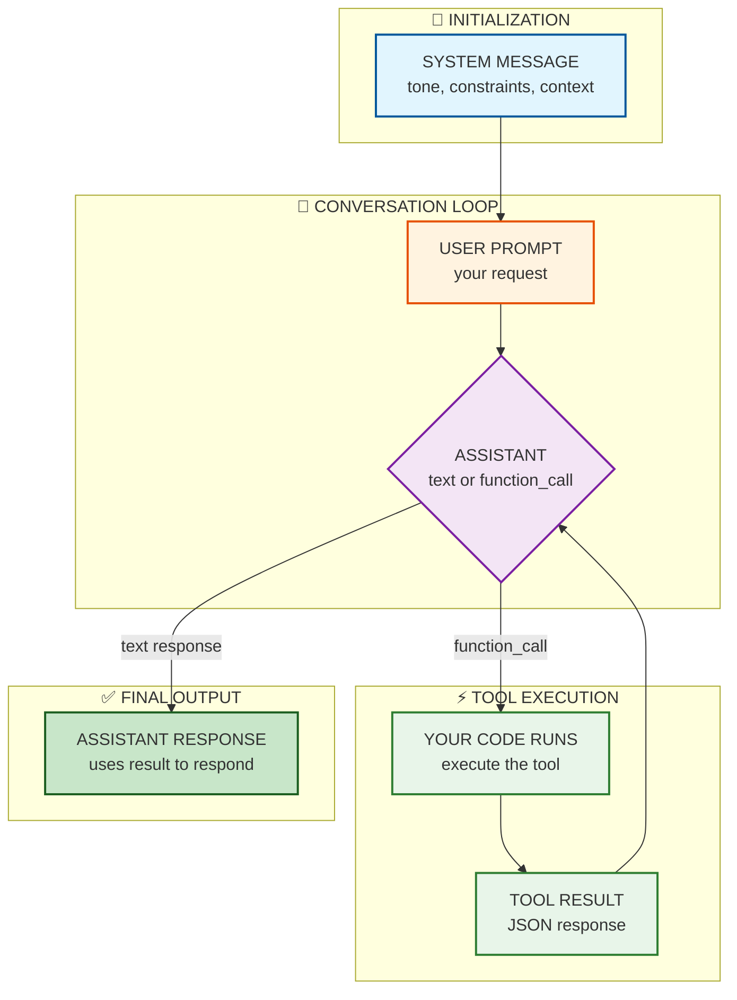

# Module 8: Codex API Internals

> **⚠️ Advanced / API Focus**: This module covers the OpenAI Codex **API** internals—building custom integrations, tool use, and managing context programmatically. **If you're using Codex CLI**, you don't need this to get started. The CLI handles tools, context, and sessions automatically. Start with the [CLI hands-on training](../training/codex-cli-hands-on/README.md) instead, and return here when you want to build custom API integrations.

## Overview

Understanding how OpenAI Codex works under the hood is essential for building custom integrations. This module explores the Responses API architecture, tool-use workflow, and context strategies that determine how Codex behaves during an API session.

**Learning Objectives**:
- Understand the message types that make up a Codex session and how system/user/assistant instructions shape each interaction
- Master tool use so Codex can reason about external data sources without hallucinating
- Keep the context window healthy through summarization, chunking, and smart request sequencing
- Break large problems into prompt chains, verifying each step and feeding results into the next

**Time**: 3-4 hours

---

## 1. Codex Session Architecture

### What is a Codex session?
A Codex session is a conversation with the OpenAI Responses API. Every request includes a series of messages, typically:
- **System**: Persistent instructions about tone, safety, and available tools
- **User**: The current request or question
- **Assistant**: Codex's response (either text or a tool call)
- **Tool**: When Codex asks your code to run a tool, you execute it and supply the result back as a `tool` message

Think of it as a structured turn-taking system where Codex only knows what you feed it in those messages.

### Message flow


This means there is no persistent agent memory outside the conversation history — context resets when you start a new sequence.

### Designing the system message

> **What is a system prompt?** The system prompt (or "system message") is the first message in every conversation that defines the AI's behavior, capabilities, and constraints. Think of it as a job description you give before work begins. The AI reads this first and follows its instructions throughout the session.

> **What is a tool call?** When Codex needs to perform an action it can't do directly (read a file, run tests, query a database), it returns a tool call instead of plain text. This object contains the tool name and arguments—your code executes it and sends the result back. This is how Codex uses external capabilities.

**Best practices with examples:**

| Practice | Why | Example |
|----------|-----|---------|
| **State the role clearly** | Focuses responses on your use case | `"You are Codex, a Python debugging assistant. Be direct. Show diffs."` |
| **Keep it short** | Long prompts waste tokens and dilute focus | ❌ 500-word backstory → ✅ 2-3 sentence role definition |
| **Declare available tools** | Codex can only call what you register | List `read_file`, `run_tests`, `search_code` with descriptions |
| **Include safety constraints** | Prevents dangerous operations | `"Never modify files outside src/. Always explain before editing."` |
| **Refresh per session** | Context resets between sessions | Re-send system prompt + any critical context when starting fresh |

**Example system message:**
```
You are Codex, a backend debugging assistant for a Python Flask app.

Available tools: read_file, run_tests, search_code, git_diff
Constraints:
- Never modify production config files
- Always run tests after changes
- Explain your reasoning before making edits

Project context: Flask 2.0, PostgreSQL, pytest for testing
```

### What Codex retains

| Retained | Not Retained |
|----------|--------------|
| System message | Previous sessions |
| Conversation history (user + assistant messages) | Files you didn't explicitly share |
| Registered tools and their schemas | External state (databases, APIs) |
| Tool results you send back after a tool call | Anything outside the message array |

Anything outside that sequence is invisible until you mention it again, so plan to summarize or re-send as needed.

---

## 2. Tool Use & Tool Wrappers

Tool use lets Codex delegate tasks to your own code. Instead of dreaming up how to make an API call, Codex returns a structured tool call that you execute.

### Declaring tools
In the request you send to the OpenAI client, register each tool you want Codex to use:
```python
from openai import OpenAI
client = OpenAI()  # Reads OPENAI_API_KEY from environment

response = client.responses.create(
    model="codex-1",
    input=[
        # System message: sets AI behavior and context
        {"role": "system", "content": "You are a thoughtful coding assistant."},
        # User message: the actual request
        {"role": "user", "content": "Get the list of TODOs."},
    ],
    # Tools: capabilities Codex can ask you to execute
    tools=[
        {
            "type": "function",
            "function": {
                "name": "list_todos",                           # Tool identifier
                "description": "Collect TODO comments from a repo",  # Helps Codex decide when to use it
                "parameters": {                                 # JSON Schema for arguments
                    "type": "object",
                    "properties": {
                        "paths": {
                            "type": "array",
                            "items": {"type": "string"}         # Array of file paths
                        }
                    },
                    "required": ["paths"]                       # paths is mandatory
                }
            }
        }
    ],
    tool_choice="auto"  # Let Codex decide when to call tools
)
```

**`tool_choice` options:**
| Value | Behavior |
|-------|----------|
| `"auto"` | Codex decides whether to call a tool or respond with text (recommended default) |
| `"none"` | Codex will only respond with text, even if tools are available |
| `{"type": "function", "function": {"name": "list_todos"}}` | Force Codex to call a specific tool |

Use `"auto"` for most cases. Use the explicit form when you know a tool must be called (e.g., first step of a workflow).

Codex may respond with a tool call telling you which tool to invoke and what arguments to pass.

### Running the tool
After you see a tool call, run the matching tool and send the result back:
```python
import json

# Check if Codex wants to call a tool
for item in response.output or []:
    if item.type == "function_call":
        # Parse arguments (they come as a JSON string)
        args = json.loads(item.arguments or "{}")

        # Run YOUR implementation of the tool
        result = list_todos(**args)  # Unpack parsed arguments

        # Send the result back using the response ID for continuation
        follow_up = client.responses.create(
            model="codex-1",
            previous_response_id=response.id,  # Continue from previous response
            input=[
                {
                    "type": "function_call_output",
                    "call_id": item.call_id,      # Match the tool call ID
                    "output": json.dumps(result)  # Serialize result to JSON string
                }
            ]
        )
```

> **Note**: The Responses API structure may evolve. Always verify the current request format in the [OpenAI API documentation](https://platform.openai.com/docs). Key fields to check: `previous_response_id`, `call_id`, and the tool output format.

> **Note**: A response can include multiple tool calls. In production code, iterate over `response.output` and handle each `function_call` in order, sending a `function_call_output` for each `call_id` before continuing.

Codex now sees the tool result and can continue reasoning.

### Tool wrappers instead of built-in tools

> **Why wrappers?** The Codex API is a raw language model—it can only send and receive text. Unlike Codex CLI (which has built-in file/shell tools), the API cannot read files, run commands, or access the internet on its own. You must provide these capabilities by:
> 1. Declaring tools that describe what operations are available
> 2. Implementing those tools in your code
> 3. Running them when Codex requests, and sending results back

**Common wrappers to build:**

```python
# codex_helpers/read_file.py
import json

def read_file(args):
    """
    Wrapper for file reading. Codex calls this instead of reading files directly.
    Returns JSON so Codex can parse structured data.
    """
    path = args.get("path")

    # Security: prevent escaping the project directory
    if not path or ".." in path or path.startswith("/"):
        return json.dumps({"error": "Invalid path - must be relative, no ../"})

    try:
        with open(path, "r") as f:
            content = f.read()

        # Truncate large files to avoid blowing up context
        if len(content) > 10000:
            content = content[:10000] + "\n... (truncated)"

        return json.dumps({
            "path": path,
            "content": content,
            "lines": len(content.splitlines())
        })
    except FileNotFoundError:
        return json.dumps({"error": f"File not found: {path}"})
```

```python
# codex_helpers/run_tests.py
import subprocess
import json

def run_tests(args):
    """
    Wrapper for running tests. Returns structured pass/fail data.
    """
    target = args.get("target", "tests/")  # Default to tests/ directory

    # Run pytest with JSON output
    result = subprocess.run(
        ["pytest", target, "-v", "--tb=short"],
        capture_output=True,
        text=True,
        timeout=60  # Prevent runaway tests
    )

    return json.dumps({
        "exit_code": result.returncode,          # 0 = all passed
        "passed": result.returncode == 0,
        "stdout": result.stdout[:5000],          # Truncate output
        "stderr": result.stderr[:1000] if result.stderr else None
    })
```

**Recommended folder structure:**
```
project/
├── codex_helpers/
│   ├── __init__.py
│   ├── read_file.py      # File reading wrapper
│   ├── run_tests.py      # Test runner wrapper
│   ├── git_status.py     # Git operations wrapper
│   └── tools.json        # Schema manifest for all tools
├── scripts/
│   └── codex_session.py  # Your main API integration script
└── .env                  # API keys (gitignored)
```

Store your wrappers in `./codex_helpers/` and keep a manifest (`tools.json`) describing their schemas. This way every session reuses the same catalog of trusted, validated operations.

### Tool use best practices

**Keep each tool focused**
```json
{
  "type": "function",
  "function": {
    "name": "read_file",
    "description": "Read a file and return its contents",
    "parameters": {
      "type": "object",
      "properties": {
        "path": { "type": "string", "description": "Relative path to the file" }
      },
      "required": ["path"]
    }
  }
}
```

**Limit responses to avoid noisy results**
```python
response = client.responses.create(
    model="codex-1",
    input=messages,
    max_output_tokens=800,  # Cap output length
    tools=tools
)
```

**Validate and sanitize arguments** (Codex can hallucinate parameter names)
```python
def read_file(args):
    path = args.get("path")
    if not path or ".." in path:  # Prevent directory traversal
        return {"error": "Invalid path"}
    if not os.path.exists(path):
        return {"error": f"File not found: {path}"}
    with open(path) as f:
        return {"content": f.read()[:10000]}  # Limit size
```

**Never expose secrets** — use `.env` files
```bash
# .env (add to .gitignore!)
OPENAI_API_KEY=sk-...
DATABASE_URL=postgres://...
```
```python
# Load before any API calls
from dotenv import load_dotenv
load_dotenv()

client = OpenAI()  # Reads OPENAI_API_KEY from environment
```

**Log every call for reproducibility**
```python
import logging
logging.basicConfig(filename="codex_calls.log", level=logging.INFO)

def log_tool_call(name, args, result):
    logging.info(f"Tool: {name} | Args: {args} | Result: {result[:200]}")

# After each tool execution:
log_tool_call(tool_name, tool_args, json.dumps(result))
```

---

## 3. Managing Context and Tokens

### The context window
OpenAI models have finite context windows (e.g., 128K tokens for later Codex models). Each message contributes to this total:
```
Total context = system prompt + user/assistant history + tool results + new generation
```
The window includes both incoming message tokens and the tokens you expect the model to emit, so budget accordingly.

### Strategies to stay inside the window

**1. Summaries** — Periodically compress prior exchanges:

*API approach:*
```python
# After a long exchange, ask for a summary
messages.append({"role": "user", "content": "Summarize our progress in 3 bullet points."})
response = client.responses.create(model="codex-1", input=messages)
summary = response.output_text

# Start fresh with just the summary
messages = [
    {"role": "system", "content": system_prompt},
    {"role": "assistant", "content": f"Progress so far:\n{summary}"}
]
```

*CLI approach:*
```bash
codex exec "Summarize what we've learned about the auth system in 3 bullets" > context.txt
# Start new session with context
codex "Context: $(cat context.txt)

Now implement the rate limiting we discussed."
```

**2. Chunking** — Search before sharing entire files:

*API approach:*
```python
def get_relevant_snippet(filepath, keyword):
    """Return only lines containing keyword, with context."""
    with open(filepath) as f:
        lines = f.readlines()
    matches = [(i, line) for i, line in enumerate(lines) if keyword in line]
    # Return matches with 3 lines of context
    return format_with_context(lines, matches, context=3)

# Instead of sending entire file:
snippet = get_relevant_snippet("src/auth.ts", "validateUser")
messages.append({"role": "user", "content": f"Review this code:\n{snippet}"})
```

*CLI approach:*
```bash
# Don't do this (sends entire file):
codex "Review src/auth.ts"

# Do this instead (targeted):
codex "Show me only the validateUser function from src/auth.ts and review it"
```

**3. Streaming** — Stop early if output diverges:

Streaming lets you process response tokens as they arrive, enabling early termination if output goes off-track.

> **Why conceptual?** The OpenAI streaming API evolves frequently. Rather than provide code that may break, we show the pattern and link to authoritative docs.

```
Conceptual pattern:
1. Start streaming request
2. For each chunk received:
   - Accumulate text
   - Check for divergence (repetition, off-topic)
   - Cancel stream early if needed
3. Process final output
```

**Implementation**: For a runnable example, use the code snippet in the [OpenAI Streaming Guide](https://platform.openai.com/docs/api-reference/streaming). Key patterns:
- Enabling streaming (`stream=True` or dedicated streaming method)
- Event/chunk structure for extracting text
- Canceling a stream mid-response

**4. Cache context** — Store state between sessions:

```bash
# Save progress after each major step
codex exec "Summarize: what files we changed, what's left to do" > .codex-context.md

# Resume later
codex "Previous context: $(cat .codex-context.md)

Continue with the next step."
```

### Monitoring tokens

*API approach:*
```python
response = client.responses.create(model="codex-1", input=messages)

# Check token usage
usage = response.usage
print(f"Input: {usage.input_tokens}, Output: {usage.output_tokens}, Total: {usage.input_tokens + usage.output_tokens}")

# If approaching limit (e.g., 100K of 128K), summarize and reset
if usage.input_tokens + usage.output_tokens > 100000:
    summary = summarize_conversation(messages)
    messages = [{"role": "system", "content": system_prompt},
                {"role": "assistant", "content": summary}]
```

*CLI approach:*
```bash
# Codex CLI manages context automatically, but you can check session size:
ls -la ~/.codex/sessions/

# If a session feels slow or forgetful, start fresh with a summary:
codex exec "Summarize our current task and progress" > summary.txt
# Then start new session with that context
```

---

## 4. Chaining Requests and Planning

### When to split work
Large problems benefit from staged prompts:
1. **Discover**: Ask Codex to describe the problem space or analyze a diff
2. **Plan**: Have it reason about steps and output a plan (list of actions)
3. **Execute**: Apply a plan step-by-step, feeding results back
4. **Verify**: Run tests/functions to confirm the change
5. **Document**: Summarize what changed and how to continue

**Example: Adding rate limiting to an API endpoint**

```python
# Stage 1: DISCOVER - Gather context about current implementation
messages = [
    {"role": "system", "content": "You are a senior backend engineer."},
    {"role": "user", "content": """
        I need to add rate limiting to our login endpoint.
        First, analyze the current implementation and tell me:
        1. How authentication currently works
        2. Where rate limiting should be added
        3. What existing middleware patterns we use
    """}
]
# Codex calls read_file("src/auth/login.py"), read_file("src/middleware/index.py")
# You run those functions and feed results back
# Codex responds with analysis

# Stage 2: PLAN - Get a concrete action plan
messages.append({"role": "user", "content": """
    Based on your analysis, create a numbered implementation plan.
    Each step should be small and testable.
    Include which files to modify and what changes to make.
"""})
# Codex responds with plan:
# 1. Create src/middleware/rate_limit.py with token bucket algorithm
# 2. Add rate limit config to src/config.py
# 3. Apply middleware to login route in src/auth/routes.py
# 4. Add tests in tests/test_rate_limit.py

# Stage 3: EXECUTE - Implement step by step
messages.append({"role": "user", "content": """
    Implement step 1: Create the rate limiting middleware.
    Show me the complete file content.
"""})
# Codex responds with code
# You write it to disk, then continue to step 2...

# Stage 4: VERIFY - Run tests
# (Assuming Codex called run_tests tool and it returned a failure)
test_result = '{"passed": false, "stdout": "FAILED test_rate_limit.py::test_blocks_after_limit"}'
messages.append({"role": "user", "content": f"Tests failed with: {test_result}. Fix the issue."})
# Codex analyzes failure and provides fix

# Stage 5: DOCUMENT - Summarize for future context
messages.append({"role": "user", "content": """
    Tests pass. Summarize what we changed in 3 bullet points.
    I'll use this summary to continue in a future session.
"""})
# Codex: "• Added token bucket rate limiter at src/middleware/rate_limit.py
#         • Login endpoint now allows 5 attempts per minute per IP
#         • Tests added covering limit enforcement and reset behavior"
```

Each stage adds a small amount to the context, so keep plan outputs concise.

### Re-using plan templates

Maintain prompt templates with placeholders so you can quickly spin up consistent sessions:

**Template file: `prompts/feature_plan.md`**
```markdown
System: You are a senior engineer helping implement features.
Always explain your reasoning. Never modify files outside src/.

User: I need to {{task}}.

First, use read_file to examine the relevant code, then:
1. Summarize the current implementation
2. Propose a 3-step plan (keep each step small and testable)
3. Ask me to confirm before proceeding
```

**Template file: `prompts/bug_fix.md`**
```markdown
System: You are debugging a production issue. Be methodical.

User: Bug report: {{bug_description}}

Steps:
1. Use read_file to examine the reported location
2. Form a hypothesis about the root cause
3. Propose a minimal fix (no refactoring)
4. Suggest a test to prevent regression
```

**Rendering script: `scripts/render_prompt.py`**
```python
import sys
import re

def render(template_path, **variables):
    with open(template_path) as f:
        content = f.read()
    for key, value in variables.items():
        content = content.replace(f"{{{{{key}}}}}", value)
    return content

# Usage: python render_prompt.py prompts/feature_plan.md task="add caching to user lookup"
if __name__ == "__main__":
    template = sys.argv[1]
    kwargs = dict(arg.split("=", 1) for arg in sys.argv[2:])
    print(render(template, **kwargs))
```

### Feedback loops

After every Codex response, validate before proceeding:

```python
def validate_response(response, context):
    """Check for common issues in Codex responses."""
    content = response.output_text or ""
    issues = []

    # Check for hallucinated file paths
    mentioned_files = re.findall(r'[`\'"]([^`\'"]+\.(py|js|ts))[`\'"]', content)
    for file in mentioned_files:
        if not os.path.exists(file):
            issues.append(f"Referenced non-existent file: {file}")

    # Check for dangerous operations
    danger_patterns = ["rm -rf", "DROP TABLE", "DELETE FROM", "> /dev/"]
    for pattern in danger_patterns:
        if pattern in content:
            issues.append(f"Dangerous operation detected: {pattern}")

    # Check for secrets/keys in output
    if re.search(r'(sk-[a-zA-Z0-9]{20,}|password\s*=\s*["\'][^"\']+["\'])', content):
        issues.append("Possible secret in response")

    return issues

# In your main loop:
response = client.responses.create(...)
issues = validate_response(response, context)

if issues:
    # Send correction back to Codex
    messages.append({
        "role": "user",
        "content": f"Hold on. I found issues with your response:\n"
                   f"{chr(10).join('- ' + i for i in issues)}\n\n"
                   f"Please revise your answer."
    })
    response = client.responses.create(model="codex-1", input=messages)
```

**Common corrections to send:**
```python
# Codex referenced a file that doesn't exist
"That file doesn't exist. Use read_file to check what files are in src/auth/"

# Codex suggested too many changes at once
"That's too much at once. Let's do step 1 first, then verify it works."

# Codex made assumptions instead of checking
"Don't assume - use read_file to check the actual implementation first."

# Codex output was too vague
"Be more specific. Show me the exact code changes as a diff."
```

---

## 5. Working with Local Data and Scripts

> **Note**: Codex CLI has built-in file and shell tools. This section is for **API users** building custom integrations who need to implement their own tool wrappers.

When using the API directly, you provide your own tool implementations. Here's a complete `git_status` wrapper:

```python
# codex_helpers/git_status.py
import subprocess
import json

def git_status(args):
    """
    Get current git state: branch, modified files, staged changes.
    Returns structured data Codex can reason about.
    """
    result = {}

    # Current branch
    branch = subprocess.run(
        ["git", "branch", "--show-current"],
        capture_output=True, text=True
    )
    result["branch"] = branch.stdout.strip()

    # Modified files (unstaged)
    modified = subprocess.run(
        ["git", "diff", "--name-only"],
        capture_output=True, text=True
    )
    result["modified"] = modified.stdout.strip().split("\n") if modified.stdout.strip() else []

    # Staged files
    staged = subprocess.run(
        ["git", "diff", "--staged", "--name-only"],
        capture_output=True, text=True
    )
    result["staged"] = staged.stdout.strip().split("\n") if staged.stdout.strip() else []

    # Untracked files
    untracked = subprocess.run(
        ["git", "ls-files", "--others", "--exclude-standard"],
        capture_output=True, text=True
    )
    result["untracked"] = untracked.stdout.strip().split("\n") if untracked.stdout.strip() else []

    # Recent commits (for context)
    # --no-pager prevents git from waiting for interactive input
    log = subprocess.run(
        ["git", "--no-pager", "log", "--oneline", "-5"],
        capture_output=True, text=True
    )
    result["recent_commits"] = log.stdout.strip().split("\n") if log.stdout.strip() else []

    return json.dumps(result, indent=2)
```

### File sharing strategy

**Don't send entire files** — search first, then share relevant snippets:

```python
# codex_helpers/search_files.py
import subprocess
import json

def search_files(args):
    """
    Search for a pattern in the codebase. Returns matching lines with context.
    Much more efficient than sending whole files to Codex.
    """
    pattern = args.get("pattern")
    path = args.get("path", ".")
    context_lines = args.get("context", 3)

    # Use ripgrep for fast searching (fall back to grep)
    try:
        result = subprocess.run(
            ["rg", "--json", "-C", str(context_lines), pattern, path],
            capture_output=True, text=True, timeout=30
        )
    except FileNotFoundError:
        result = subprocess.run(
            ["grep", "-rn", "-C", str(context_lines), pattern, path],
            capture_output=True, text=True, timeout=30
        )

    # Limit output to prevent context overflow
    lines = result.stdout.split("\n")[:100]

    return json.dumps({
        "pattern": pattern,
        "path": path,
        "matches": len([l for l in lines if l.strip()]),
        "output": "\n".join(lines),
        "truncated": len(result.stdout.split("\n")) > 100
    })
```

**When sharing code, include line numbers:**

```python
def read_file_with_lines(args):
    """Read file with line numbers so Codex can reference specific locations."""
    path = args.get("path")
    start_line = args.get("start_line", 1)
    end_line = args.get("end_line", None)

    with open(path) as f:
        lines = f.readlines()

    # Slice if range specified
    if end_line:
        lines = lines[start_line-1:end_line]
    else:
        lines = lines[start_line-1:]

    # Add line numbers
    numbered = [f"{start_line + i:4d} | {line.rstrip()}"
                for i, line in enumerate(lines)]

    # Truncate if too long
    if len(numbered) > 200:
        numbered = numbered[:200] + ["... (truncated, use start_line/end_line to page)"]

    return json.dumps({
        "path": path,
        "start_line": start_line,
        "total_lines": len(lines),
        "content": "\n".join(numbered)
    })
```

**Use git diff to show what changed:**

```python
def git_diff(args):
    """Show diff for specific file or all changes."""
    file_path = args.get("path")  # Optional: specific file
    staged = args.get("staged", False)

    # --no-pager prevents git from waiting for interactive pager input
    cmd = ["git", "--no-pager", "diff"]
    if staged:
        cmd.append("--staged")
    if file_path:
        cmd.append(file_path)

    result = subprocess.run(cmd, capture_output=True, text=True)

    # Truncate large diffs
    diff_output = result.stdout
    if len(diff_output) > 5000:
        diff_output = diff_output[:5000] + "\n... (diff truncated)"

    return json.dumps({
        "path": file_path or "all files",
        "staged": staged,
        "diff": diff_output
    })
```

### Security and secrets

**Never expose secrets in prompts or tool results:**

```python
import os
import re

# Load secrets from environment, never hardcode
OPENAI_API_KEY = os.environ.get("OPENAI_API_KEY")
DATABASE_URL = os.environ.get("DATABASE_URL")

def sanitize_output(text):
    """Remove potential secrets before sending to Codex."""
    patterns = [
        (r'sk-[a-zA-Z0-9]{20,}', '[OPENAI_KEY_REDACTED]'),
        (r'ghp_[a-zA-Z0-9]{36}', '[GITHUB_TOKEN_REDACTED]'),
        (r'password["\']?\s*[:=]\s*["\'][^"\']+["\']', 'password="[REDACTED]"'),
        (r'postgres://[^@]+@', 'postgres://[REDACTED]@'),
        (r'Bearer [a-zA-Z0-9._-]+', 'Bearer [REDACTED]'),
    ]
    for pattern, replacement in patterns:
        text = re.sub(pattern, replacement, text, flags=re.IGNORECASE)
    return text

# Wrap all function outputs
def safe_read_file(args):
    result = read_file(args)
    return sanitize_output(result)
```

**Audit logging for tool calls:**

```python
import logging
from datetime import datetime

# Set up audit log
audit_logger = logging.getLogger("codex_audit")
audit_logger.setLevel(logging.INFO)
handler = logging.FileHandler("codex_audit.log")
handler.setFormatter(logging.Formatter('%(asctime)s - %(message)s'))
audit_logger.addHandler(handler)

def audit_tool_call(tool_name, args, result, user_id=None):
    """Log every tool call for security review."""
    audit_logger.info(json.dumps({
        "timestamp": datetime.utcnow().isoformat(),
        "user": user_id,
        "tool": tool_name,
        "args": args,
        "result_length": len(result),
        # Flag suspicious patterns
        "flags": detect_suspicious(tool_name, args)
    }))

def detect_suspicious(tool_name, args):
    """Flag potentially dangerous operations."""
    flags = []
    args_str = json.dumps(args)

    if ".." in args_str:
        flags.append("path_traversal_attempt")
    if "/etc/" in args_str or "/root/" in args_str:
        flags.append("system_path_access")
    if tool_name == "run_command" and any(d in args_str for d in ["rm ", "dd ", "mkfs"]):
        flags.append("destructive_command")

    return flags
```

---

## Next Steps
1. Try the Module 8 exercises to practice designing prompts and tool definitions
2. Build a helper that searches files and registers itself as a tool
3. Experiment with chaining requests and summarizing long histories
4. Document any useful prompts in `docs/prompts/`
