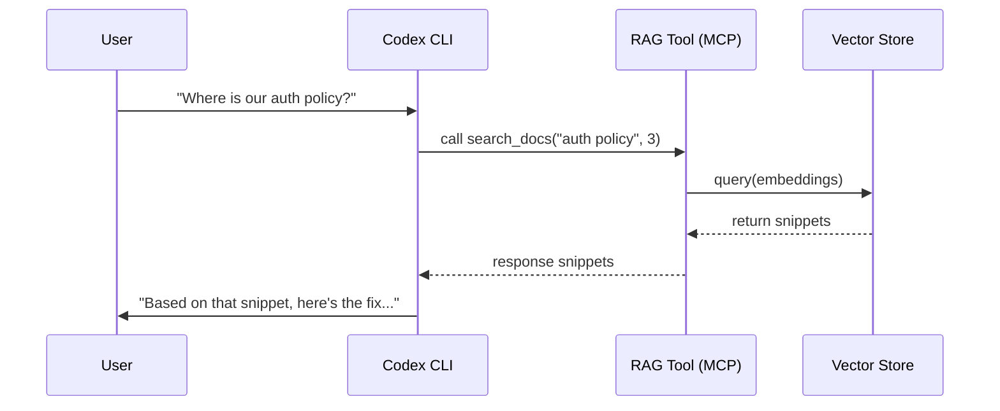

# 🧠 Recipe: RAG & Infinite Context for Codex CLI

**Goal:** Keep Codex responsive when the project or documentation can't fit in a single prompt. **Retrieval-Augmented Generation (RAG)** lets you assemble high-value context by searching only what matters before asking Codex to reason or edit.

## The Problem: Token Noise

Dumping your entire repo or a set of PDFs into the Responses call quickly exhausts tokens and slows Codex down. RAG solves this by:
1.  **Indexing** the docs/code with embeddings.
2.  **Searching** for the most relevant chunks.
3.  **Feeding** only those pieces to the model every turn.



---

## Scenario A: Greenfield Writer (External Docs)

**Context:** You're learning a new internal SDK or vendor API that Codex wasn't trained on yet.

*   **Wrong Way:** Paste a 2000-line PDF into the prompt and hope Codex ignores the noise.
*   **RAG Way:** Run a tool that embeds the PDF, then ask Codex to call `search_docs("XYZ SDK payment flow")` to fetch only the relevant paragraphs.

### Workflow
1.  Index the documentation using a vector store (Chroma, FAISS, etc.) and expose it via an MCP server or local script.
2.  Prompt Codex: "Build a payment confirmation screen using XYZ SDK".
3.  Codex invokes `search_docs` and receives 2-3 focused snippets.
4.  Codex writes code with only that context—no hallucinated APIs.

---

## Scenario B: Legacy Archaeologist (Massive Codebase)

**Context:** A 10-year-old monolith spans directories and teams. You only need to change one feature, but the logic is scattered.

*   **Wrong Way:** Slog through `rg` and copy 500 files into the prompt.
*   **RAG Way:** Chunk the repo, index it semantically, and let Codex search for the concept (e.g., `"password reset flow"`).

### Workflow
1.  Use a script (Python + MCP or Node + `mcp.tool`) to read source files, chunk them by function, and push them into a vector database.
2.  Prompt Codex with the task plus a `search_code("reset flow", limit=4)` tool call.
3.  Codex receives only the four most semantically relevant functions and applies the refactor safely.

## Comparison Table

| Feature | Greenfield (Docs) | Legacy (Codebase) |
| --- | --- | --- |
| **Goal** | Teach Codex new APIs | Localize existing logic |
| **Data Source** | Manuals, design docs | Source files, history |
| **Token Savings** | High (skip whole manuals) | Extreme (avoid 100k lines) |
| **Session Memory** | Short-lived (
quick experiments) | Long-lived (persistent index) |
| **Key Advantage** | Stops hallucinated APIs | Finds hidden dependencies |

---

## 🛠️ Implementation Tips

1.  **Build an MCP tool** (Python/Node) that exposes `learn_docs(path)` and `search_docs(query, limit)` to Codex.
2.  **Stay in sync** by re-indexing when docs or code change; store metadata (timestamps, commit hashes) inside the vector store.
3.  **Chain retrieval + reasoning** inside prompts: first call the tool, then ask for the edit using only the returned snippet.
4.  **Optional:** Combine RAG with the `CodexPrompt` component so docs can surface both the rendered explanation and the raw snippet you fed Codex.

### Tool snippet (Python)

```python
@server.tool()
def search_docs(query: str, limit: int = 3) -> str:
    results = collection.query(query_texts=[query], n_results=limit)
    hits = []
    for doc, meta in zip(results["documents"][0], results["metadatas"][0]):
        hits.append(f"{meta['source']} ({meta['chunk_id']}):\n{doc.strip()}")
    return "\n\n".join(hits) or "No matches found."
```

Use this response verbatim in the prompt that follows the tool call, for example:

```txt
Codex: "I've retrieved the auth policy from `security/api.md`.  
Use those gap-free paragraphs to update the login flow."
```

### Integrating `search_docs` into a Codex CLI session

1.  Register your MCP tool in `codex mcp-config` or `codex skill add`, for example:

    ```json
    {
      "name": "rag-index",
      "description": "Shared search tool for documentation snippets",
      "mcpServers": {
        "rag": {
          "command": "python3",
          "args": ["rag_server.py"]
        }
      },
      "tools": ["search_docs", "learn_docs"]
    }
    ```

2.  Start a Codex session with skills/extensions enabled: `codex --skills rag-index`.
3.  When Codex publishes the plan, it will emit a `{"name": "search_docs", "args": ["auth policy", 3]}` tool call; run it via your MCP server so the tool returns the relevant text.
4.  Feed the tool output back as the next message (Codex already knows to read it) and continue the workflow: “Use those snippets to update login.md”.

Optionally pair the dialog with `<CodexPrompt>` in the docs so maintainers can show the rendered story while also revealing the raw prompt + tool call that drove the session. This keeps documentation and tooling in sync for RAG-driven tasks.

### Ingestion example (Python)

```python
def learn_docs(folder_path: str, chunk_size: int = 800):
    """Read Markdown/docs, split into chunks, and add them to the vector store."""
    for path in Path(folder_path).rglob("*.md"):
        source = path.relative_to(folder_path)
        text = path.read_text()
        chunks = split_into_chunks(text, chunk_size)
        for number, chunk in enumerate(chunks, start=1):
            metadata = {
                "source": str(source),
                "chunk_id": f"{source}-{number}",
                "commit": current_commit(),
                "category": "docs"
            }
            collection.add(
                documents=[chunk],
                metadatas=[metadata],
                ids=[f"{metadata['chunk_id']}"]
            )
    return f"Indexed {folder_path} into {collection.name}."


def split_into_chunks(text: str, chunk_size: int):
    return [text[i : i + chunk_size] for i in range(0, len(text), chunk_size)]

```

Call `learn_docs` from your MCP ingestion workflow (e.g., via `scripts/update_context.sh` or a CI job) so `search_docs` always sees the latest material. Store the returned chunk IDs with each index pass for traceability.

### Best Practices

- **Chunk size**: Keep documents under ~1,000 tokens per chunk to stay under the GPU limit and avoid truncated responses.
- **Metadata**: Record `source`, `commit`, `author`, and chunk tags so you can surface the origin inside Codex’s next prompt.
- **Tool logging**: Emit structured JSON (timestamp, query, matched chunk IDs) every time `search_docs` runs; this makes triaging retrieval failures easy.
- **CodexPrompt pairing**: Use `<CodexPrompt>` to render the user-facing guidance (with the diagram/storyboard) while exposing the actual `raw` prompt snippet you passed to Codex. This keeps docs and experiments synced.
- **Freshness**: Rebuild indexes on every doc/code merge (e.g., via CI job or `post_session_logger.sh` hook) so Codex never sees stale context.
- **Fallback**: If the vector store returns nothing, gracefully fall back to a smaller inferencing prompt (e.g., “Codex, search the repo for _password reset_, then make a plan.”).

### Verifying Retrieval Quality

1.  **Replay tool calls** from failed runs: store tool inputs/outputs as artifacts (JSON + metadata) so you can rerun the same query locally.
2.  **Sanity-check relevance** by comparing vector scores—make sure the top `n` hits contain the expected `source` path.
3.  **Unit test retrieval** by mocking `search_docs` and asserting that important files (e.g., `auth/flow.md`) show up for key queries.
4.  **Surface confidence** back to the user: include the chunk titles/paths in Codex’s response so reviewers can verify the cited sections.

## Summary

RAG turns Codex CLI from a code editor into a research assistant. Index only what matters, fetch just the right chunks each turn, and Codex will stay within budget while still remembering every corner of the project.
