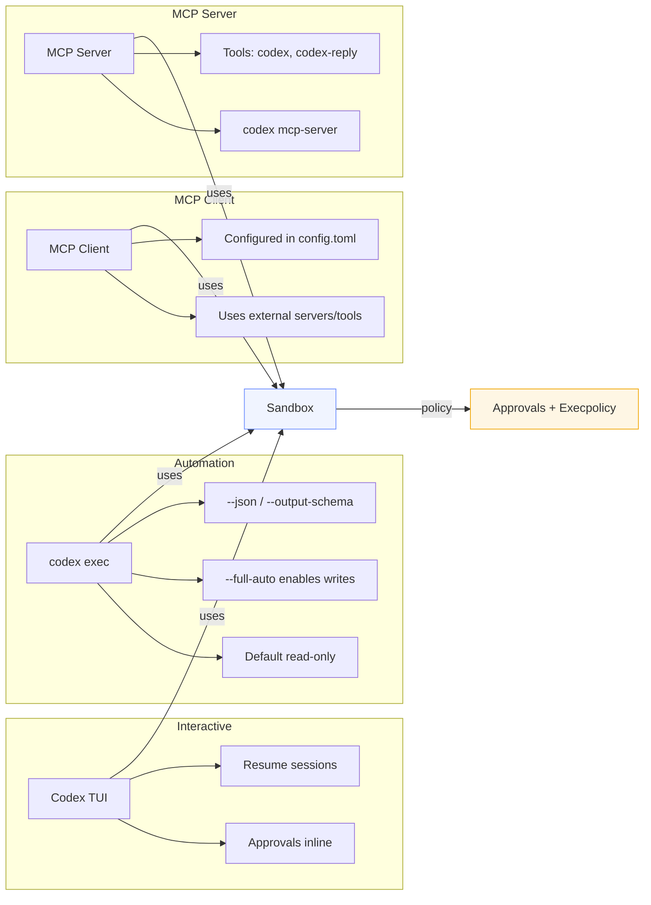

# Architecture and Core Concepts

Overview:
- How Codex CLI is structured (interactive TUI vs `codex exec`).
- Instruction sources: `AGENTS.md` and skills.
- Sandboxing, approvals, and execpolicy interaction.
- MCP as a client (add servers) and as a server (expose Codex).
- Logging/tracing and structured output for observability.

Codex modes:
- Interactive TUI (`codex`): conversational, approvals surfaced inline, supports resume (`codex resume`).
- Non-interactive automation (`codex exec`): no approvals by default; starts in `read-only` unless `--full-auto` or sandbox loosened.
- MCP server (`codex mcp-server`): run Codex as a server for other agents; tools `codex` and `codex-reply`.

Instruction stack (see [AGENTS.md docs](https://github.com/openai/codex/blob/main/docs/agents_md.md)):
- Global: `~/.codex/AGENTS.override.md` or `AGENTS.md`.
- Project: walk from repo root to cwd, preferring `AGENTS.override.md`, then `AGENTS.md`, then configured fallbacks.
- Combined in order; deeper paths override earlier guidance. Size capped by `project_doc_max_bytes`.

Skills (see [skills docs](https://github.com/openai/codex/blob/main/docs/skills.md)):
- Experimental feature flag: enable via `config.toml [features] skills = true` or `--enable skills`.
- Skills live under `~/.codex/skills/**/SKILL.md` with YAML frontmatter (name, description).
- Runtime shows names/descriptions; bodies stay on disk. Mention `$skill-name` or use `/skills` in TUI to insert.
- Invalid skills trigger startup modal; fix and restart.
- **Verify skills are enabled:** In TUI, use `/skills` command to list available skills. If empty, check your config.

Sandboxing, approvals, execpolicy:
- Sandbox modes: `read-only`, `workspace-write`, `danger-full-access` (⚠️ completely disables sandboxing; use only for trusted automation). TUI start banner shows roots; `codex exec` defaults to `read-only`.
- Approval policies: `untrusted` (prompts for commands outside trusted set), `on-failure` (prompts if sandbox fails), `on-request` (model decides when to escalate), `never` (no prompts). Use `--ask-for-approval` or `-a` flag to require approvals.
- Execpolicy (see [execpolicy docs](https://github.com/openai/codex/blob/main/docs/execpolicy.md)): repo rules to allow/deny commands or files; enforce guardrails beyond approvals.
- Safety best practice: request plan + diff before writes; decline broad/deleting commands; prefer minimal scope.

MCP integration (see [advanced docs](https://github.com/openai/codex/blob/main/docs/advanced.md) and [MCP config](https://github.com/openai/codex/blob/main/docs/config.md#mcp-integration)):
- As a client: configure MCP servers in `config.toml`; Codex gains tools from those servers.
- As a server: `codex mcp-server` exposes Codex to other frameworks; tools include `codex` (start session) and `codex-reply` (continue).
- Inspector quickstart: `npx @modelcontextprotocol/inspector codex mcp-server` and send `tools/list` requests; increase timeouts for long runs.

Observability:
- Logs: `~/.codex/log/codex-tui.log` (TUI), `RUST_LOG` env for verbosity. Note: paths may vary on Windows/WSL.
- `codex exec` JSON mode (`--json`) streams events (`command_execution`, `file_change`, `mcp_tool_call`, etc.).
- Structured outputs: `--output-schema` for JSON schema; `-o/--output-last-message` to capture final output.

Facilitator prompts:
- “Where is the current instruction stack coming from? Which AGENTS apply?”
- “Is `skills` enabled? Which skills are visible for this repo?”
- “What sandbox mode are we in? Which approval policy?”
- “Are MCP servers configured? Client or server role for this session?”
- “How would you enforce an execpolicy for today’s labs?”
- “Can we load the demo AGENTS and rules files? What changes do you see after enabling them?”

## Diagrams

Instruction stack (source + PNG):

```mermaid
graph TB
  subgraph Inputs
    A[Global AGENTS (~/.codex/AGENTS.md)]
    B[Project AGENTS (root → cwd)]
    C[Skills (names + descriptions)]
    D[Config.toml flags]
  end
  subgraph Codex
    E[Instruction merger]
    F[Codex runtime]
  end
  subgraph Outputs
    G[Plans & diffs]
    H[Commands]
    I[File edits]
  end
  A --> E
  B --> E
  C --> E
  D --> F
  E --> F
  F --> G
  F --> H
  F --> I
  style Inputs fill:#f0f4ff,stroke:#6b8cff
  style Codex fill:#fef6e4,stroke:#f0a500
  style Outputs fill:#e8fff3,stroke:#23a36c
```

Image: `docs/training/codex-cli-hands-on/diagrams/instruction-stack.png` (SVG: `.../instruction-stack.svg`)

Mode map (source + PNG):



Image: `docs/training/codex-cli-hands-on/diagrams/modes-map.png` (SVG: `.../modes-map.svg`)

Safety gates (source + PNG):

```mermaid
graph TB
  A[User request] --> B[Instruction stack (AGENTS + skills)]
  B --> C[Codex plan]
  C --> D[Sandbox rules]
  D --> E[Execpolicy rules]
  E --> F{Approval policy}
  F -->|allow| G[Execute command/edit]
  F -->|prompt/deny| H[Revise or skip]
  G --> I[Show diff/results]
  I --> J[Validation (tests/checks)]
  J --> K[Done]
  H --> C
  style D fill:#f0f4ff,stroke:#6b8cff
  style E fill:#fef6e4,stroke:#f0a500
  style F fill:#ffe3ed,stroke:#d23c7b
  style J fill:#e8fff3,stroke:#23a36c
```

Image: `docs/training/codex-cli-hands-on/diagrams/safety-gates.png` (SVG: `.../safety-gates.svg`)
